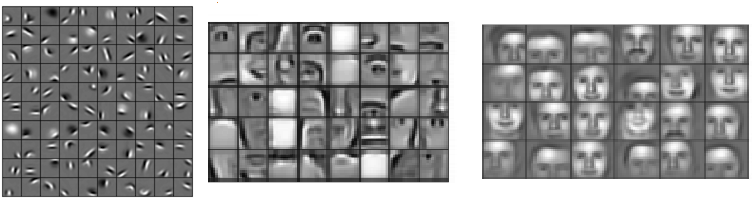
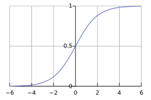
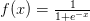
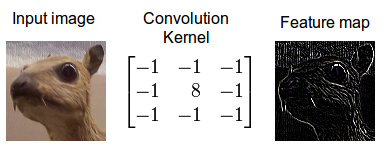
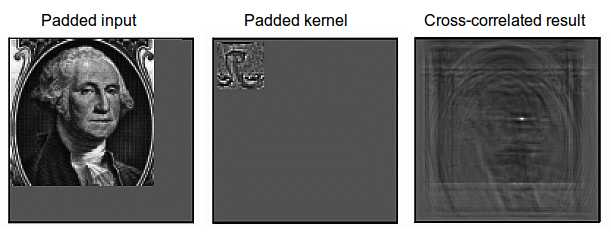

# Core Concepts In Deep Learning

>iFDING

>03/28/2017

### Core Concepts

#### Machine Learning

In machine learning we

(1) take some data,
(2) train a model on that data, and
(3) use the trained model to make predictions on new data.

The process of __training__ a model can be seen as a learning process where the model is exposed to new, unfamiliar data step by step.

At each step, the model makes predications and gets feedback about how accurate its generated predictions were. This feedback, which is provided in terms of an error according to some measure (for example distance from the correct soultion), is used to correct the errors made in prediction.

It may take many iterations to train a model with good predictive performance. This iterative predict-and-adjust process continues until the predictions of the model no longer improve.

#### Feature Engineering

__Feature engineering__ is the art of extracting useful patterns from data that will make it easier for Machine Learning models to distinguish between classes. For example, you might take the number of greenish vs. bluish pixels as an indicator of whether a land or water animal is in some picture. This feature is helpful for a machine learning model because it limits the number of classes that need to be considered for a good classification.

However, it is difficult to learn and master since different data sets and different kinds of data require different feature engineering approaches. Features that are usable for one data set often are not usable for other data sets.

The difficulty of feature engineering and the effort involved is the main reason to seek algorithms that can learn features; that is, algorithms that automatically engineer features.

#### Feature Learning

__Feature learning__ algorithms find the common patterns that are important to distinguish between classes and extract them automatically to be used in a classification or regression process. Feature learning can be thought of as Feature Engineering done automatically by algorithms.

In deep learning, convolutional layers are exceptionally good at finding good features in images to the next layer to form a hierarchy of nonlinear features that grow in complexity (e.g. blobs, edges -> noses, eyes, cheeks -> faces). The final layer(s) use all these generated features for classification or regression.

Figure 1: Learned hierarchical features from a deep learning algorithm. Each feature can be thought of as a filter, which filters the input image for that feature (a nose). If the feature is found, the responsible unit or units generate large activations, which can be picked up by the later classifier stages as a good indicator that the class is present. Image by Honglak Lee and colleagues (2011) as published in "Unsupervised Learning of Hierarchical Representatons with Convolutional Deep Belief Networks".

Figure 1 shows features generated by a deep learning algorithm that generates easily interpretable features. This is rather unusual. Features are normally difficult to interpret, especially in deep networks like recurrent neural networks and LSTMs or very deep convolutional networks.

#### Deep Learning

In hierarchical Feature Learning, we extract multiple layers of non-linear features and pass them to a classifier that combines all the features to make predictions. We are interested in stacking such very deep hierarchies of non-linear features because we cannot learn complex features from a few layers.

It can be shown mathemaitcally that for images the best features for a single layer are edges and blobs because they contain the most information that we can extract from a single non-linear transformation. 

To generate features that contain more information we cannot operate on the inputs directly, but we need to transform our first features (edges and blobs) again to get more complex features that contain more information to distinguish between classes.

It has been shown that the human brain does exactly the same thing: The first hierarchy of neurons that receives information in the visual cortex are sensitive to sepcific edges and blobs while brain regions further down the visual pipeline are sensitive to more complex structures such as faces.

While hierarchical feature learning was used before the field deep learning existed, these architectures suffered from major problems such as the vanishing gradient problem where the gradients became too small to provide a learning signal for very deep layers, thus making these architectures perform poorly when compared to shallow learning algorithms (such as support vector machines).

The term __deep learning__ originated from new methods and strategies designed to generate these deep hierarchies of non-linear features by overcoming the problems with vanishing gradients so that we can train architectures with dozens of layers of non-linear hierarchical features. In the early 2010s, it was shown that combinning GPUs with activation functions that offered better gradient flow was sufficient to train deep architectures without major difficulties. From here the interest in deep learning grew steadily.

Deep learning is not associated just with learning deep non-linear hierarchical features, but also with learning to detect very long non-linear time dependencies in sequential data.

### Fundamental Concepts

#### Logistic Regression

__Logistic Regression__ is a regression model that uses input variables to predict a categorical outcome variable that can take on one of a limited set of class values, for example "cancer" / "no cancer", or an image category such as "bird" / "car" / "dog" / "horse".

Logistic regression applies the logistic sigmoid function (see Figure 2) to weighted input values to generate a prediction of which of two classed the input data belongs to (or in case of multinomial logistic regression, which of multiple classes).

Figure 2: The logistic sigmoid function

[Image source](https://en.wikipedia.org/wiki/File:Logistic-curve.svg)

Logistic regression is similar to a non-linear perceptron or a neural network without hidden layers. The main difference from other basic models is that logistic regression is easy to interpret and reliable if some statistical properties for the input variables hold. If these statistical properties hold one can produce a very reliable model with very little input data. This makes logistic regression valuable for areas where data are scarce, scarce, like the medical and social sciences where logistic regression is used to analyze and interpret results from experiments. Because it is simple and fast it is also used for very large data sets.

In deep learning, the final layer of a neural network used for classification can often be interpreted as a logistic regression. In this context, one can see a deep learning algorithm as multiple feature learning stages, which then pass their features into a logistic regression that classifies an input.

#### Artificial Neural Network

An artificial neural network

(1) takes some input data, and
(2) transforms this input data by calculating a weighted sum over the inputs and 
(3) applies a non-linear function to this transformation to calculate an intermediate state.

The three steps above constitute what is known as a layer, and the transformative function is often referred to as a unit. The intermediate states - often termed features - are used as the input into another layer.

Through repetition of these steps, the artificial neural network learns multiple layers of non-linear features, which it then combines in a final layer to create a prediction.

The neural network learns by generating an error signal that measures the difference between the predictions of the network and the desired values and then using this error signal to change the weights (or parameters) so that predictions get more accurate.

#### Unit

A unit often refers to the activation function in a layer by which the inputs are transformed via a non-linear activation function (for example by the logistic sigmoid function). Usually, a unit has several incoming connections and several outgoing connections.

However, units can also be more complex, like long short-term memory (LSTM) units, which have multiple activation functions with a distinct layout of connections to the non-linear activation functions, or maxout units, which compute the final output over an array of non-linearly transformed input values.

#### Artifical Neuron

The term __artifical neuron__ - or most often just neuron - is an equivalent term to unit, but implies a close connection to neurobiology and the human brain while deep learning has very little to do with the brain.

For example, it is now thought that biological neurons are more similar to entire multilayer perceptrons rather than a single unit in a neural network.

#### Activation Function

An __activation function__ takes in weighted data (matrix multiplication between input data and weights) and outputs a non-linear transformation of the data. For example, output = max(0, weighted_data) is the rectified linear activation function (essentially set all negative values to zero). 

The difference between units and activation functions is that units can be more complex, that is, a unit can have multiple activation functions (for example LSTM units) or a slightly more complex structure (for example maxout units).

The difference between linear and non-linear activation functions can be shown with the relationship of some weighted values: Imagine the four points A1, A2, B1 and B2. The pairs A1 / A2, and B1 / B2 lie close to each other, but A1 is distant from B1 and B2, and vice versa; the same for A2.

With a linear transformation the relationship between pairs might change. For example A1 and A2 might be far apart, but this implies that B1 and B2 are also far apart. The distance between the pairs might shrink, then both B1 and B2 will be close to A1 and A2 at the same time. We can apply many linear transformations, but the relationship between A1 / A2 and B1 / B2 will always be similar.

In contrast, with a non-linear activation function we can increase the distance between A1 and A2 while we decrease the distance between B1 and B2. We can make B1 close to A1, but B2 distant from A1. By applying non-linear functions, we create new relationships between the points. With every new non-linear transformation we can increase the complexity of the relationships. In deep learning, using non-linear activation functions creates increasingly complex features with every layer.

In contrast, the features of 1000 layers of pure linear transformations can be reproduced by a single layer (because a chain of matrix multiplication can always be represented by a single matrix multiplication). This is why non-linear activation functions are so important in deep learning.

#### Layer

A layer is the highest-level building block in deep learning. 

A layer is a container that usually receives weighted input, transforms it with a set of mostly non-linear functions and then passes these values as output to the next layer.

A layer is usually uniform, that is it only contains one type of activation function, pooling, convolution etc. so that it can be easily compared to other parts of the network.

The first and last layers in a network are called input and output layers, respectively, and all layers in between are called hidden layers.

### Convolutional Deep Learning

#### Convolution

Convolution is a mathematical operation which describes a rule of how to mix two functions or pieces of information:

(1) The feature map (or input data) and 
(2) the convolution kernel mix together to form
(3) a transformed feature map.

Convolution is often interpreted as a filter, where the kernel filters the feature map for information of a certain kind (for example one kernel might filter for edges and discard other information).

[Image source](https://devblogs.nvidia.com/parallelforall/deep-learning-nutshell-core-concepts/)

Figure 3: Convolution of an image with an edge detector convolution kernel.

Convolution is important in physics and mathematics as it defines a bridge between the spatial and time domains (pixel with intensity 147 at position (0,30)) and the frequency domain (amplitude of 0.3, at 30 Hz, with 60-degree phase) through the convolution theorem.This bridge is defined by the use of Fourier transforms: When you use a Fourier transform on both the kernel and the feature map, then the convolution operation is simplified significantly (integration becomes mere multiplication). 

[Image source](https://devblogs.nvidia.com/parallelforall/deep-learning-nutshell-core-concepts/)

Figure 4: Calculating convolution by sliding image patches over the entire image. One image patch (yellow) of the original image (green) is multiplied by the kernel (red numbers in the yellow patch), and its sum is written to one feature map pixel (red cell in convolved feature).

While it is unkown which interpretation of convolution is correct for deep learning, the cross-correlation interpretation is currently the most useful: convolutional filters can be interpreted as feature detectors, that is, the input (feature map) is filtered for a certain feature (the kernel) and the output is large if the feature is detected in the image. This is exactly how you interpret cross-correlation for an image.

Figure 5: Cross-correlation for an image. Convolution can be transformed to cross-correlation by reversing the kernel (upside-down image). The kernel can then be interpreted as a feature detector where a detected feature results in large outputs (white) and small outputs if no feature is present (black) Images are taken from Steven Smith's excellent [free online book](http://www.dspguide.com/pdfbook.htm).

#### Pooling / Subsampling

Pooling is a procedure that takes input over a certain area and reduces that to a single value (subsampling). In convolutional neural networks, this concentration of information has the useful property that outgoing connections usually receive similar information (the information is "funneled" into the right place for the input feature map of the next convolutional layer).

This provides basic invariance to rotations and translations. For example, if the face on an image patch is not in the center of the image but slightly translated, it should still work fine because the information is funneled into the right place by the pooling operation so that the convolutional filters can detect the face.

The larger the size of the pooling area, the more information is condensed, which leads to slim networks that fit more easily into GPU memory. However, if the pooling area is too large, too much information is thrown away and predictive performance decreases.

#### Convolutional Neural Network (CNN)

A __convolutional neural network__, or preferably convolutional network uses convolutional layers that filter inputs for useful information. These convolutional layers have parameters that are learned so that these filters are adjusted automatically to extract the most useful information for the task at hand. 

For example, in a general object recognition task it might be most useful to filter information about the shape of an object (objects usually have very different shapes) while for a bird recognition task it might be more suitable to extract information about the color of the bird (most birds have a similar shape, but different colors; here color is more useful to distinguish between birds). Convolutional networks adjust automatically to find the best feature for these tasks.

Usually, multiple convolutional layers are used that filter images for more and more abstract information after each layer.

Convolutional networks usually also use pooling layers for limited translation and rotation invariance (detect the object even if it appears at some unusual place). Pooling also reduces the memory consumption and thus allows for the usage of more convolutional layers.

Figure 6: An image of a traffic sign is filtered by 4 5x5 convolutional kernels which create 4 feature maps, these feature maps are subsampled by max pooling. The next layer applies 10 5x5 convolutional kernels to these subsampled images and again we pool the feature maps. The final layer is a fully connected layer where all generated features are combined and used in the classifier (essentially logistic regression).Image by [Maurice Peemen](http://parse.ele.tue.nl/mpeemen).

More recent convolutional networks use inception modules which use 1x1 convolutional kernels to reduce the memory consumption further while speeding up the compution (and thus training).

#### Inception

Inception modules in convolutional networks were designed to allow for deeper and larger convolutional layers while at the same time allowing for more efficient computation. This is done by using 1x1 convolutions with small feature map size, for example, 192 28x28 sized feature maps can be reduced to 64 28x28 feature maps through 64 1x1 convolutions. Because of the reduced size, these 1x1 convolutions can be followed up with larger convolutions of size 3x3 and 5x5. In addition to 1x1 convolution, max pooling may also be used to reduce dimensionality.

In the output of an inception module, all the large convolutions are concatenated into a big feature map which is then fed into the next layer (or inception module).

### Reference

* [Deep Learning in a Nutshell: Core Concepts](https://devblogs.nvidia.com/parallelforall/deep-learning-nutshell-core-concepts/)

