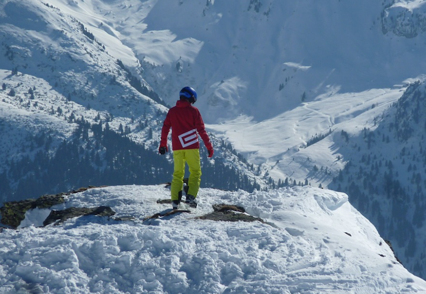
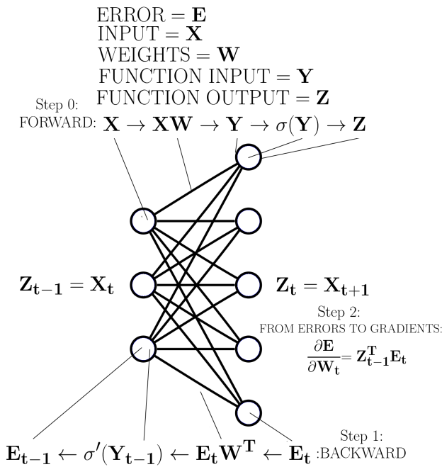

# Deep Learning in a Nutshell - Training

>iFDING

>03/26/2017

### Training Deep Learning Architectures

#### Training

The process of training a deep learning architecture is similar to how toddlers start to make sense of the world around them. When a toddler encounters a new animal, say a monkey, he or she will not know what it is. But then an adult points with a finger at the monkey and says: "That is a monkey!" The toddler will then be able to associate the image he or she sees with the label "monkey".

A single image, however, might not be sufficient to label an animal correctly when it is encountered the next time. For reliable recall can labeling, a toddler needs to see many different monkeys and similar animals and needs to know each time whether or not it is really a monkey - feedback is essential for learning.

The deep learning process is similar. We present the neural network with images or other data, such as the image of a monkey. The deep neural network predicts a certain outcome, for example, the label of the object in an image ("monkey"). We then supply the network with feedback. For example, if the network predicted that the image showed a monkey with 30% probability and a sloth with 70% probability, then all the output in favor of the sloth class made an error! We use this error to adjust the parameters of the neural network using the backpropagation of errors algorithm.

Usually, we randomly initialize the parameters of a deep network so the network initially outputs random predictions. This means for ImageNet, which consists of 1000 classes, we will achieve an average classification accuracy of just 0.1% for any image after initializing the neural network. To improve the performance we need to adjust the parameters so that the classfication performance increases over time. But this is inherently difficult: If we adjust one parameter to improve performance on one class, this change might decrease the classification performance for another class. Only if we find parameter changes that work for all classes can we achieve good classification performance.

If you imagine a neural network with only 2 parameters (e.g. -0.37 and 1.14), then you can imagine a mountain landscape, where the height of the landscape represents the classification error and the two directions - north-south (x-axis) and east-west (y-axis) - represent the directions in which we can change the two parameters (negative-positive direction). The task is to find the lowest altitude point in the mountain landscap: we want to find the minimum.

The problem with this is that the entire mountain landscape is unknown to us at the beginning. It is as if the whole mountain range is covered in fog. We only know our current position (the initial random parameters) and our height (the current classification error). How can we find the minimum quickly when we have so little information about the landscape?

#### Stochastic Gradient Descent 

Imagine you stand on top of a mountain with skis strapped to your feet. You want to get down to the valley as quickly as possible, but there is fog and you can only see your immediate surroundings. How can you get down the mountain as quickly as possible? You look around and identify the steepest path down, go down that path for a bit, again look around and find the new steepest path, go down that path, and repeat-this is exactly what **gradient descent** does.

While gradient descent is equivalent to stopping every 10 meters and measuring the steepness of your surroundings with a measuring tape, stochastic gradient descent is the equivalent of quickly estimating the steepness with a short glance (just a few hundred data points are used to estimate the steepness).

In terms of stochastic gradient descent, we go down the steepest path (the negative gradient or first derivative) on the landscape of the error function to find a local minumum, that is, the point that yields a low error for our task. We do this in tiny steps so that we do not get trapped in half-pipe-like obstacles (if we are too fast, we never get out of these half-pipes and we may even be "catapulted" up the mountain).

While our ski-landscape is 3D, typical error landscapes may have millions of dimensions. In such a space we have many valleys so it is easy to find a good solution, but we also have many saddle points, which makes matters very different.

Saddle points are points at which the surroundings are almost entirely flat, yet which may have dramatic descents at one end or the other (saddle points are like plateaus that slightly bend and may lead to a cliff). Most difficulties to find good solutions on an error landscape with many dimensions stems from navigating saddle points (because these plateaus have almost no steepness, progress is very slow near saddle points) rather than finding the minimum itself (there are many minima, which are almost all of the same quality).

#### Backpropagation of errors

**Backpropagration of errors**, or often simply backpropagation, is a method for finding the gradient of the error with respect to weights over a neural network. The gradient of the error with respect to weights over a neural network. The gradient signifies how the error of the network changes with changes to the network's weights. The gradient is used to perform gradient descent and thus find a set of weights that minimize the error of the network.

Figure 3: Backpropagation for an arbitrary layer in a deep neural network

There are three good ways to teach backpropagation:

(1) Using a visual representation,
(2) using a mathematical representation,
(3) using a rule-based representation.

Here I'll use a rule-based representaion as it requires little math and is easy to understand.

Image a neural network with 100 layers. We can imagine a forward pass in which a matrix (dimensions: number of examples x number of input nodes) is input to the network and propagated t through it, where we always have the order 

(1) input nodes,
(2) weight matrix (dimensions: input nodes x output nodes), and
(3) output nodes,

which usually also have a non-linear activation function (dimensions: examples x output nodes). How can we imagine these matrices?

The input matrix represents the following:

For every input node we have one input value, for example, pixels (three input values = three pixels in Figure 3), and we take this times our number of examples, such as the nubmer of images. So for 128 3-pixel images, we have 128x3 input matrix.

The weight matrix represents the connections between input and output nodes. The value passed to an input node (a pixel) is weighted by the weight matrix values and it “flows” to each output node through these connections. This flow is a result of multipying the input value by the value of each weight between the input node and output nodes. The output matrix is the accumulated “flow” of all input nodes at all output nodes.

So for each input, we multiply by all weights, and add up all those contributions at the output nodes, or more easily we take the matrix product of the input matrix times the weight matrix. In our example, this would be our 128×3 input matrix multiplied by the 3×5 weight matrix (see Figure 1). We thus receive our output matrix as a result which in this example is of size 128×5. We then use this output matrix, apply the non-linear activation function and treat our resulting output matrix as the input matrix to the next layer. We repeat these steps until we reach the error function. We then apply the error function to see how far the predictions are different from the correct values. We can formulate this whole process of the forward pass, and equivalently the backward pass, by defining simple rules (see Figure 3).

For the forward pass with given input data we go from the first to the last layer according to these rules:

1. When we encounter a weight matrix, we matrix multiply by this weight and propagate the result.

2. If we encounter a function, we put our current result into the function and propagate the function output as our result.

3. We treat outputs of the previous layer as inputs into the next layer.

4. When we encounter the error function we apply it and thus generate the error for our backward pass.

The backward pass for a given error is similar but proceeds from the last to the first layer where the error generated in rule 4 in the forward pass represents the “inputs” to the last layer. We then go backward through the network and follow these rules:

1. When we encounter a weight matrix, we matrix multiply by the transpose of the matrix and propagate the result.

2. If we encounter a function, we multiply (element-wise) by the derivative of that function with respect to the inputs that this function received from the forward pass. (see Figure 3).

3. We treat errors of the previous layer as inputs (errors) into the next layer.

To calculate the gradients, we use each intermediate result obtained after executing rule 2 in the backward pass and matrix multiply this intermediate result by the value of rule 2 from the forward pass from the previous layer (see Figure 3).

Figure 4: Behavior of different methods to accelerate gradient descent on a saddle point. Saddle points are thought to be the main difficulty in optimizing deep networks. Image by [Alec Radford](https://www.themuse.com/companies).

### Reference

* [Deep Learning in a Nutshell: History and Training](https://devblogs.nvidia.com/parallelforall/deep-learning-nutshell-history-training/)

