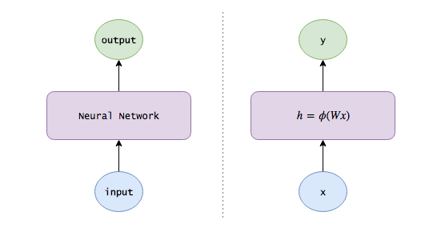
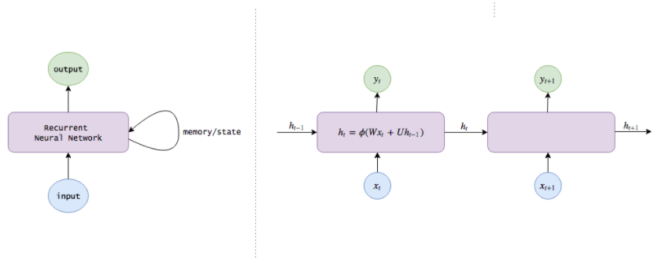

# Understanding LSTM Networks

## Neural Networks

Imagine we have a sequence of images from a movie, and we want to label each image with an activity. How do we do this?

One way is to ignore the sequential nature of the images, and build a per-image classifier that considers each image in isolation. For example, given enough images and labels:
- Our algorithm might first learn to detect low-level patterns like shapes and edges.
- With more data, it might learn to combine these patterns into more complex ones, like faces or cats.
- And with even more data, it might learn to map these higher-level patterns into activities themselves.

This is a __deep neural network__: it takes an image input, returns an activity output, and - just as we might learn to detect patterns in puppy behavior without knowing anything about dogs, learn to represent images through hidden layers of representations.

In matrix notation:



[image source](http://blog.echen.me/2017/05/30/exploring-lstms/)

- x is our input vector
- W is a weight matrix connecting the input and hidden layers
- Common activation functions for ϕ are the sigmoid function, σ(x), which squashes numbers into the range (0, 1); the hyperbolic tangent, tanh(x), which squashes numbers into the range (-1, 1), and the rectified linear unit, ReLU(x)=max(0,x).

## RNNs: remembering information

If we see a scene of a beach, we should boost beach activities in future frames: an image of someone in the water should probably be labeled _swimming_, not _bathing_, and an image of someone lying with their eyes closed is probably _suntanning_.

So what we'd like is to let our model track the state of the world:
1. After seeing each image, the model outputs a label and also updates the knowledge it's been learning.
2. When given a new image, the model should incorporate the knowledge it's gathered to do a better job.

This, then, is a __recurrent neural network__. Instead of simply taking an image and returning an activity, an RNN also maintains internal memories about the world (weights assigned to different pieces of information) to help performs its classifications.

We know that the hidden layers of neural networks already encode usefull information about their inputs, so why not use these layers as the memory passed from one time step to the next? This gives us our RNN equations:
```
ht=ϕ(W * xt + U * ht−1)
yt=V * ht
```

Note that the hidden state computed at time t (ht, our internal knowledge) is fed back at the next time step.



[image source](http://blog.echen.me/2017/05/30/exploring-lstms/)

A recurrent neural network can be thought of as multiple copies of the same network, each passing a message to a successor. This chain-like nature reveals that recurrent neural networks are intimately related to sequences and lists.

Long Short-Term Memory (LSTM) network are a type of recurrent necurrent network capable of learning order dependence in sequence prediction problems.

### The problem of Long-Term Dependencies

One of the appeals of RNNs is the idea that they might be able to connect previous information to the present task, such as using previous video frames might inform the understanding of the present frame. If RNNs could do this, they'd be extremely useful. But can they? It depends.

Sometimes, we only need to look at recent information to perform the present task. For example, If we are trying to predict the last word in "the clouds are in the sky", we don't need any further context. In such cases, where the gap between the relevant information and the place that it's needed is small. RNNs can learn to use the past information.

But there are also cases where we need more context. Consider trying to predict the last word in the text  "I grew up in France… I speak fluent French." Recent information suggests that the next word is probably the name of a language, but if we want to narrow down which language, we need the context of France, from further back. It's entirely possible for the gap between the relevant information and the point where it is needed to become very large.


[image source](http://colah.github.io/posts/2015-08-Understanding-LSTMs/)

In theory, RNNs are absolutely capable of handling such "long-term dependencies". But in practice, RNNs don't seem to be able to learn them. The problem was explored in depth by Hochreiter (1991) [German](http://people.idsia.ch/~juergen/SeppHochreiter1991ThesisAdvisorSchmidhuber.pdf) and [Bengio, et al. (1994)](http://www-dsi.ing.unifi.it/~paolo/ps/tnn-94-gradient.pdf), who found some pretty fundamental reasons why it might be difficult. Thankfully, LSTMs don't have this problem.


## LSTM Networks

Long Short Term Memory networks (LSTMs) are a special kind of RNN, capable of learning long-term dependencies. They are introducted by [Hochreiter & Schmidhuber (1997)](http://www.bioinf.jku.at/publications/older/2604.pdf), and were refined an popularized by many people.

LSTMs are explicitly designed to avoid the long-term dependency problem. Remembering information for long periods of time is practically their default behavior, not something they struggle to learn.

All recurrent neural networks have the form of a chain of repeating modules of neural network. In standard RNNs, this repeating module will have a very simple structure, such as a single tanh layer.


[image source](http://colah.github.io/posts/2015-08-Understanding-LSTMs/)

LSTMs also have this chain like structure, but the repeating module has a different structure. Instead of having a single neural network layer, there are four, interacting in a very special way.


[image source](http://colah.github.io/posts/2015-08-Understanding-LSTMs/)

We'll walk through the LSTM diagram step by step later. For now, let's just try to get comfortable with the notation we'll be using.


[image source](http://colah.github.io/posts/2015-08-Understanding-LSTMs/)

In the above diagram, each line carries an entire vector, from the output of one node to the inputs of others. The pink circles represent pointwise operations, like vector addition, while the yellow boxes are learned neural network layers. Lines merging denote concatenation, while a line forking denote its content being copied and the copies going to different locations.

### The core idea behind LSTMs

The key to LSTMs is the cell state, the horizontal line running through the top of the diagram.

The cell state is kind of like a conveyor belt. It runs straight down the entire chain, with only some minor linear interactions. It's very easy for information to just flow along it unchanged.


[image source](http://colah.github.io/posts/2015-08-Understanding-LSTMs/)

The LSTM does have the ability to remove or add information to the cell state, carefully regulated by structures called gates.

Gates are a way to optionally let information through. They are composed out of a sigmoid neural net layer and a pointwise multipication operation.


[image source](http://colah.github.io/posts/2015-08-Understanding-LSTMs/)

The sigmoid layer outputs numbers between zero and one, describing how much of each component should be let through. A value of zero means "let nothing through", while a value of one means "let everything through".

An LSTM has three of these gates, to protect and control the cell state.

### Step-by-step LSTM walk through

The first step in our LSTM is to decide what information we're going to throw away from the cell state. This decision is made by a sigmoid layer called the "forget gate layer". It looks at ht-1 and xt, and outputs a number between 0 and 1 for each number in the cell state Ct-1. A 1 represents "completely keep this" while a 0 represents "completely get rid of this".

Let's go back to our example of a language model trying to predict the next word based on all the previous ones. In such a problem, the cell state might include the gender of the present subject, so that the correct pronouns can be used. When we see a new subject, we want to forget the gender of the old subject.


[image source](http://colah.github.io/posts/2015-08-Understanding-LSTMs/)

The next step is to decide what new information we're going to store in the cell state. This has two parts. First, a sigmoid layer called the "input gate layer" decides which values we'll update. Next, a tanh layer creates a vector of new candidate values, C̃t, that could be added to the state. In the next step, we'll combine these two to create an update to the state.

In the example of our language model, we'd want to add the gender of the new subject to the cell state, to replace the old one we're forgetting.

It's now time to update the old cell state, Ct-1, into the new cell state Ct. The previous steps already decided what to do, we just need to actually do it.

We multiply the old state by ft, forgetting the things we decided to forget earlier. Then we add it * C̃t. This is the new candidate valeus, scaled by how much we decided to update each state value.

In the case of the language model, this is where we'd actually drop the information about the old subject's gender and add the new information, as we decided in the previous steps.


[image source](http://colah.github.io/posts/2015-08-Understanding-LSTMs/)

Finally, we need to decide what we're going to output. This output will be based on our cell state, but will be a filered version. First, we run a sigmoid layer which decides what parts of the cell state we're going to output. Then, we put the cell state through tanh (to push the values to be between -1 and 1) and multiply it by the output of the sigmoid gate, so that we only output the parts we decided to.

For the language model example, since it just saw a subject, it might want to output information relevant to a verb, in case that's what is coming next. For example, it might output whether the subject is singular or plural, so that we know what form a verb should be conjugated into if that's what follows next.


[image source](http://colah.github.io/posts/2015-08-Understanding-LSTMs/)

### Variants on Long Short Term Memory

What I've described so far is a pretty normal LSTM. But not all LSTMs are the same as the above. In fact, it seems like almost every paper involving LSTMs uses a slightly different version.

One popular LSTM variant, introduced by [Gers & Schmidhuber (2000)](ftp://ftp.idsia.ch/pub/juergen/TimeCount-IJCNN2000.pdf), is adding "peephole connections". This means that we let the gate layers look at the cell state.


[image source](http://colah.github.io/posts/2015-08-Understanding-LSTMs/)

The above diagram adds peepholes to all the gates, but many papers will give some peepholes and not others.

Another variation is to use coupled forget and input gates. Instead of separately deciding what to forget and what we should add new information to, we make those decisions together. we only forget when we're going to input something in its place. We only input new values to the state when we forget something older.


[image source](http://colah.github.io/posts/2015-08-Understanding-LSTMs/)

A slightly more dramatic variation on the LSTM is the Gated Recurrent Unit, or GRU introduced by [Cho, et al. (2014)](https://arxiv.org/pdf/1406.1078v3.pdf). It combines the forget and input gates into a single "update gate". It also merges the cell state and hidden state, and makes some other changes. The resulting model is simpler than standard LSTM models, and has been growing increasingly popular.


[image source](http://colah.github.io/posts/2015-08-Understanding-LSTMs/)

There are only a few of the most notable LSTM variants. There are lots of others, like Depth Gated RNNs by [Yao, et al. (2015)](https://arxiv.org/pdf/1508.03790v2.pdf). There’s also some completely different approach to tackling long-term dependencies, like Clockwork RNNs by [Koutnik, et al. (2014)](https://arxiv.org/pdf/1402.3511v1.pdf).

## Reference

- [Understanding LSTM Networks](http://colah.github.io/posts/2015-08-Understanding-LSTMs/)
- [Exploring LSTMs](http://blog.echen.me/2017/05/30/exploring-lstms/)