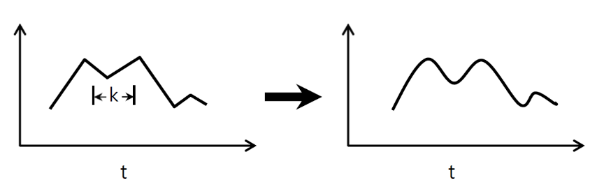
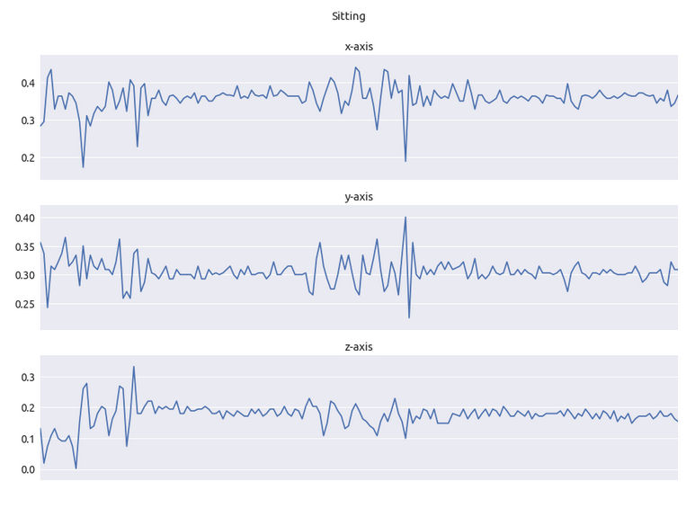
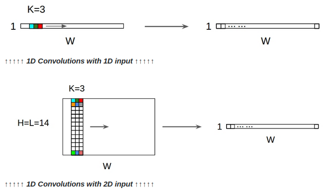
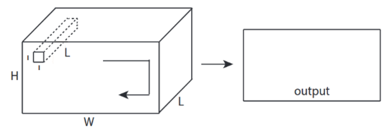
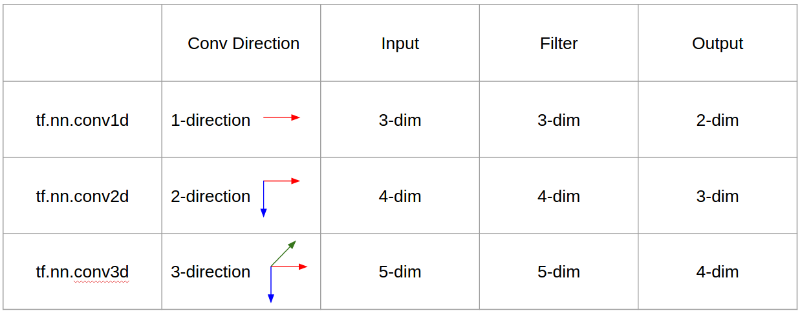

## Table of Contents

   * [1D Convolutions](#1d-convolutions)
      * [Human Activity Recognition](#human-activity-recognition)
      * [Text Classification](#text-classification)
   * [2D Convolutions](#2d-convolutions)
   * [3D Convolutions](#3d-convolutions)
   * [Summary](#summary)


## 1D Convolutions

The application domains with time-series nature (natural temporal ordering), for examples, Biomedical signals (e.g. EEG and ECG), financial data (e.g. stock market and currecy exchange rates), industrial devices (e.g. gas sensors and laser excitation), biometrics (e.g. voice, signature and gesture), video processing, music mining, forecasting and weather.




[Image source](https://stackoverflow.com/questions/42883547/what-do-you-mean-by-1d-2d-and-3d-convolutions-in-cnn)

So, 1D Convolutions:

- just 1-direction (time-axis) to calculate conv
- input = `[W]`, filter = `[k]`, output = `[W]`
- example, input = `[1,1,1,1,1]`, filter = `[0.25,0.5,0.25]`, output = `[1,1,1,1,1]`
- output-shape is 1D array

### Human Activity Recognition

The data can be downloaded from the [UCI repository](https://archive.ics.uci.edu/ml/datasets/human+activity+recognition+using+smartphones).

- Each person performed six activities (WALKING, WALKING_UPSTAIRS, WALKING_DOWNSTAIRS, SITTING, STANDING, LAYING) 
- Using its embedded accelerometer and gyroscope, we captured 3-axial linear acceleration and 3-axial angular velocity at a constant rate of 50Hz. In total, it has 3 groups of x-y-z (9 channels). 



[Image source](https://aqibsaeed.github.io/2016-11-04-human-activity-recognition-cnn/)


We can process the data into a tensor form, the generated tensors has the following dimensions:

```
(batch, seq_len, n_channels)
```

where `batch` is the number of training examples in each batch, `seq_len` is the number of steps in the time series (128) and `n_channels` is the number of channels where observations are made (9).


[Image source](https://github.com/healthDataScience/deep-learning-HAR)


### Text Classification

We denote the dimensionality of the word vectors by d. If the length of a given sentence is s, then the dimensionality of the sentence matrix is s x d. For example, s=7, d=5. Although, the sentence matrix is 2D, the computation is 1-direction.


> Here we depict three filter region sizes: 2, 3 and 4, each of which has 2 filters. Every filter performs convolution on the sentence matrix and generates (variable-length) feature maps. Then 1-max pooling is performed over each map, i.e., the largest number from each feature map is recorded. Thus a univariate feature vector is generated from all six maps, and these 6 features are concatenated to form a feature vector for the penultimate layer. The final softmax layer then receives this feature vector as input and uses it to classify the sentence; here we assume binary classification and hence depict two possible output states. 

Source: Zhang, Y., & Wallace, B. (2015). [A Sensitivity Analysis of (and Practitioners’ Guide to) Convolutional Neural Networks for Sentence Classification](https://arxiv.org/pdf/1510.03820.pdf).




[Image source](https://stackoverflow.com/questions/42883547/what-do-you-mean-by-1d-2d-and-3d-convolutions-in-cnn)

- Eventhough input is 2D ex) 20x14
- output-shape is not 2D , but 1D Matrix
- because filter height = L must be matched with input height = L
- 1-direction (x) to calcuate conv! not 2D
- input = `[W,L]`, filter = `[k,L]` output = `[W]`
- output-shape is 1D Matrix
- what if we want to train N filters (N is number of filters)
- then output shape is (stacked 1D) 2D = 1D x N matrix


## 2D Convolutions


[Image source](https://stackoverflow.com/questions/42883547/what-do-you-mean-by-1d-2d-and-3d-convolutions-in-cnn)


- 2-direction (x,y) to calculate conv
- output-shape is 2D Matrix
- input = `[W, H]`, filter = `[k,k]` output = `[W,H]`
- example) computer vision, edge detection algorithms, Sobel Egde Fllter


[Image source](https://stackoverflow.com/questions/42883547/what-do-you-mean-by-1d-2d-and-3d-convolutions-in-cnn)

2D Convolutions with 3D input - LeNet, VGG, ...,

- Eventhough input is 3D ex) 224x224x3, 112x112x32, 3 for RGB  
- output-shape is not 3D Volume, but 2D Matrix
- because filter depth = L must be matched with input channels = L
- 2-direction (x,y) to calcuate conv! not 3D
- input = `[W,H,L]`, filter = `[k,k,L]` output = `[W,H]`
- output-shape is 2D Matrix
- what if we want to train N filters (N is number of filters)
- then output shape is (stacked 2D) 3D = 2D x N matrix.

Animation (2D Conv with 3D-inputs)


[Image source](https://stackoverflow.com/questions/42883547/what-do-you-mean-by-1d-2d-and-3d-convolutions-in-cnn)

- The author: Martin Görner
- Twitter: @martin_gorner
- Google +: plus.google.com/+MartinGorne 




[Image source](https://stackoverflow.com/questions/42883547/what-do-you-mean-by-1d-2d-and-3d-convolutions-in-cnn)

1x1 conv in CNN - GoogLeNet, ...,

- 1x1 conv is confusing when you think this as 2D image filter like sobel
- for 1x1 conv in CNN, input is 3D shape as above picture.
- it calculate depth-wise filtering
- input = `[W,H,L]`, filter = `[1,1,L]` output = `[W,H]`
- output stacked shape is 3D = 2D x N matrix.


## 3D Convolutions

3D  convolutional  networks  are  more  expensive  in  the  computation  efficiency.  3D  matrix  needs  more  memories 
in  the  computer.  3D  convolutional  operations  needs  more calculations than 2D convolutional operations.  


[Image source](https://stackoverflow.com/questions/42883547/what-do-you-mean-by-1d-2d-and-3d-convolutions-in-cnn)

- 3-direction (x,y,z) to calcuate conv
- output-shape is 3D Volume
- input = `[W,H,L]`, filter = `[k,k,d]` output = `[W,H,M]`
- d < L is important! for making volume output
- example) C3D video descriptor


For example, application of 3D Convolutional Neural Network to QSM

All 20 three-dimensional images are re-sized to the same voxel size (1mm, 1mm, 3mm) and cropped to matrix size (160, 220, 48). This provides a volume coverage of (16cm, 22cm, 14.4cm), large enough for average human brain. 


[Image source](https://towardsdatascience.com/deep-gray-matter-dgm-segmentation-using-neural-network-application-to-qsm-a0183cb3e3ae)


## Summary

Ignoring number of dimensions briefly, the following can be considered strengths of a convolutional neural network (CNN), compared to fully-connected models, when dealing with certain types of data:

- The use of shared weights for each location that the convolution processes significantly reduces the number of parameters that need to be learned, compared to the same data processed through fully-connected network.

- Shared weights is a form of regularisation.

- The structure of a convolutional model makes strong assumptions about local relationships in the data, which when true make it a good fit to the problem.
  - Local patterns provide good predictive data (and/or can be usefully combined into more complex predictive patterns in higher layers)
  - The types of pattern found in the data can be found in multiple places. Finding the same pattern in a different set of data points is meaningful.

These properties of CNNs are independent of the number of dimensions.



[Image source](https://stackoverflow.com/questions/42883547/what-do-you-mean-by-1d-2d-and-3d-convolutions-in-cnn)


## Reference

- [Classification of Time-Series Images Using Deep Convolutional Neural Networks](https://arxiv.org/pdf/1710.00886.pdf)
- [In a nutshell, convolutional direction & output shape is important!](https://stackoverflow.com/questions/42883547/what-do-you-mean-by-1d-2d-and-3d-convolutions-in-cnn)
- [What is an 1D Convolutional Layer in Deep Learning?](https://datascience.stackexchange.com/questions/17241/what-is-an-1d-convolutional-layer-in-deep-learning)