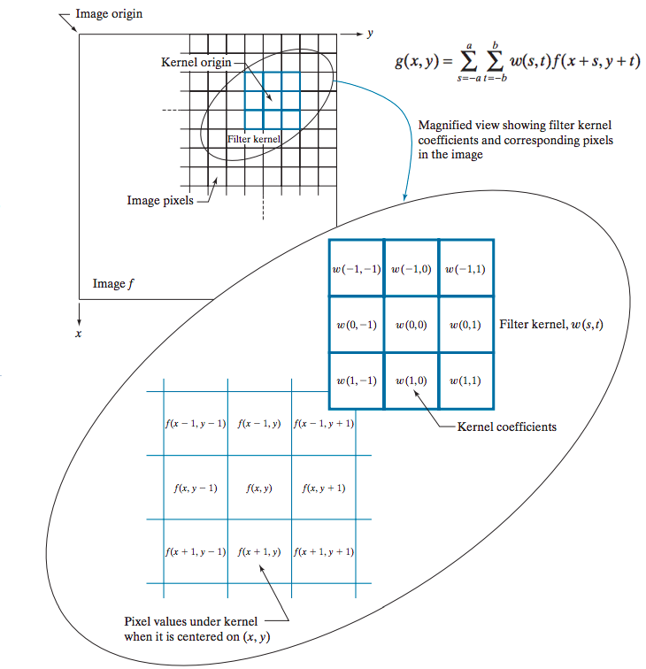
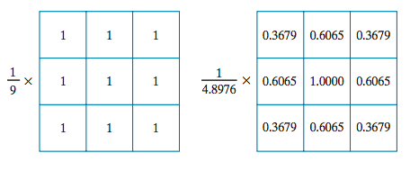
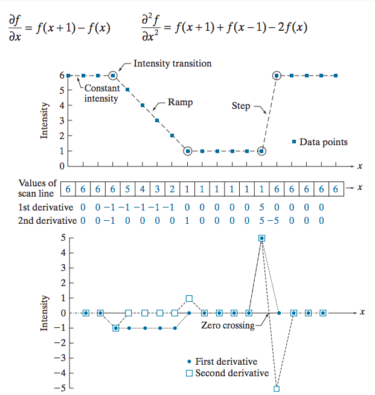
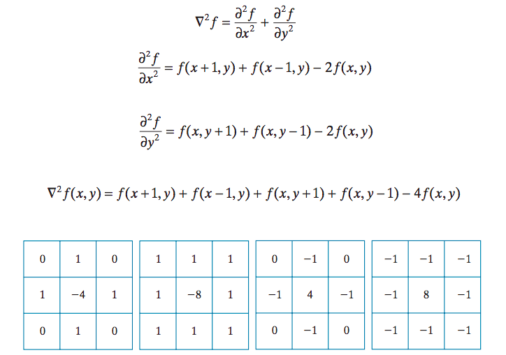

Computer Vision

===============================================================================================================

## Introduction

### Image Processing: Low-level, input: digital image, output: digital image; 

  - Noise reduction
  - Contrast enhancement
  - Image sharpening

### Image Analysis: Mid-level, input: images, output: attributes;

  - Image segmentation
  - Description of objects
  - Classification of objects

### Computer Vision: High-level, input: recognized objects, output: understanding, knowledge

  - "Making sense" of recognized objects
  - Cognitive functions

CV is about interpreting the content of images and videos

Imaging process:  image = f(world)

Computer vision: world = f-1(image)

> world, including lighting, camera location and parameters, ...

- Objects: Cat, chair, window, star, bush ...
- Properties: Big, bright, yellow, fast, moving ...
- Relations: In front, behind, on top, next to, larger, closer, identical ...
- Shapes: Round, rectangular, star-shaped, symmetric ...
- Textures: Rough, smooth, irregular ...
- Movement: Turning, looming, rolling ...

### What makes computer vision hard?

- Underspecified, ill-posed problem, e.g., 3D world projected onto 2D sensor(s)
- Environment, e.g., lighting, background, movement, camera
- Varying appearance of objects
- Calibration, FOV, camera control, image quality
- Computational complexity (speed of processing)

> Robustness is the primary challenge to computer vision!

## Image processing

> Genral 2D Image operations

- Point operation, some function of the pixel value, new_I_ij = f(I_ij), e.g., log, sqrt, threshold

- Local area operation, some function of the pixel values in the area surrounding the pixel, new_I_ij = f({I_(i+u)(j+v)}) where `-m<u<m` and `-n<v<n`, e.g., blur, low-pass, high-pass, gradient, center-surround

- Global operation, some function of the whole image, e.g., histogram, mean value, median value, 2^nd moment

> Linear filtering is an important class of local operators

- Convolution
- Correlation
- Fourier (and other) transforms
- Sampling and aliasing issues

### Spatial domain processing

g(x,y) = T[f(x,y)]

f(x,y): input image

g(x,y): output image

T: an operator on f defined over a neighborhood of point (x,y), such as elementwise sum of a sequence of images for noise reduction.

The smallest possible neighborhood is of size 1x1. g depends only on the value of f at a single point (x,y) and T becomes *intensity* (also called a *gray-level*, or *mapping*) *transformation* function

s = T(r)

s and r : the intensity of g and f at any point (x,y)

#### Histogram processing

The *unnormalized histogram* of f is defined as

h(r_k) = n_k for k = 0,1,2 ..., L-1

where n_k is the number of pixels in f with intensity r_k. The *normalized histogram* of f is defined as 

p(r_k) = h(r_k)/N = n_k/N, N = n_1 + n_2 + ... + n_L

The components of p(r_k) are estimates of the probabilities of intensity levels occuring in an image.

#### Histogram equalization

Almost **uniform** intesity value distribution and **no parameter**.

Let the variable r denote the intensities of an image to be processed, with r=0 representing black and r=L-1 representing white. the output intensity value, s.

s = T(r), 0<=r<=L-1

We assume that

(a) T(r) is a monotonic increasing function in the interval 0<=r<=L-1; and

(b) 0<=T(r)<=L-1 for 0<=r<=L-1

 
### Spatial filtering

*linear spatial filter*: the operation performed on the image pixels is linear. Otherwise, the filter is a *nonlinear spatial filter*.

#### Linear spatial filtering

A sum-of-products operation between an image f and a *filter kernel*, w, (or *mask*, *template* and *window*).

g(x,y) = w(-1,-1)f(x-1,y-1) + w(-1,0)f(x-1,y) + ... + w(0,0)f(x,y) + ... + w(1,1)f(x+1,y+1)

*Spatial correlation*, correlation consists of moving the center of a kernel over an image, and computing the sum of products at each location: 

The mechanics of *spatial convolution* are the same, except that the correlation kernel is rotated by 180 degree.

#### Smoothing spatial filters

box kernel and Gaussian kernel

#### Sharpening spatial filters

The first-order and second-order derivative:

The Laplacian kernel:

## 2D Image Analysis

- Segmentation
- Localization
- Shape analysis
- Classification & Categorization

### Segmentation

Partition images into meaningful entities, isolating a specific region of interest, group together similar-looking pixels for efficiency of further processing.

The problem is extremely hard

- Noise
- Sensing and lighting conditions
- Repetitive patterns
- Syntactic vs. semantic grouping
- Top down vs. bottom up approaches

Representation (syntactic level)

- Describe the shape (appearance) of edges and regions
- regions: size, location, orientation, etc.
- edges: curvature, orientation, length, etc.
- info can be extracted from images alone

Interpretation (semantic analysis)

- Describe the identity of image features
- Regions: sky, water body, etc.
- Edges: 3D orientation, occluding contours, road boundaries, etc.
- Often need domain specific knowledge and contextual information

#### Segmentation as clustering

Cluster similar pixels (features) together, e.g., k-means clustering based on intensity of color is essentially vector quantization of the image attributes.

Pros:

- Very simple method
- Converges to a local minimum of the error function

Cons:

- Memory-intensive
- Need to pick K
- Sensitive to initialization
- Sensitive to outliers
- Only finds "spherical" clusters

#### Images as graphs

> Segmentation by graph partitioning

- Node for every pixel
- Edge between every pair of pixels (or every pair of "sufficiently close" pixels)
- Each edge is weighted by the affinity or similarity of the two nodes
- Break Graph into segments
  - Delete links that cross between segments
  - Easiest to break links that have low affinity, similar pixels should be in the same segments and dissimilar pixels should be in different segments.

### Object detection and recognition

> Detection, recognition, and classification

- Detection = 2-class classification problem
  - Object/class or not object/class
  - E.g., detect all the faces in this image

- Recognition of identity = within-class classification problem
  - Within a given class of objects (e.g., faces, logos), identify the object as one particular member of class (e.g., Joe's face, Nike logo)

- Recognition of class = among-class classification
  - Which class of things is this: sky, cloud, forest, face, ...

Approaches to detection and classification:

- Modeling the object(s) ("training")
- Preprocessing the image (computing features, shape, ...)
- Classify based on a comparison or match between model and image data

## References

- [CS/ECE 281B Computer Vision and Image Analysis](https://sites.cs.ucsb.edu/~yfwang/courses/cs281b/)
- [Computer Vision CS 678](http://pages.cs.wisc.edu/~gdguo/courses/cv.html)
- [bilibili](https://www.bilibili.com/video/BV1ME411G7b3?from=search&seid=8111633998458619818)