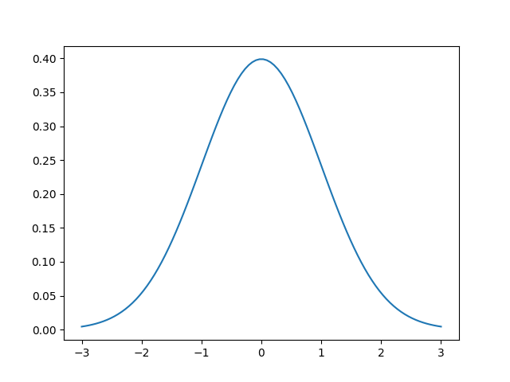
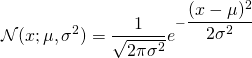
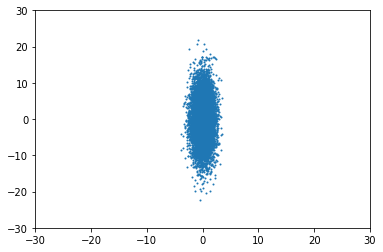
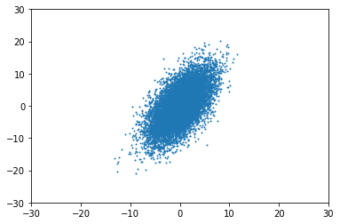
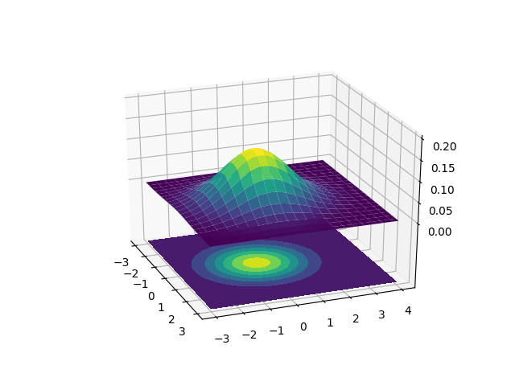
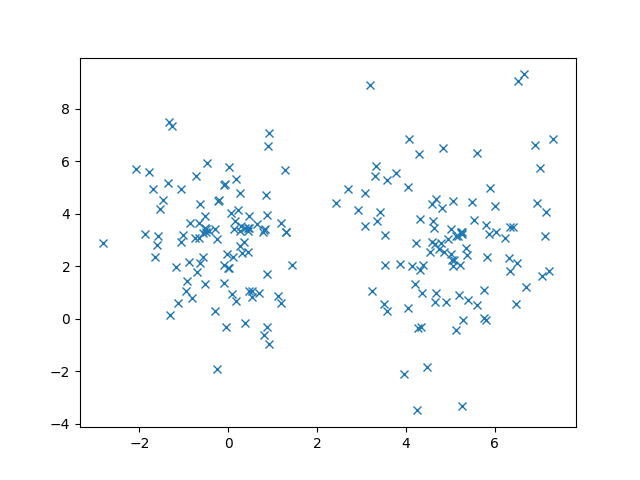
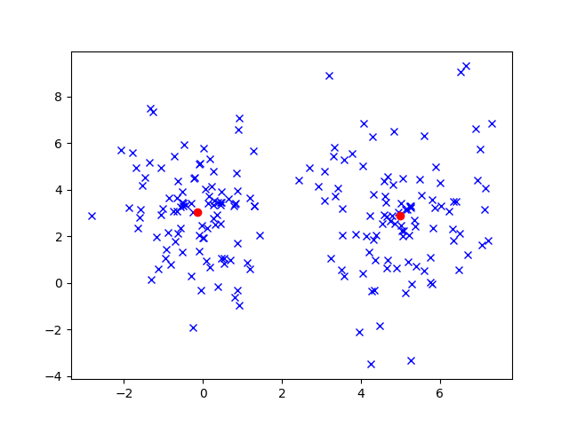
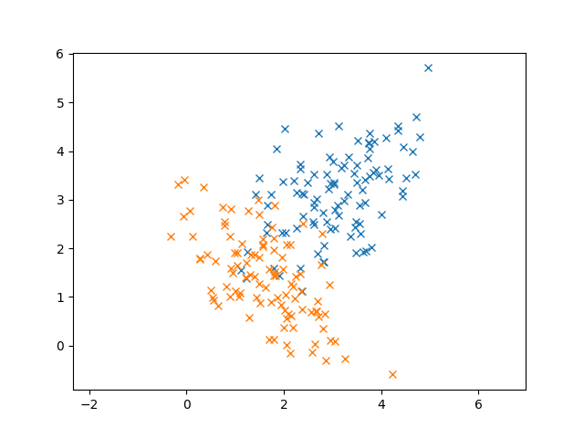
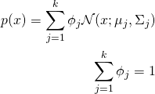

Gaussian Mixture Models


### Gaussian Distribution



The function that describes the normal distribution is the following:



There are one input and two parameters. First, let’s discuss the parameters and how they change the Gaussian. Then we can discuss what the input means.

The two parameters are called the mean \mu and standard deviation \sigma. The mean of the Gaussian simply shifts the center of the Gaussian, i.e., the “bump” or top of the bell. The standard deviation is a measure of the spread of the Gaussian. It affects the “wideness” of the bell. Using a larger standard deviation means that the data are more spread out, rather than closer to the mean.

What about the input? More specifically, the above function is called the probability density function (pdf) and it tells us the probability of observing an input x, given that specific normal distribution. Since this is a probability distribution, the sum of all of the values under the bell curve, i.e., the integral, is equal to 1.

Why are we using the Gaussian distribution? The Expectation-Maximization algorithm is actually more broad than just the normal distribution, but what makes Gaussians so special? It turns out that many dataset distributions are actually Gaussian! We find these Gaussians in nature, mathematics, physics, biology, and just about every other field! They are ubiquitous! There is a famous theorem in statistics called the **Central Limit Theorem** that states that as we collect more and more samples from a dataset, they tend to resemble a Gaussian, even if the original dataset distribution is not Gaussian! This makes Gaussian very powerful and versatile!


### Isotropic Gaussian

An isotropic gaussian is one where the covariance matrix is represented by the simplified matrix Σ=σ2I.

Consider the traditional gaussian distribution:  N(μ,Σ),  where μ is the mean and Σ is the covariance matrix.

Consider how the number of free parameters in this Gaussian grows as the number of dimensions grows.

μ will have a linear growth. Σ will have a quadratic growth!

This quadratic growth can be very computationally expensive, so Σ is often restricted as Σ=σ2I where σ2I is a scalar variance multiplied by an identity matrix.

Note that this results in Σ where all dimensions are independent and where the variance of each dimension is the same. So the gaussian will be circular/spherical.

Therefore, an isotropic gaussian distribution means a multidimensional gaussian distribution with its variance matrix as an identity matrix multiplied by the same number on its diagonal. Each dimension can be seen as an independent one-dimension gaussian distribution (no covariance exists).

When the variables are independent, i.e. the distrubtion is **isotropic**, it means that the distribution is aligned with the axis.

For example, for Σ=matrix([1,0],[0,30]), you'd get something like this:



So, what happens when it is not isotropic? For example, when Σ=matrxi([1, 15], [15, 30]), the distribution appears "rotated", no longer aligned with the axes:




### Multivariate Gaussians

We’ve only discussed Gaussians in 1D, i.e., with a single input. But they can easily be extended to any number of dimensions. For Gaussian Mixture Models, in particular, we’ll use 2D Gaussians, meaning that our input is now a vector instead of a scalar. This also changes our parameters: the mean is now a vector as well! The mean represents the center of our data so it must have the same dimensionality as the input.

The variance changes less intuitively into a covariance matrix \Sigma. The covariance matrix, in addition to telling us the variance of each dimension, also tells us the relationship between the inputs.

Multivariate normal distribution: [http://en.wikipedia.org/wiki/Multivariate_normal_distribution](http://en.wikipedia.org/wiki/Multivariate_normal_distribution).



The above chart has two different ways to represent the 2D Gaussian. The upper plot is a **surface plot** that shows this our 2D Gaussian in 3D. The X and Y axes are the two inputs and the Z axis represents the probability. The lower plot is a **contour plot**. The lighter the color, the larger the probability.  The Gaussian contours resemble ellipses so our Gaussian Mixture Model will look like it’s fitting ellipses around our data. Since the surface plot can get a little difficult to visualize on top of data, we’ll be sticking to the contour plots.

### Gaussian Mixture Models

Let’s discuss to Gaussian Mixture Models (GMMs)! To motivate our discussion, let’s see some example data that we want to cluster.



We could certainly cluster these data using an algorithm like K-Means to get the following results.



In this case, K-Means works out pretty well. But let’s consider another case where we have overlap in our data. (The two Gaussians are colored differently)



In this case, it’s pretty clear that these data are generated from Gaussians from the elliptical shape of the 2D Gaussian. In fact, we know that these data follow the normal distribution so using K-Means doesn’t seem to take advantage of that fact.  Even though I didn’t tell you our data were normally distributed, remember that the **Central Limit Theorem** says that enough random samples from any distribution will look like the normal distribution.

Additionally, K-Means doesn’t take into account the covariance of our data. For example, the blue points seem to have a relationship between X and Y: larger X values tend to produce larger Y values.

Since we know these data are Gaussian, why not try to fit Gaussians to them instead of a single cluster center? The idea behind **Gaussian Mixture Models** is to find the parameters of the Gaussians that best explain our data.

This is what we call **generative modeling**. We are assuming that these data are Gaussian and we want to find parameters that maximize the likelihood of observing these data. In other words, we regard each point as being generated by a **mixture of Gaussians** and can compute that probability.



The first equation tells us that a particular data point x is a linear combination of the k Gaussians. We weight each Gaussian with \phi_j, which represents the strength of that Gaussian. The second equation is a constraint on the weights: they all have to sum up to 1. We have three different parameters that we need to write update: the weights for each Gaussian \phi_j, the means of the Gaussians \mu_j, and the covariances of each Gaussian \Sigma_j.

If we try to directly solve for these, it turns out that we can actually find closed-forms! But there is one huge catch: we have to know the \phi_j‘s! In other words, if we knew exactly which combination of Gaussians a particular point was taken from, then we could easily figure out the means and covariances! But this one critical flaw prevents us from solving GMMs using this direct technique. Instead, we have to come up with a better approach to estimate the weights, means, covariances.


> Definitions

A *Gaussian Mixture* is a function that is comprised of several Gaussians, each identified by k ∈ {1,…, K}, where K is the number of clusters of our dataset. Each Gaussian k in the mixture is comprised of the following parameters:

- A mean μ that defines its centre.
- A covariance Σ that defines its width. This would be equivalent to the dimensions of an ellipsoid in a multivariate scenario.
- A mixing probability π that defines how big or small the Gaussian function will be.

Let us now illustrate these parameters graphically:


Here, we can see that there are three Gaussian functions, hence K = 3. Each Gaussian explains the data contained in each of the three clusters available. The mixing coefficients are themselves probabilities and must meet sum up to 1.

Now how do we determine the optimal values for these parameters? To achieve this we must ensure that **each Gaussian fits the data points belonging to each cluster**. This is exactly what maximum likelihood does.

In general, the Gaussian density function is given by:


Where x represents our data points, D is the number of dimensions of each data point. μ and Σ are the mean and covariance, respectively. If we have a dataset comprised of N = 1000 three-dimensional points (D = 4), then x will be a 1000 × 4 matrix. μ will be a 1 × 4 vector, and Σ will be a 4 × 4 matrix. The result of Gaussian density function will be a 1000 x 1000 matrix. For later purposes, we will also find it useful to take the log of this equation.


```python
# Reference
#     https://stackoverflow.com/questions/11615664/multivariate-normal-density-in-python
import numpy as np
import math
# covariance matrix
sigma = np.matrix([[2.3, 0, 0, 0],
           [0, 1.5, 0, 0],
           [0, 0, 1.7, 0],
           [0, 0,   0, 2]
          ])
# mean vector
mu = np.array([2,3,8,10])

# input
x = np.array([2.1,3.5,8, 9.5])

def norm_pdf_multivariate(x, mu, sigma):
    size = len(x)
    if size == len(mu) and (size, size) == sigma.shape:
        det = np.linalg.det(sigma)
        if det == 0:
            raise NameError("The covariance matrix can't be singular")

        norm_const = 1.0/ ( math.pow((2*math.pi),float(size)/2) * math.pow(det,1.0/2) )
        x_mu = np.matrix(x - mu)
        inv = sigma.I        
        result = math.exp(-0.5 * (x_mu * inv * x_mu.T))
        return norm_const * result
    else:
        raise NameError("The dimensions of the input don't match")

print(norm_pdf_multivariate(x, mu, sigma))
```

If we derive this equation with respect to the mean and covariance and then equal it to zero, then we will be able to find the optimal values for these parameters, and the solutions will correspond to the Maximum Likelihood Estimates (MLE) for this setting. However, because we are dealing with not just one, but many Gaussians, things will get a bit complicated when time comes for us to find the parameters for the whole mixture. 


### Expectation-Maximization

There are two steps in this algorithm as you might think: expectation and maximization. To explain these steps, I’m going to cover how the algorithm works at a high level.

The first part is the *expectation step*. In this step, we have to compute the probability that each data point was generated by each of the k Gaussians. In contrast to the K-Means **hard assignments**, these are called **soft assignments** since we’re using probabilities. Note that we’re not assigning each point to a Gaussian, we’re simply determining the probability of a particular Gaussian generating a particular point.

The second part is the *maximization step*. In this step, we need to update our weights, means, and covariances. Recall in K-Means, we simply took the mean of the set of points assigned to a cluster to be the new mean. We’re going to do something similar here, except apply our expectations that we computed in the previous step.

To summarize, Gaussian Mixture Models are a clustering technique that allows us to fit multivariate Gaussian distributions to our data. These GMMs well when our data is actually Gaussian or we suspect it to be. We also discussed the famous expectation-maximization algorithm, at a high level, to see how we can iteratively solve for the parameters of the Gaussians. 

## Reference

- [Clustering with Gaussian Mixture Models](https://pythonmachinelearning.pro/clustering-with-gaussian-mixture-models/)
- [Gaussian Mixture Models Explained](https://towardsdatascience.com/gaussian-mixture-models-explained-6986aaf5a95)
- [Gaussian distribution is isotropic?](https://math.stackexchange.com/questions/1991961/gaussian-distribution-is-isotropic)