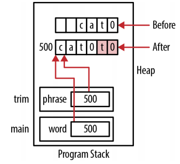
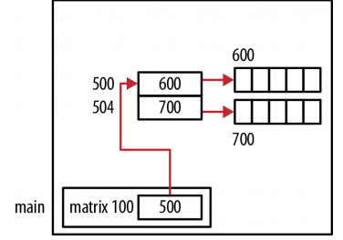

# Pointers and arrays

An array is contiguous collection of homogeneous elements that can be accessed using an index. Arrays have a fixed size. The realloc function and variable length arrays provide techniques for dealing with arrays whose size needs to change.

One-Dimensional arrays: the internal representation of an array has no information about the number of elements it contains. The array name simply references a block of memory.To determine the number os elements:
```c
int arr[5];
printf("%d\n", sizeof(arr)/sizeof(int));
```

Two-Dimensional arrays use rows and columns to identify array elements. This type of array needs to be mapped to the one-dimension address space of main memory. The array's first row is placed in memory followed by the second row, then the third row, and this orderding continues until the last row is placed in memory.

A two-dimensional array is treated as an array of arrays. That is, when we access the array using only one subscript, we get a pointer to the corresponding row.

## Pointer notation and arrays

We can use pointers with existing arrays or to allocate memory from the heap and then treat the memory as if it were an array.
```c
int arr[5] = {1, 2, 3, 4, 5};
int *pv = arr; //point to the first element of the array

//the first element: either the array name by itself or use the address-of operator
printf("%p\n",vector);
printf("%p\n",&vector[0]);

//this new address is then dereferenced to return its contents
*(pv + i);  //equivalent with *(arr + i)
```

When we add 1 to the array address we effectively add 4, the size of an integer, to be address since this is an array of integers.

Array notation can be thought of as a "shift and dereference" operation. The expression arr[2] means start with *arr*, which is a pointer to the beginning of the array, shift two positions to the right, and then dereference that location to fetch its value.

Using the address-of operator in conjunction with array notation, as in *&arr[2]*, essentially cancels out the dereferencing. It can be interpreted as go left two positions and then return that address.
```c
pv = arr;
int value = 3;
for(int i=0; i<5; i++) {
  *pv++ *= value;  //takes a value and multiplies it against each element of arr
}
```

**Differences between arrays and pointers**
```c
int arr[5] = {1, 2, 3, 4, 5};
int *pv = arr;
```

1. The notation *arr[i]* generates machine code that starts at location *arr*, *moves i* positions from this location, and uses its content. The notation *arr+i* generates machine code that starts at location *arr*, *adds i* to the address, and then uses the contents at that address.

2. Applying the *sizeof* operator to *arr* will return 20, the number of bytes allocated to the array. Applying the *sizeof* operator against *pv* will return 4, the pointer's size.

3. The pointer *pv* is an *lvalue*. An *lvalue* denotes the term used on the lefthand side of an assignment operator. An *lvalue* must be capable of being modified. An array name such as *arr* is not an *lvalue* and cannot be modified.
```c
pv = pv + 1;
arr = arr + 1;  //syntax error
```

### Using realloc function to resize an Array

The C99 supports variable length arrays, which may prover to be a better solution than using the *realloc* function in some situations. Variable length arrays can only be declared as a member of a function. If the array is needed longer than the function's duration, then *realloc* will need to be used.

To illustrate the *realloc* function, we will implement a function to read in characters from standard input and assign them to a buffer. The buffer will contain all of the characters read in except for a terminating return character. Since we do not know how many characters the user will input, we do not know hoe long the buffer should be. We will use the *realloc* function to allocate additional space by a fixed increment amount.
```c
char* getLine(void) {
  //the size of the initial buffer and the amount it will be incremented by
  const size_t sizeIncrement = 10;

  //a pointer to the characters read in
  char* buffer = malloc(sizeIncrement);

  //a pointer to the next free position in the buffer
  char* currentPosition = buffer;

  //the maximum number of the characters that can be safely stored in the buffer
  size_t maximumLength = sizeIncrement;

  //the number of characters read in
  size_t length = 0;

  //the last character read in
  int character;

  //if the malloc function is unable to allocate memory
  if(currentPosition == NULL) { return NULL; }
  while(1) {
    character = fgetc(stdin);
    if(character == '\n') { break; }

    //whether we have execeeded the buffer's size
    if(++length >= maximumLength) {
      //create a new block of memory
      char *newBuffer = realloc(buffer, maximumLength += sizeIncrement);

      //if it is unable to allocate memory, free up and return NULL
      if(newBuffer == NULL) {
        free(buffer);
        return NULL;
      }
      //point to the right position within the new buffer
      currentPosition = newBuffer + (currentPosition - buffer);

      //assign the variable buffer to point to the newly allocated buffer
      buffer = newBuffer;

      //we did not free buffer if realloc was successful because realloc will copy
      //the original buffer to the new buffer and free up the old one
    }
    //the character is added to the current position within the buffer
    *currentPosition++ = character;
  }
  *currentPosition = '\0';
  return buffer;
}
```

The realloc function can also be used to decrease the amount of space used by a pointer.
```c
char* trim(char* phrase) {
  char* old = phrase;
  char* new = phrase;

  //use the tmp variable to skip over any leading blanks
  while(*old == ' ') {
    old++;
  }

  //copy the remaining characters in the string to the beginning of the string
  while(*old) {  //it will evaluate to true until NUL is reached
    *(new++) = *(old++);
  }
  //a zero is then added to terminate the string
  *new = 0;

  //reallocate the memory based on the string's new length
  return (char*) realloc(phrase,strlen(phrase)+1);
}

int main() {
  char* buffer = (char*)malloc(strlen(" cat")+1);
  strcpy(buffer," cat");
  printf("%s\n",trim(buffer));
}
```



The memory in red is the old memory and should not be accessed.

### Passing a One-Dimensional array

When a one-dimensional array is passed to a function, the array's address is passed by value. This makes the transfer of information more efficient since we are not passing the entire array and having to allocate memory in the stack for it. Normally, this means the array's size must be passed.

In the case of a string stored in an array, we can rely on the NUL termination character to tell us when we can stop processing the array. Generally, if we do not know the array's size, we are unable to process its elements and can wind up working with too few elements or treating memory outside of the array as if it were part of the array.

```c
//pointer notation to declare and array notation in function's body
void displayArray(int* arr, int size) {
  for (int i = 0; i < size; i++) {
    printf("%d\n", arr[i]);
  }
}

//pointer notation to declare and pointer notation in function's body
void displayArray(int* arr, int size) {
  for (int i = 0; i < size; i++) {
    printf("%d\n", *(arr+i));
  }
}

//array notation to declare and pointer notation in funtion's body
void displayArray(int arr[], int size) {
  for (int i = 0; i < size; i++) {
    printf("%d\n", *(arr+i));
  }
}
```

### One-Dimensional array of pointers

This following example declares an array of integer pointers, allocates memory for each element, and initializes this memory to the array's index:
```c
int* arr[5];
for(int i=0; i<5; i++) {
  arr[i] = (int*)malloc(sizeof(int));
  *arr[i] = i;
}
```

If this array was displayed, the numbers 0 through 4 would be printed. We used `arr[i]` to reference the pointer and `*arr[i]` to assign a value to the location referenced by the pointer. Do not let the use of array notation confuse you. Since `arr` was declared as an array of pointers, `arr[i]` returns an address. When we dereference a pointer such as `*arr[i]`, we get the contents at that address.

We could have used the following equivalent pointer notation for the loop's body:
```c
*(arr+i) = (int*)malloc(sizeof(int));
**(arr+i) = i;
```

The subexpression `(arr+i)` represents the address of the array's ith element. We need to modify the content of this address so we use the subexpression `*(arr+i)`. The allocated memory is assigned to this location in the first statement. Dereferencing this subexpression a second time, as we do in the second statement, return the allocated memory's location.

For example, `arr[1]` is located at address 104. The expression `(arr+1)` will give us 104. Using `*(arr+1)` gives us its content. In this example, it is the pointer 504. Dereferencing this a second time using `**(arr+1)` gives us the contents of 504, which is a 1.


### Pointers and multidimensional arrays

For example:
```c
int matrix[2][5] = {{1,2,3,4,5},{6,7,8,9,10}};

for(int i=0; i<2; i++) {
  for(int j=0; j<5; j++) {
    printf("matrix[%d][%d] Address: %p Value: %d\n",
            i, j, &matrix[i][j], matrix[i][j]);
  }
}
```

The output follows:
```
matrix[0][0] Address: 100 Value: 1
matrix[0][1] Address: 104 Value: 2
matrix[0][2] Address: 108 Value: 3
matrix[0][3] Address: 112 Value: 4
matrix[0][4] Address: 116 Value: 5
matrix[1][0] Address: 120 Value: 6
matrix[1][1] Address: 124 Value: 7
matrix[1][2] Address: 128 Value: 8
matrix[1][3] Address: 132 Value: 9
matrix[1][4] Address: 136 Value: 10
```

We can declare a pointer for use with this array as follows:
```c
int (*pmatrix)[5] = matrix;
printf("%p\n", matrix);      //100
printf("%p\n", matrix + 1);  //120
```

The expression, `(*pmatrix)`, declares a pointer to an array. *pmatrix* is defined as a pointer to a two-dimensional array of integers with five elements per column. If we had left the parentheses off, we would have declared a five-element array of pointers to integers. The size of the first dimension is 2 since we know the dimensions of the *matrix*.

The address returned by *matrix+1* is not offset by 4 from the beginning of the array, it is 20 bytes, a row's size. Using *matrix* by itself returns the address of the array's first element. Since a two-dimensional array is an array of arrays, we get the address of a five-element integer array. Its size is 20. We can verify this with:
```c
printf("%lu\n",sizeof(matrix[0])); // Displays 20
```

To access the array's second element, we need to add 1 to the first row of the array as follow: `*(matrix[0]+1)`. The expression, `matrix[0]`, returns the address of the first element of the first row of the array.
```c
printf("%p %d\n", matrix[0] + 1, *(matrix[0] + 1)); // 104  2

//matrix[0]  --->  1 2 3 4 5
//matrix[1]  --->  6 7 8 9 10
```

### Passing a two-dimensional array

To pass the matrix array, use either:
```c
void display2DArray(int arr[][5], int rows)
//arr[] is an implicit declaration of a pointer
//or:
void display2DArray(int (*arr)[5], int rows)
//(*arr) is an explicit declaration of the pointer

int matrix[2][5] = { {1,2,3,4,5}, {6,7,8,9,10}};
```

In both versions the number of columens is specified. This is needed because the compiler needs to know the number of elements in each row.

This function pass a single pointer and the number of rows and columns:
```c
void display2DArrayUnknownSize(int *arr, int rows, int cols) {
  for(int i=0; i<rows; i++) {
    for(int j=0; j<cols; j++) {
      printf("%d ", *(arr + (i*cols) + j));
      // or: printf("%d ", (arr+i)[j]);
    }
    printf("\n");
  }
}
```

### Dynamically allocating a two-dimensional array

About dynamically allocating memory for a two-dimensional array:
- Whether the array elements need to be contiguous
- Whether the array is jagges

Since a two-dimensional array can be treated as an array of arrays, there is no reason the "inner" arrays need to be contiguous.

Allocating potentially noncontiguous memory:
```c
int rows = 2;
int columns = 5;

int **matrix = (int **) malloc(rows * sizeof(int *));

for (int i = 0; i < rows; i++) {
  matrix[i] = (int *) malloc(columns * sizeof(int));
}
```



The actual allocation depends on the heap manager and the heap's state. It may well be contiguous.

Allocating contiguous memory (1):
```c
//allocates the "outer" array first and then all of the memory for the rows
int rows = 2;
int columns = 5;

//the first malloc allocates an array of pointers to integers
//each element will be used to hold a pointer to a row
int **matrix = (int **) malloc(rows * sizeof(int *));

//the second malloc allocates memory for all of the elements of the array
//at location 600
matrix[0] = (int *) malloc(rows * columns * sizeof(int));

//each element of the first array is assigned a portion of the memory
//allocated by the second malloc
for (int i = 1; i < rows; i++)
  matrix[i] = matrix[0] + i * columns;
```


Allocating contiguous memory (2):
```c
int *matrix = (int *)malloc(rows * columns * sizeof(int));

//when the array is referenced, indexes need to be calculated manually
for (int i = 0; i < rows; i++) {
  for (int j = 0; j < columns; j++) {
    *(matrix + (i*columns) + j) = i*j;
  }
}
```

This approach has limited use in the real world, but it does illustrate the relationship between the concept of a two-dimensional array and the one-dimensional nature of main memory.


## Reference

* Reese, Richard. Understanding and Using C pointers. " O'Reilly Media, Inc.", 2013.
