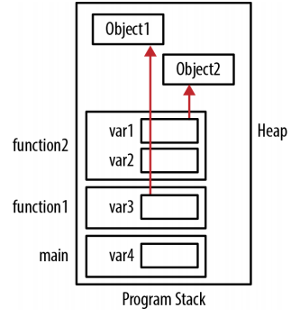
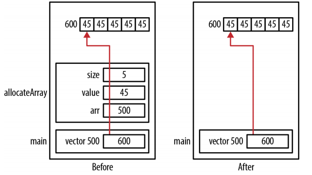
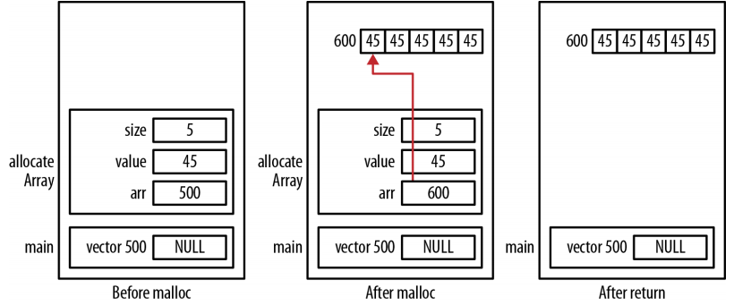

# Pointers and Functions

When pointers hold the address of a function, they provides a means to dynamically control a program's execution flow.

## Program stack and heap

Local variables are also called automatic variables. They are always allocated to a stack frame.

For example:
```c
void function2() {
 Object *var1 = ...;
 int var2;
 printf("Program Stack Example\n");
}
void function1() {
 Object *var3 = ...;
 function2();
}
int main() {
 int var4;
 function1();
}
```



Image Source:Reese, Richard. Understanding and Using C pointers. " O'Reilly Media, Inc.", 2013.

As functions are called, their stack frames are pushed onto the stack and the stack grows "upward". When a function terminates, its stack frame is popped off the program stack. The memory used by the stack frame is not cleared and may eventually be overridden by another stack frame when it is pushed onto the program stack.

When memory is dynamically allocated, it comes from the heap, which tends to grow "downward". The heap will fragment as memory is allocated and then deallocated. Although the heap tends to grow downward, this is a general direction.Memory can be allocated from anywhere within the heap.

### Organization of a stack frame

A stack frame consists of several elements, including:
- Return address,  where the function is to return upon completion
- Storage for local data,  memory allocated for local variables
- Storage for parameters,  memory allocated for the function's parameters
- Stack and base pointers,  pointers used by the runtime system to manage the stack

A stack pointer usually points to the top of the stack. A stack base pointer (frame pointer) is often present and points to an address within the stack frame, such as the return address. This pointer assists in accessing the stack frame's elements. Neither of these pointers are C pointers. They are addresses used by the runtime system to manage the program stack. If the runtime system is implemented in C, then these pointers may be real C pointers.

### Passing and returning by pointer

Parameters, including pointers, are passed by value. That is, a copy of the argument is passed to the function. Passing a pointer to an argument can be efficient when dealing with large data structures.

One of the primary reasons for passing data using a pointer is to allow the function to modify the data.

Returning a pointer is easy to do. If we need to return an object from a function, the following two techniques are frequently used:
- Allocate memory within the function using malloc and return its address. The caller is responsible for deallocating the memory returned.
- Pass an object to the function where it is modified. This makes the allocation and deallocation of the object's memory the caller's responsiblility.

First, let's innustrate the use of malloc type functions to allocate the memory returned.
```c
int* allocateArray(int size, int value) {
 int* arr = (int*)malloc(size * sizeof(int));
 for(int i=0; i<size; i++) {
   arr[i] = value;
 }
 return arr;
}

//if this function is used like:
int* vector = allocateArray(5,45);
...
//Returning dynamically allocated memory from the function means the function's caller
//is responsible for deallocating it.
free(vector);
```

Also we can use passing NULL pointers:
```c
int* allocateArray(int *arr, int size, int value) {
 if(arr != NULL) {  //it is always good practice to verify it is not null before using
   for(int i=0; i<size; i++) {
     arr[i] = value;
   }
 }
 return arr;
}

//the function can be invoked as follows:
int* vector = (int*)malloc(5 * sizeof(int));
//if the pointer is NULL, then no action is performed and
//the program will execute without terminating abnormally
allocateArray(vector,5,45);
```

### Passing a pointer to a pointer

When a pointer is passed to a function, it is passed by value. If we want to modify the original pointer and not the copy of the pointer, we need to pass it as a pointer to a pointer.

In the following example, a pointer to an integer array is passed, which will be assigned memory and initialized. The function will return the allocated memory back through the first parameter. In the function, we first allocate memory and then initialize it. The address of this allocated memory is intended to be assigned to a pointer to an int. To modify this pointer in the calling function, we need to pass the pointer's address. Thus, the parameter is declared as a pointer to a pointer to an int.
```c
void allocateArray(int **arr, int size, int value) {
  *arr = (int*)malloc(size * sizeof(int));
  if(*arr != NULL) {
    for(int i=0; i<size; i++) {
      *(*arr+i) = value;
    }
  }
}

//the function can be tested using the following code
int *vector = NULL;
allocateArray(&vector,5,45);
```

The first parameter to allocateArray is passed as a pointer to a pointer to an integer. When we call the function, we need to pass a value of this type. This is done by passing the address of vector. The address returned by malloc is assigned to arr. Dereferencing a pointer to a pointer to an integer results in a pointer to an integer. Because this is the address of vector, we modify vector.

The memory allocation is illustrated in the following figure. The *Before* image shows the stack's state after malloc returns and the array is initialized. Likewise, the *After* image shows the stack's state after the function returns.



Image Source:Reese, Richard. Understanding and Using C pointers. " O'Reilly Media, Inc.", 2013.

The following version of the function illusrates why passing a simple pointer will not work:
```c
void allocateArray(int *arr, int size, int value) {
  arr = (int*)malloc(size * sizeof(int));
  if(arr != NULL) {
    for(int i=0; i<size; i++) {
      arr[i] = value;
    }
  }
}

//the following sequence illustrates using the function
int *vector = NULL;
allocateArray(&vector,5,45);
printf("%p\n",vector);
```

When the program is executed you will see 0x0 displayed because when *vector* is passed to the function, its value is copied into the parameter *arr*. Mofifying *arr* has no effect on *vector*. When the function returns, the value stored in *arr* is not copied to *vector*.



Image Source:Reese, Richard. Understanding and Using C pointers. " O'Reilly Media, Inc.", 2013.

The *Before malloc* image shows the state of memory just before *arr* is assigned a new value. It contains the value of 500, which was passed to it from *vector*. The *After malloc* image shows the state of memory after the *malloc* function was executed in the *allocateArray* function and the array was initialized. The variable *arr* has been modified to point to a new place in the heap. The *After return* image shows the program stack's state after the function returns. In addition, we have a memory leak because we have lost access to the block of memory at address 600.

### Writing your own free function

The following illustrates one way of implementating your own *free* function that assigns a NULL value to the pointer. It requires that we use a pointer to a pointer:
```c
void saferFree(void **pp) {
  if (pp != NULL && *pp != NULL) {
    free(*pp);
    *pp = NULL;
  }
}
```

The *saferFree* function calls the *free* function that actually deallocates the memory. Its parameter is declared as a pointer to a pointer to *void*. Using a pointer to a pointer allows us to modify the pointer passed. However, we get a warning if we do not explicitly cast the pointer type to void when we call the function.

The *safeFree* macro calls the *saferFree* function with this cast and uses the address-of operator, thus alleviating the need for a function's user to perform the cast and to pass the pointer's address.
```c
#define safeFree(p) saferFree((void**)&(p))
```

The next sequence illustrates the use of this macro:
```c
int main() {
 int *pi;
 pi = (int*) malloc(sizeof(int));
 *pi = 5;
 printf("Before: %p\n",pi);
 safeFree(pi);
 printf("After: %p\n",pi);
 safeFree(pi);
 return (EXIT_SUCCESS);
}
```

Assuming *malloc* returned memory from address 1000, the output of this sequence will be 1000 and then 0. The second use of the *safeFree* macro with a NULL value does not terminate the application, as the function detects and ignores it.

## Function pointers

A function pointer is a pointer that holds the address of a function. This provides us with another way of executing functions in an order that may not be known at compile time and without using conditional statements.

One concern regarding the use of function pointers is a potentially slower running program. The processor may not be able to use branch prediction in conjunction with pipelining. This slowdown may or may not be realized. The use of function pointers in situations such as table lookups can mitigate performance issues.

The syntax for declaring a pointer to a function:
```c
int* f1();    //returns a pointer to an integer
int (*f2)();  //a function pointer that returns an integer
```

For example:
```c
int (*fptr1)(int);
int square(int num) {
  return num*num;
}

int n = 5;
fptr1 = square;  //assign the square function's address to the function pointer
//fptr1 = &square;
//use the address-of operator is not necessary and is redundant
printf("%d squared is %d\n",n, fptr1(n));
```

We will demonstrate passing a function pointer using add, sub, and compute functions as declared below:
```c
int add(int num1, int num2) {
  return num1 + num2;
}
int subtract(int num1, int num2) {
  return num1 - num2;
}
typedef int (*fptrOperation)(int,int);

int compute(fptrOperation operation, int num1, int num2) {
  return operation(num1, num2);
}

// The add and sub function’s addresses were passed to the compute function.
// These addresses were then used to invoke the corresponding operation.
printf("%d\n",compute(add,5,3));
printf("%d\n",compute(sub,5,3));
```

## Reference

* Reese, Richard. Understanding and Using C pointers. " O'Reilly Media, Inc.", 2013.
