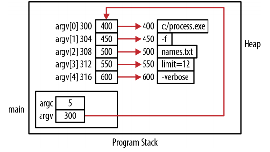

# Pointers and Strings

## String fundamentals

A string is a sequence of characters terminated with the ASCII NUL character. The ASCII character NUL is represented as *\0*. Strings are commonly stored in arrays or in memory allocated from the heap. However, not all arrays of characters are strings. An array of char may not contain the NUL character. Arrays of char have been used to represent smaller integer units, such as boolean, to conserve memory space in an application.

The length of a string is the number of charactes in the string, not include NUL character.

> Remember that NULL and NUL are different. NULL is used as a special pointer and is tpically defined as ((void*)0). NUL is a char and is defined as '\0'.

Character constants are character sequences enclosed in single quotes. Normally, they consist of a single character but can contain more than one character. In C, they are of type int.
```c
printf("%lu\n", sizeof(char));  //the size of char will be 1
printf("%lu\n", sizeof('a'));   //the character literal's size will be 4

char heaer[32];  //only use 31 elements for the actual string's text 
char *header;    //a pointer to a character
```

### The String Literal Pool

When literals are defined they are frequently assigned to a literal pool. This area of memory holds the character sequences making up a string. When a literal is used more than once, there is normally only a single copy of the string in the string literal pool. Since a literal is normally considered to be immutable, it does not hurt to have a single copy of it. Most compilers provide an option to turn off string pooling. When this happens, literals may be duplicated, each having their own address. e.g., GCC uses a -fwritable-stings option to turn off string pooling.


String literals are frequently allocated to read-only memory. This makes them immutable. It doesn't matter where a string literal is used or whether it is global, static, or local. In this sense, string literals do not have scope.

String Initialization:
```c
//initializing an array of char
char header[] = "Media Player";

//or
char header[13];
strcpy(header,"Media Player");

//initializing a pointer to a char
char *header = (char*) malloc(strlen("Media Player")+1); 
//add one for the NUL terminator
//strlen funtion determines the length of an existing string
//sizeof returns the size of an array or pointer, not the length of the string
strcpy(header,"Media Player");

//instead of using a string literal and strcpy function
*(header + 0) = 'M';
*(header + 1) = 'e';
...
*(header + 12) = '\0';
```

Attempting to initialize a pointer to a char with a character literal will not work. Since a character literal is of type int, we would be trying to assign an integer to a character pointer. A valid approach using the malloc function follows:
```c
//char* prefix = '+'; //illegal
prefix = (char*)malloc(2);
*prefix = '+';
*(prefix+1) = 0;
```

Strings can be allocated in several potential locations. For example:
```c
char* globalHeader = "Chapter";
char globalArrayHeader[] = "Chapter";

void displayHeader() {
	static char* staticHeader = "Chapter";
	char* localHeader = "Chapter";
	static char staticArrayHeader[] = "Chapter";
	char localArrayHeader[] = "Chapter";
	char* heapHeader = (char*)malloc(strlen("Chapter")+1);
	strcpy(heapHeader,"Chapter");
}
```

A string's location determines how long it will persist and which parts of an application can access it. For example, string allocated to global memory will always be available and are accessible by multiple functions. Static strings will always be available but are accessible only to their defining function. Strings allocated to the heap will persist until they are released and may be used in multiple functions.


### Standard string operations

The standard way to compare strings is to use the strcmp function. Its prototype follows: `int strcmp(const char *s1, const char *s2)`. For example:
```c
char command[16];
printf("Enter a Command: ");
scanf("%s", command);
if (strcmp(command, "Quit") == 0) {
  ...
```

Copying stringsis a common operation and is normally accomplished using the strcpy function: `char* strcpy(char *s1, const char *s2)`. For example:
```c
char name[32];
char *names[30];
size_t count = 0;

printf("Enter a name: ");
scanf("%s",name);   //read in the string using a large array of char
names[count] = (char*)malloc(strlen(name)+1);  // allocate memory
strcpy(names[count],name);  //copy the string into dynamically allocated memory
count++;
```

Two pointers can reference the same string. When two pointers reference the same location, this is called *aliasing*. The assignment of one pointer to another does not result in string being copied, instead, string's address being copied.
```c
char *pageHeaders[300];

pageHeaders[12] = "Amorphous Compounds";   //point to address 600
pageHeaders[13] = pageHeaders[12];   //the pointer is copied, not the string, 600
```

String concatenation involves the merging of two strings. `char *strcat(char *s1, const char *s2)`. This function takes pointers to the two strings to be concatenated and returns a pointer to the concatenated results.

The function does not allocate memory. This means the first string must be large enough to hold the concatenated results or it may write past the end of the string, resulting in unpredicatable behavior. The return value of the fuction is the same address as its first argument.

Concatenating strings is using a character literal:
```c
char* path = "C:";
//we need space for the extra character and the NUL character
char* currentPath = (char*) malloc(strlen(path)+2);
currentPath = strcat(currentPath,"\\");
```

### Passing strings

Using a function that mimics the *strlen* function as implemented below:
```c
size_t stringLength(char* string) {
  size_t length = 0;
  while(*(string++)) {
  length++;
  }
  return length;
}

char simpleArray[] = "simple string";
char *simplePtr = (char*)malloc(strlen("simple string")+1);
strcpy(simplePtr, "simple string");

//use the array's name, this will return its address
printf("%d\n",stringLength(simpleArray));
//the address-of operator is used explicitly, this is unnecessary, warning!
printf("%d\n",stringLength(&simpleArray));
//the address-of operator with the first element, it works, but somewhat verbose
printf("%d\n",stringLength(&simpleArray[0]));
```


Passing a pointer to a string as a constant char is a very common and useful technique. It passes the string using a pointer, and at the same time prevents the string being passed from being modified.

Passing the function an empty buffer to be filled and returned by the function:
```c
char* format(char *buffer, size_t size,
             const char* name, size_t quantity, size_t weight) {

  //a simple way of formatting the string
  //this function writes to the buffer provided by the first parameter
  //the second argument spefifies the buffer's size
  snprintf(buffer, size, "Item: %s Quantity: %u Weight: %u",
           name, quantity, weight);
  return buffer;
}

//by returning a pointer to buffer, we are able to use the function 
//as a parameter of the printf function
printf("%s\n",format(buffer,sizeof(buffer),"Axle",25,45));
//output: Item: Axle Quantity: 25 Weight: 45
```

An alternative to this approach is to pass NULL as the buffer's address. This implies the caller does not want to provide the buffer or is unsure how large the buffer should be.
```c
char* format(char *buffer, size_t size,
             const char* name, size_t quantity, size_t weight) {
  char *formatString = "Item: %s Quantity: %u Weight: %u";
  size_t formatStringLength = strlen(formatString)-6;
  size_t nameLength = strlen(name);
  //10+10 represents the largest width for the quantity and weight
  size_t length = formatStringLength + nameLength +
                  10 + 10 + 1;

  //the caller is now responsible for freeing the memeory allocated
  if(buffer == NULL) {
    buffer = (char*)malloc(length);
    size = length;
  }
  snprintf(buffer, size, formatString, name, quantity, weight);
  return buffer;
}
```

C supports command line arguments using the traditionally named *argc* and *argv* parameters. The first parameter, *argc*, is an integer that indicates how many parameters are passed. At least one parameter is always passed, the name of the *executable*. The second parameter, argv, is normally viewed as a one-fimensional array of string pointers.

```c
// char** argv is equivalent to char* argv[]
int main(int argc, char** argv) {
  for(int i=0; i<argc; i++) {
    printf("argv[%d] %s\n",i,argv[i]);
  }
  return 0;
}
```

The program is executed with the following:
```
$ ./a.out -f names.txt limit=12 -verbose
argv[0] ./a.out
argv[1] -f
argv[2] names.txt
argv[3] limit=12
argv[4] -verbose
```

The memory allocated for the program is illustrated:



### Returning strings

When a function returns a string, it returns the address of the string. The main concern is to return a valid string address. To do this, we can return a reference to either:
- A literal
- Dynamically allocated memory
- A local string variable

An example of returning a literal is shown below:
```c
char* returnALiteral(int code) {
  switch(code) {
    case 100:
      return "Boston";
    case 200:
      return "Denver";
    case 300:
      return "Atlanta";
  }
}
```

An example of returning the address of dynamically allocated memory:
```c
char* blanks(int number) {
  char* spaces = (char*) malloc(number + 1);
  int i;
  for (i = 0; i<number; i++) {
    spaces[i] = ' ';
  }
  spaces[number] = '\0';
  return spaces;
}

//it is the caller's responsibility to deallocate the memory returned
char *tmp = blanks(5);
printf("[%s]\n",tmp);
free(tmp);
```


An example of returning the address of a local string:
```c
#define MAX_TAB_LENGTH 32
char* blanks(int number) {
  //an array is declared within the function and will be located in a stack frame
  char spaces[MAX_TAB_LENGTH];
  int i;
  for (i = 0; i < number && i < MAX_TAB_LENGTH; i++) {
    spaces[i] = ' ';
  }
  spaces[i] = '\0';
  return spaces;  //the function returns the array's address
}
```

When the function executes it will return the string's address, but that memory area will subsequently be overwritten by the next function called. When this pointer is dereferenced, the contents of this memory location may have been changed.

### Function pointers and strings

Function pointers can be a flexible means of controlling how a program executes. We will demonstrate this capability by passing a comparison function to a sort function. For example:
```c
int compare(const char* s1, const char* s2) {
  return strcmp(s1,s2);
}
//convert the strings to lower case before it uses the strcmp
int compareIgnoreCase(const char* s1, const char* s2) {
  char* t1 = stringToLower(s1);
  char* t2 = stringToLower(s2);
  int result = strcmp(t1, t2);
  free(t1);
  free(t2);
  return result;
}
//it returns a lowercase equivalent of the string
char* stringToLower(const char* string) {
  char *tmp = (char*) malloc(strlen(string) + 1);
  char *start = tmp;
  while (*string != 0) {
    *tmp++ = tolower(*string++);
  }
  *tmp = 0;
  return start;
}
```

The function pointer to be used is declared using a type definition:
```c
typedef int (fptrOperation)(const char*, const char*);
```

The following sort function's implementation is based on the bubble sort algorithm. It is passed the array's address, its size, and a pointer to the function controlling the sort.
```c
void sort(char *array[], int size, fptrOperation operation) {
  int swap = 1;
  while(swap) {
    swap = 0;
    for(int i=0; i<size-1; i++) {
      if(operation(array[i],array[i+1]) > 0){
        swap = 1;
        char *tmp = array[i];
        array[i] = array[i+1];
        array[i+1] = tmp;
      }
    }
  }
}

//a display function will show the array's contents:
void displayNames(char* names[], int size) {
  for(int i=0; i<size; i++) {
    printf("%s ",names[i]);
  }
  printf("\n");
}
```

We can invoke the sort function using either of the two comparison functions.
```c
char* names[] = {"Bob", "Ted", "Carol", "Alice", "alice"};
sort(names,5,compare);
displayNames(names,5);
```

The out of this sequence follows: `Alice Bob Carol Ted alice`.

If we had used the compareIgnoreCase function instead, then our output would appear
as shown below: `Alice alice Bob Carol Ted`.

This makes the sort function much more flexible.

## Reference

* Reese, Richard. Understanding and Using C pointers. " O'Reilly Media, Inc.", 2013.
