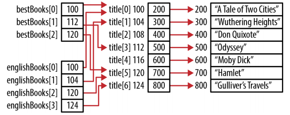

# Introduction to c pointers

## Pointers and Memory

When a C program is compiled, it works with three types of memory:

*Static/Global*

They are allocated when the program starts and remain in existence until the program terminates. While all functions have access to global variables, the scope of static variables is restricted to their defining function.

*Automatic*

These variables are declared within a funtion and are created when a function is called. Their scope is restricted to the functon, and their lifetime is limited to the time the function is executing.

*Dynamic*

Memory is allocated from the heap and can be released as necessary. A pointer referencs the allocated memory. The scope is limited to the pointer or pointers that reference the momory. It exists until it is released.

## Declaring Pointers

The use of while spaces around the asterisk is irrelevant. The following declarations are all equivalent:

int *pi;
int* pi;
int * pi;
int *pi;
int*pi;

While a pointer may be used without being initialized, it may not always work properly until it has been initialized.

How to read a declaration, the trick is to read them backward.

```
const int *pci;
```

pci is a pointer variable to a constant integer.

It is a good practice to initialize a pointer as soon as possible, as illustrated below:

int num = 0;
int *pi;
pi = &num;

```c
printf("Address of pi: %d Value: %d\n",&pi, pi);
printf("Address of pi: %x Value: %x\n",&pi, pi);
printf("Address of pi: %o Value: %o\n",&pi, pi);
printf("Address of pi: %p Value: %p\n",&pi, pi);
```
Address of pi: 4520824 Value: 4520836
Address of pi: 44fb78 Value: 44fb84
Address of pi: 21175570 Value: 21175604
Address of pi: 0044FB78 Value: 0044FB84

Note: %x	Displays the value as a hexadecimal number
      %o	Displays the value as an octal number
      %p	Displays the value in an implementation-specific manner; typically as hexadecimal numbr.

## Virtual memory and pointers

Each program assumes it has access to the machine's entire physical memory space. In reality, it does not. The address used by a program is a virtual address. The operating system maps the virtual address to a real physical memory address when needed.

This means code and data in a page may be in different physical locations as the program executes. The application's virtual address do not change; they are the addresses we see when we examine the contents of a pointer. The virtual addresses are transparently mapped to real addresses by the operating system.

## The Concept of Null

Confusion can occur because we often deal with several similar, yet distinct concepts, including:
- The null concept
- The null pointer constant
- The NULL macro

When NULL is assigned to a pointer, it means the pointer does not point to anything. The null concept refers to the idea that a pointer can hold a special value that is not equal to another pointer. It does not point to any area of memory. Two null pointers will always be equal to each other. There can be a null pointer type for each pointer type, such as a pointer to a character or a pointer to an integer, although this is uncommon.

The null concept is an abstraction supported by the null pointer constant. This constant may or may not be a constant zero. A C programmer need not be concerned with their actual internal representation.

The NULL macro is a constant integer zero cast to a pointer to void. In many libraries, it is defined as follows:
```c
#define NULL ((void *)0)
```

If the intent was to assign the null value to pi, we use the NULL type, we can assign a zero to a pointer, but we cannot assign any other integer value.
```c
pi = 0;
pi = NULL;
pi = 100; // Syntax error
pi = num; // Syntax error
```

Which is better form: using NULL or using 0 when working with pointers? Either is perfectly acceptable. However, NULL should not be used in contexts other than pointers.

The meaning of zero changes depending on its context:
```c
int num;
int *pi = 0; // Zero refers to the null pointer, NULL
pi = &num;
*pi = 0;    // Zero refers to the integer zero, this zero is also overloaded.
```

### Pointer to void

A pointer to void is a general-purpoe pointer used to hold references to any data type.
```c
void *pv;
```

It has two properties:
- A pointer to void will have the same representation and memory alignment as a pointer to char.
- A pointer to void will never be equal to another pointer.

Any pointer can be assigned to a pointer to void. It can then be cast back to its original pointer type.
```c
int num;
int *pi = &num;
printf("Value of pi:  %p\n", pi);
void* pv = pi;
pi = (int*) pv;
printf("Value of pi: %p\n", pi);
```

When this sequence is executed as shown below, the pointer address is the same:

*Value of pi: 100*

*Value of pi: 100*

The *sizeof* operator can be used with a pointer to void. However, we cannot use the operator with void as shown below:
```c
sizeof size = sizeof(void *);  // Legal
sizeof size = sizeof(void);    // Illegal
```

## Pointer Size and Types

Four predefined types are frequently used when working with pointers. They include:

- size_t      Created to provide a safe type for sizes
- ptrdiff_t   Created to handle pointer arithmetic
- intptr_t and uintprt_t Used for storing pointer addresses

### Understanding size_t

The type size_t represents the maximum size any object can be in C. It is an unsigned integer since negative numbers do not make sense in this context. The size_t type is used as the return type for the sizeof operator and as the argument to many functions, including malloc and strlen, among others.

The declaration of size_t is implementation-specific. It is found in one or more standard headers, such as stdio.h and stdlib.h, and it is typically defined as follows:
```c
#ifndef __SIZE_T
#define __SIZE_T
typedef unsigned int size_t;
#endif
```

When printing values defined as size_t, the recommended format speficer is *%zu*, *%u* or *%lu*.

### Using intptr_t and unintptr_t

Used for storing pointer addresses and useful for converting pointers to their integer representation. The type *uintptr_t* is the unsigned version of *intptr_t*. For most operations *intptr_t* is preferred.
```c
int num;
intptr_t *pi = &num;
uintptr_t *pu = (uintptr_t*)&num;
```

When an array name is used by itself, it returns the address of an array, which is also the address of the first element of the array.

Most compilers allow arithmetic to be performed on a pointer to void as an extension. However, trying to add one to a pointer to void may result in a syntax error.

## Common Uses of Pointers

### Multiple levels of indirection

It is common to see a variable declared as a pointer to a pointer, sometimes called a *double pointer*.

The example below uses three arrays. The first array is an array of strings used to hold a list of book titles:
```c
char *titles[] = {"A Tale of Two Cities","Wuthering Heights","Don Quixote",
                "Odyssey","Moby-Dick","Hamlet","Gulliver's Travels"};
```

Two additional arrays are provided whose purpose is to maintain a list of the "best books" and English books. Instead of holding copies of the titles, they will hold the address of a title in the titles array. This will avoid having to duplicate memory for each title. If a title needs to be changed, then the change will only have to be performed in one location.

The two arrays are declared below. Each array element contains a pointer that points to a second pointer to char:
```c
char **bestBooks[3];
char **englishBooks[4];

// The two arrays are initialized
bestBooks[0] = &titles[0];
bestBooks[1] = &titles[3];
bestBooks[2] = &titles[5];

englishBooks[0] = &titles[0];
englishBooks[1] = &titles[1];
englishBooks[2] = &titles[5];
englishBooks[3] = &titles[6];

printf("%s\n",*englishBooks[1]); // Wuthering Heights
```

Memory is allocated for this example as shown:



Image Source:Reese, Richard. Understanding and Using C pointers. " O'Reilly Media, Inc.", 2013.

### Constants and Pointers

Using the const keyword with pointers is a rich and powerful aspect of C. A pointer can be defined to point to a constant. This means the pointer cannot be used to modify the value it is referencing.
```c
int num = 5;
const int limit = 500;
int *pi;   // Pointer to an integer
const int *pci;  // Pointer to a constant integer

pi = &num;
pci = &limit;

pci = &num; // we can dereference pci to read it; however, we cannot dereference it to modify it.
            // we can still modify num using its name, we just cann't use pci to modify it.
*pci = 200; // syntax error: you cannot assign to a variable that is const.
```

Note: `const int *pci;` and `int const *pci` are equivalent.

### Constant pointers to nonconstants

We can also declare a constant pointer to a nonconstant. It means that while the pointer cannot be changed, the data pointed to can be modified.
```c
int num;
int *const cpi = &num;

*cpi = 25;  //valid assignment

int age;
cpi = &age; // error: you cannot assign to variable that is const
```

With this declaration:
- cpi must be initialized to a nonconstant variable
- cpi cannot be modified
- The data pointed to by cpi can be modified

## Reference

* Reese, Richard. Understanding and Using C pointers. " O'Reilly Media, Inc.", 2013.
