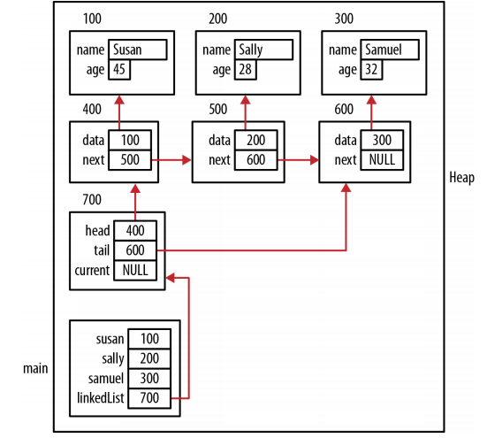
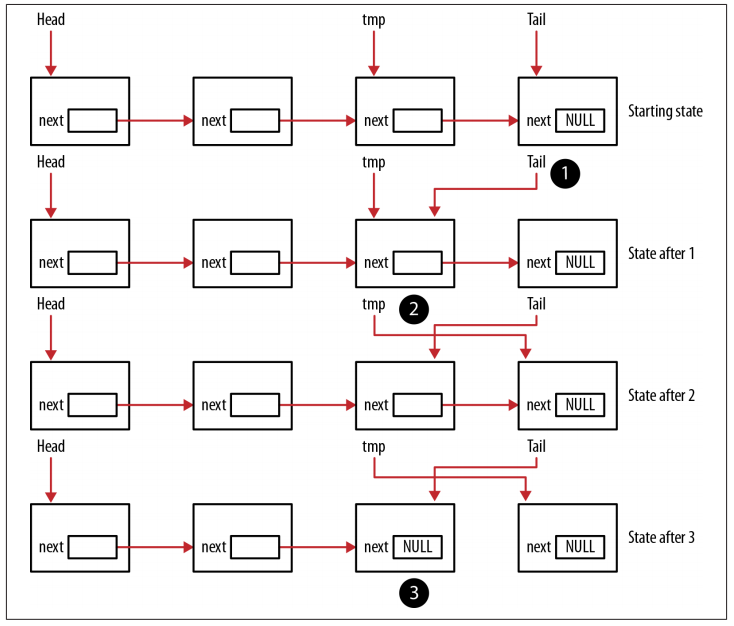
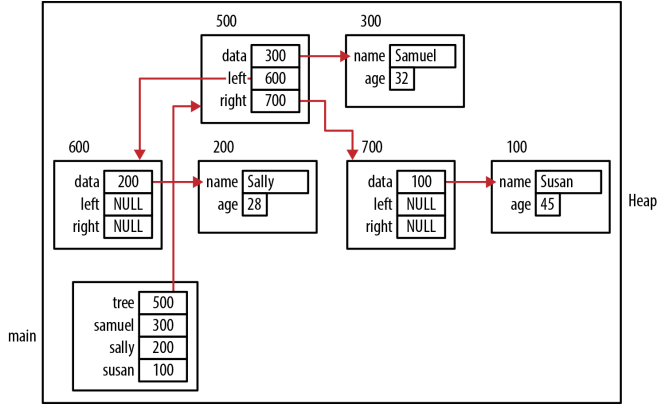

# Pointers and Structures

## Introduction

A structure in C can be declared in a number of ways. Using the *struct* keyword:
```c
//the structure's name is prefixed with an underscore, it is used as a naming convention
struct _person {
  char* firstName;
  char* lastName;
  char* title;
  unsigned int age;
};
```

A structure's declaration frequently uses the *typedef* keyword to simplify its use later:
```c
typedef struct _person {
  char* firstName;
  char* lastName;
  char* title;
  unsigned int age;
} Person;
```

An instance of a person is declared as follows:
```c
Person person;
person.firstName = (char*)malloc(strlen("Emily")+1);  //use the dot notation
strcpy(person.firstName,"Emily");
person.age = 23;

//declare a pointer to a Person and allocate memory for it
Person *ptrPerson;
ptrPerson = (Person*) malloc(sizeof(Person));
ptrPerson->firstName = (char*)malloc(strlen("Emily")+1); // (*ptrPerson).firstName
strcpy(ptrPerson->firstName,"Emily");
ptrPerson->age = 23;
```

## Structure deallocation issues

When memory is allocated for a structure, the runtime system will not automatically allocate memory for any pointers defined within it. Likewise, when the structure goes away, the runtime system will not automatically deallocate memory assigned to the structure's pointers.

```c
typedef struct _person {
  char* firstName;
  char* lastName;
  char* title;
  uint age;
} Person;

//three pointers will contain garbage
void processPerson() {
  Person person;
  ...
}

//during the initialization of this structure, each filed will be assigned a value
void initializePerson(Person *person, const char* fn,
                      const char* ln, const char* title, uint age) {
  person->firstName = (char*) malloc(strlen(fn) + 1);
  strcpy(person->firstName, fn);
  person->lastName = (char*) malloc(strlen(ln) + 1);
  strcpy(person->lastName, ln);
  person->title = (char*) malloc(strlen(title) + 1);
  strcpy(person->title, title);
  person->age = age;
}

void processPerson() {
  Person person;
  initializePerson(&person, "Peter", "Underwood", "Manager", 36);
  ...
  deallocatePerson(&person); //deallocate the memory
}

void deallocatePerson(Person *person) {
  free(person->firstName);
  free(person->lastName);
  free(person->title);
}

int main() {
  processPerson();
  ...
}
```


If we use a pointer to a Person, we need to remember to free up the person:
```c
void processPerson() {
  Person *ptrPerson;
  ptrPerson = (Person*) malloc(sizeof(Person));
  initializePerson(ptrPerson, "Peter", "Underwood", "Manager", 36);
  ...
  deallocatePerson(ptrPerson);
  free(ptrPerson);
}
```


## Avoiding malloc/free overhead

When structures are allocated and then deallocated repeatedly, some overhead will be incurred, resulting in a potentially significant performance penalty. One approach to deal with this problem is to maintain your own list of allocated structures. When a user no longer needs an instance of a structure, it is returned to the pool. When an instance is needed, it obtains the object from the pool. If there are no elements available in the pool, a new instance is dynamically allocated. This approach effectively maintains a pool of structures that can be used and reused as needed.

A pool of persons is maintained in an array, as declared below:
```c
#define LIST_SIZE 10
Person *list[LIST_SIZE];

//before the list can be used, it needs to be initialized
void initializeList() {
  for(int i=0; i<LIST_SIZE; i++) {
  list[i] = NULL;
  }
}
```

Two functions are used to add and retrieve persons. The *getPerson* function retrieves a person from the list if possible. The array's elements are compared to NULL. We only allocate memory if there is none in the pool. This avoids the overhead of dynamically allocating memory for a person every time a new one is needed.
```c
Person *getPerson() {
  for(int i=0; i<LIST_SIZE; i++) {
    if(list[i] != NULL) {
      Person *ptr = list[i];
      list[i] = NULL;
      return ptr;
    }
  }
  //if there is no person available, then a new instance of a Person is created and returned
  Person *person = (Person*)malloc(sizeof(Person));
  return person;
}
```

The *returnPerson* either adds the person to the list or frees it up. The array's elements are checked to see whether there are any NULL values. If it does, then person is added to that position and the pointer is returned. If the list is full, then the pointers within *person* are freed using the *deallocatePerson* function, *person* is freed, and then NULL is returned:
```c
Person *returnPerson(Person *person) {
  for(int i=0; i<LIST_SIZE; i++) {
    if(list[i] == NULL) {
      list[i] = person;
      return person;
    }
  }
  deallocatePerson(person);
  free(person);
  return NULL;
}
```

The following illustrates the initialization of the list and adding a person to the list:
```c
initializeList();
Person *ptrPerson;
ptrPerson = getPerson();
initializePerson(ptrPerson,"Ralph","Fitsgerald","Mr.",35);
displayPerson(*ptrPerson);
returnPerson(ptrPerson);
```

## Using pointers to support data structures

- A single-linked list
- A simple first-in first-out queue
- A simple stack
- A binary tree

We will illustrate each of these data structures using an employee structure:
```c
typedef struct _employee{
  char name[32];
  unsigned char age;
} Employee;

//equal, return 0; the first precedes the second, -1; the first follows the second, 1 
int compareEmployee(Employee *e1, Employee *e2) {
  return strcmp(e1->name, e2->name);
}

void displayEmployee(Employee* employee) {
  printf("%s\t%d\n", employee->name, employee->age);
}
```

In addition, two function pointers will be used as defined below. The DISPLAY function pointer designates a function that is passed void and returns void. Its intent is to display data. The second pointer, COMPARE, represents a function used to compare data referenced by two pointers.
```c
typedef void(*DISPLAY)(void*);
typedef int(*COMPARE)(void*, void*);
``` 

### Single-Linked List

```c
//A Node structure is defined to represent a node
typedef struct _node {
  void *data;     //a pointer to void, holds an arbitrary data type
  struct _node *next;  //a pointer to the next node
} Node;

//the linked list holds a pointer to the head and the tail
typedef struct _linkedList {
  Node *head;
  Node *tail;
  Node *current;   //traverse the linked list
} LinkedList;
```

We will develop several functions that use these structures to support linked list functionality:
```c
void initializeList(LinkedList*)    //Initializes the linked list
void addHead(LinkedList*, void*)    //Adds data to the linked list’s head
void addTail(LinkedList*, void*)    //Adds data to the linked list’s tail
void delete(LinkedList*, Node*)     //Removes a node from the linked list
Node *getNode(LinkedList*, COMPARE, void*)    //Returns a pointer to the node containing a specific data item
void displayLinkedList(LinkedList*, DISPLAY)   //Displays the linked list
```

Before the linked list can be used it needs to be initialized:
```c
void initializeList(LinkedList *list) {
  list->head = NULL;
  list->tail = NULL;
  list->current = NULL;
}
```

In the *addHead* function listed below, memory is first allocated for the node and the data passed to the function is assigned to the structure's data field. By passing the data as a pointer to void, the linked list is able to hold any type of data the user wants to use.
```c
void addHead(LinkedList *list, void* data) {
  Node *node = (Node*) malloc(sizeof(Node));
  node->data = data;
  if (list->head == NULL) {   //check whether the linked list is empty
    list->tail = node;        //assign the tail pointer to the node
    node->next = NULL;        //assign NULL to the node's next field
  } else {
    node->next = list->head;  //assign the list's head to the node's next pointer
  }
  list->head = node;  //the list's head is assigned to the node
}
```

Three employees are added to the list:
```c
LinkedList linkedList;

Employee *samuel = (Employee*) malloc(sizeof(Employee));
strcpy(samuel->name, "Samuel");
samuel->age = 32;

Employee *sally = (Employee*) malloc(sizeof(Employee));
strcpy(sally->name, "Sally");
sally->age = 28;

Employee *susan = (Employee*) malloc(sizeof(Employee));
strcpy(susan->name, "Susan");
susan->age = 45;

initializeList(&linkedList);
addHead(&linkedList, samuel);
addHead(&linkedList, sally);
addHead(&linkedList, susan);
```



The *addTail* function starts by allocating memory for a new node and assigning the data to the *data* field:
```c
void addTail(LinkedList *list, void* data) {
  Node *node = (Node*) malloc(sizeof(Node));
  node->data = data;   //since the node will always be added to the tail
  node->next = NULL;   //the node's next field is assigned to NULL
  if (list->head == NULL) {  //if the linked list is empty
    list->head = node;    //head can be assigned to the new node
  } else {
    list->tail->next = node;  //the tail's next pointer is assigned to the new node
  }
  list->tail = node;   //the linked list's tail pointer is assigned to the node
}

initializeList(&linkedList);
addTail(&linkedList, susan);
addTail(&linkedList, sally);
addTail(&linkedList, samuel);  //it will get the same results as shown in above figure
```

The code for the *getNode* function follows. The variable node initially points to the list's head and traverses the list until either a match is found or the linked list's end is encountered.
```c
Node *getNode(LinkedList *list, COMPARE compare , void* data) {
  Node *node = list->head;
  while (node != NULL) {
    if (compare(node->data, data) == 0) {
      return node;
    }
    node = node->next;
  }
  return NULL;
}
```

The *delete* function follows. To keep the function simple, it does not always check for null values in the linked list or the node passed.
```c
void delete(LinkedList *list, Node *node) {
  if (node == list->head) {            //handles a node to be deleted from the head
    if (list->head->next == NULL) {    //if the head node is the only node
      list->head = list->tail = NULL;  //head and tail are assigned null values
    } else {
      list->head = list->head->next;   //the head is assigned to the node following the head
    }
  } else {      //traverse the list from head to tail using a tmp pointer
    Node *tmp = list->head;
    //while loop will terminate if either tmp is assigned NULL, the node does not exist in list,
    //or the node following tmp is the node we are looking for
    while (tmp != NULL && tmp->next != node) {
      tmp = tmp->next;
    }
    if (tmp != NULL) {  //assign the node following the target node to the preceding node's next field
      tmp->next = node->next;
    }
  }
  free(node);  //the node is freed
}
```

The next sequence demonstrates the use of this function:
```c
addHead(&linkedList, samuel);
addHead(&linkedList, sally);
addHead(&linkedList, susan);
Node *node = getNode(&linkedList,
                     (int (*)(void*, void*))compareEmployee, sally);
delete(&linkedList, node);
```

When this sequence executes, the program stack and heap will appear as illustrated in this figure:


The *displayLinkedList* function illustrates how to traverse a linked list:
```c
//it starts at the head and displays each element using the function passes as the second argument
void displayLinkedList(LinkedList *list, DISPLAY display) {
  printf("\nLinked List\n");
  Node *current = list->head;
  //it will terminate when the last node is displayed
  while (current != NULL) {
    display(current->data);
    current = current->next; //the node pointer is assigned the next field's value
  }
}

displayLinkedList(&linkedList, (DISPLAY)displayEmployee);
```

### Using pointers to support a queue

A linked list is frequently used to implement a queue. The enqueue operation will add a node to the linked list's head and the dequeue operation will remove a node from the tail.

Let's start by using a type definition statement to define a term for queue:
```c
typedef LinkedList Queue;
```

To implement the initialization operation, all we need to do is use the function initializaList:
```c
void initializeQueue(Queue *queue) {
  initializeList(queue);
}

//add a node to a queue using the addHead function
void enqueue(Queue *queue, void *node) {
  addHead(queue, node);
}

//the dequeue function needs to handle three conditions:I II III
void *dequeue(Queue *queue) {
  Node *tmp = queue->head;
  void *data;
  if (queue->head == NULL) {  // I. an empty queue
    data = NULL;
  } else if (queue->head == queue->tail) {  // II. a single node queue
    queue->head = queue->tail = NULL;
    data = tmp->data;
    free(tmp);
  } else {  // III. a mulitiple node queue
    //the tmp pointer is advanced node by node until it points to the node preceding the tail node
    while (tmp->next != queue->tail) {
    tmp = tmp->next;
  }
  //three operations are then performed in the following sequence:1 2 3
  queue->tail = tmp;  // 1. the tail is assigned to the tmp node
  tmp = tmp->next;    // 2.the tmp pointer is advanced to the next node
  // 3.the tail's next field is set to NULL to indicate there are no more nodes in the queue
  queue->tail->next = NULL;
  data = tmp->data;  //the data assigned to the node is returned
  free(tmp);   //the node is freed
  }
  return data;
}
```



These functions are illustrated in the following code sequence:
```c
Queue queue;
initializeQueue(&queue);
enqueue(&queue, samuel);
enqueue(&queue, sally);
enqueue(&queue, susan);

void *data = dequeue(&queue);
printf("Dequeued %s\n", ((Employee*) data)->name);  //Dequeued Samuel
data = dequeue(&queue);
printf("Dequeued %s\n", ((Employee*) data)->name);  //Dequeued Sally
data = dequeue(&queue);
printf("Dequeued %s\n", ((Employee*) data)->name);  //Dequeued Susan
```

### Using pointers to support a stack

The stack exhibits First-In-Last-Out (FILO) behavior. We can use a linked list to support stack operations.
```c
typedef LinkedList Stack;
```

To initialize the stack, we add an initializaStack function.
```c
void initializeStack(Stack *stack) {
  initializeList(stack);
}

//the push operation calls the addHead function:
void push(Stack *stack, void* data) {
  addHead(stack, data);
}

//the pop operation's implementation follows
void *pop(Stack *stack) {
  Node *node = stack->head;
  if (node == NULL) {  //the stack is empty
    return NULL;
  } else if (node == stack->tail) {   //the stack contains a single element
    stack->head = stack->tail = NULL;  //the head and the tail are assigned NULL
    void *data = node->data;
    free(node);
    return data;
  } else {   //the stack contains more than one element
    stack->head = stack->head->next;
    void *data = node->data;  //the head is assigned to the next element
    free(node);
    return data;
  }
}
```

The following code sequence will push three employees and then pop them off the stack
```c
Stack stack;
initializeStack(&stack);
push(&stack, samuel);
push(&stack, sally);
push(&stack, susan);
Employee *employee;

for(int i=0; i<4; i++) {
  employee = (Employee*) pop(&stack);
  printf("Popped %s\n", employee->name);
}
```

When executed, we get the following output. Because we used the pop function four times, NULL was returned the last time:
```
Popped Susan
Popped Sally
Popped Samuel
Popped (null)
```

### Using pointers to support a tree

A tree can have any number of children nodes. However, binary trees are more common where each node possesses zero, one, or two children nodes. Using a pointer to void allows us to handle any type of data that we need:
```c
typedef struct _tree {
  void *data;
  struct _tree *left;
  struct _tree *right;
} TreeNode;
```

Binary Search Tree: a common ordering is to add a new node to a tree such that all of the node's children posses a value less than the parent node and all of the children on the right posses a value greater than the parent node.

The following *insertNode* function will insert a node into a binary search tree.
```c
//a comparison needs to be performed between the new node and the tree's existing nodes
//the COMPARE function pointer is used to pass the comparison function's address
void insertNode(TreeNode **root, COMPARE compare, void* data) {
  //allocate memory for a new node and assigns the data to the node
  TreeNode *node = (TreeNode*) malloc(sizeof(TreeNode));
  node->data = data;
  //the left and right children are set to NULL
  node->left = NULL;
  node->right = NULL;
  //check to determine whether the tree is empty
  if (*root == NULL) {
    *root = node;   //a new node is assigned to the root
    return;
  }
  //if the tree is not empty
  while (1) {    //with each loop's iteration, the new node and current parent node are compared
    if (compare((*root)->data, data) > 0) {
      //this root pointer points to the current node in the tree
      if ((*root)->left != NULL) {
        *root = (*root)->left;
      } else {    //if the left child is NULL, then the node is added as a child
        (*root)->left = node;   //the loop terminates
        break;
      }
    } else {
      if ((*root)->right != NULL) {
        *root = (*root)->right;
      } else {
        (*root)->right = node;
        break;
      }
    }
  }
}
```

The following sequence initializes an empty *TreeNode* and then inserts the three employees.
```c
TreeNode *tree = NULL;
insertNode(&tree, (COMPARE) compareEmployee, samuel);
insertNode(&tree, (COMPARE) compareEmployee, sally);
insertNode(&tree, (COMPARE) compareEmployee, susan);
```



Binary trees are used for a number of purposes and can be traversed in three different ways: pre-order (visit the node, go left, go right), in-order (go left, visit the node, go right), and post-order (go left, go right, visit the node).

The functions' implementations are shown below.
```c
void inOrder(TreeNode *root, DISPLAY display) {
  if (root != NULL) {
    inOrder(root->left, display);
    display(root->data);
    inOrder(root->right, display);
  }
}
void postOrder(TreeNode *root, DISPLAY display) {
  if (root != NULL) {
    postOrder(root->left, display);
    postOrder(root->right, display);
    display(root->data);
  }
}
void preOrder(TreeNode *root, DISPLAY display) {
  if (root != NULL) {
    display(root->data);
    preOrder(root->left, display);
    preOrder(root->right, display);
  }
}
```

The following code sequence invokes these functions:
```c
preOrder(tree, (DISPLAY) displayEmployee);
inOrder(tree, (DISPLAY) displayEmployee);
postOrder(tree, (DISPLAY) displayEmployee);
```

The in-order traversal will return a sorted list of the tree’s members. The pre-order and post-order traversal can be used to evaluate arithmetic expressions when used in con‐junction with a stack and queue.

## Reference

* Reese, Richard. Understanding and Using C pointers. " O'Reilly Media, Inc.", 2013.