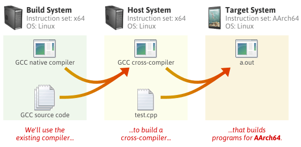

# GNU build system

## Use Cases

### VPATH Builds
```
[HOST1] ~ $ mkdir /tmp/amh && cd /tmp/amh
[HOST1] /tmp/amh $ /nfs/src/amhello-1.0/configure
...
[HOST1] /tmp/amh $ make && sudo make install
```

In this secnario, nothing forbids the `/nfs/src/amhello-1.0` directory from being read-only. In fact VPATH builds are also a means of building packages from a read-only medium such as a CD-ROM.

### Two-Part Installation

These targets are `install-exec` for architecture-dependent files and `install-data` for architecture-independent files. The command we used up to now, `make install`, can be thought of as a shorthand for `make install-exec install-data`.

The disctinction between architecture-dependent files and architecture-independent files is based exclusively on the directory variable used to specify their installation destination. ll the variables based on *exec-prefix* designate architecture-dependent directories whose files will be installed by make `install-exec`. The others designate architecture-independent directories and will serve files installed by `make install-data`. 

Here is how we could revist our two-host installation example, assuming that (1) we want to install the package directly in /usr, and (2) the directory /usr/share is shared by the two hosts.

On the first host we would run
```
[HOST1] ~ $ mkdir /tmp/amh && cd /tmp/amh
[HOST1] /tmp/amh $ /nfs/src/amhello-1.0/configure --prefix /usr
...
[HOST1] /tmp/amh $ make && sudo make install
...
```

On the second host, however, we need only install the architecture-specific files.
```
[HOST2] ~ $ mkdir /tmp/amh && cd /tmp/amh
[HOST2] /tmp/amh $ /nfs/src/amhello-1.0/configure --prefix /usr
...
[HOST2] /tmp/amh $ make && sudo make install-exec
...
```

In packages that have installation checks, it would make sense to run `make installcheck` to verify that the package works correctly despite the apparent partial installation.

### Cross-Compilation

To *cross-compile* is to build on one platform a binary that will run on another platform. It is important to distinguish between the *build platform* on which the compilation is performed, and the `host platform` on which the resulting executable is expected to run.

**--build=build**: The system on which the package is built.

**--host=host**: The system where built programs and libraries will run.

Cross-compilation tools commonly have their target architecture as prefix of their name. For instance my cross-compiler for *MinGW32* has its binaries called *i586-mingw32msvc-gcc*, *i586-mingw32msvc-ld*, *i586-mingw32msvc-as*, etc.

Here is how we could build *amhello-1.0* for *i586-mingw32msvc* on a GNU/Linux PC.

```
~/amhello-1.0 $ ./configure --build i686-pc-linux-gnu --host i586-mingw32msvc
checking for a BSD-compatible install... /usr/bin/install -c
checking whether build environment is sane... yes
checking for gawk... gawk
checking whether make sets $(MAKE)... yes
checking for i586-mingw32msvc-strip... i586-mingw32msvc-strip
checking for i586-mingw32msvc-gcc... i586-mingw32msvc-gcc
checking for C compiler default output file name... a.exe
checking whether the C compiler works... yes
checking whether we are cross compiling... yes
checking for suffix of executables... .exe
checking for suffix of object files... o
checking whether we are using the GNU C compiler... yes
checking whether i586-mingw32msvc-gcc accepts -g... yes
checking for i586-mingw32msvc-gcc option to accept ANSI C...
…
~/amhello-1.0 $ make
…
~/amhello-1.0 $ cd src; file hello.exe
hello.exe: MS Windows PE 32-bit Intel 80386 console executable not relocatable
```

The *--host* and *--build* options are usually all we need for cross-compiling. The only exception is if the package being built is itself a cross-compiler: we need a third option to specify its target architecture.

**--target=target**: When building compiler tools: the system for which the tools will create output.

For instance when installing GCC, the GNU Compiler Collection, we can use *--target=target* to specify that we want to build GCC as a cross-compiler for *target*.

GCC is not just a compiler. It’s an open source project that lets you build all kinds of compilers. Some compilers support multithreading; some support shared libraries; some support multilib. It all depends on how you configure the compiler before building it.



[Image Source](http://preshing.com/20141119/how-to-build-a-gcc-cross-compiler/)

### Building Binary Packages Using DESTDIR

The *DESTDIR* variable can be used to perform a staged installation. The package should be configured as if it was going to be installed in its final location (e.g., --prefix /usr), but when running `make install`, the *DESTDIR* should be set to the absolute name of a directory into which the installtion will be diverted. From this directory it is easy to review which files are being installed where, and finally copy them to their final location by some means.

For instance here is how we could create a binary package containing a snapshot of all the files to be installed.
```
~/amhello-1.0 $ ./configure --prefix /usr
…
~/amhello-1.0 $ make
…
~/amhello-1.0 $ make DESTDIR=$HOME/inst install
…
~/amhello-1.0 $ cd ~/inst
~/inst $ find . -type f -print > ../files.lst
~/inst $ tar zcvf ~/amhello-1.0-i686.tar.gz `cat ../files.lst`
./usr/bin/hello
./usr/share/doc/amhello/README
```

After this example, *amhello-1.0-i686.tar.gz* is ready to be uncompressed in / on many hosts. (Using \`cat ../files.lst\` instead of ‘.’ as argument for tar avoids entries for each subdirectory in the archive: we would not like tar to restore the modification time of /, /usr/, etc.)

## A Small Hello World

In this section we recreate the amhello-1.0 package from scratch. The first subsection shows how to call the Autotools to instantiate the GNU Build System, while the second explains the meaning of the configure.ac and Makefile.am files read by the Autotools.

### Creating amhello-1.0.tar.gz

Creat the following files in an empty directory.

- *src/main.c* is the source file for the hello program. We store it in the src/ subdirectory, because later, when the package evolves, it will ease the addition of a man/ directory for man pages, a data/ directory for data files, etc.
```
~/amhello $ cat src/main.c
#include <config.h>
#include <stdio.h>

int
main (void)
{
  puts ("Hello World!");
  puts ("This is " PACKAGE_STRING ".");
  return 0;
}
```

- *README* contains some very limited documentation for our little package.
```
~/amhello $ cat README
This is a demonstration package for GNU Automake.
Type 'info Automake' to read the Automake manual.
```

- *Makefile.am* and *src/Makefile.am* contain Automake instructions for these two directories.
```
~/amhello $ cat src/Makefile.am
bin_PROGRAMS = hello
hello_SOURCES = main.c
~/amhello $ cat Makefile.am
SUBDIRS = src
dist_doc_DATA = README
```
- Finally, *configure.ac* contains Autoconf instructions to create the configure script.
```
~/amhello $ cat configure.ac
AC_INIT([amhello], [1.0], [bug-automake@gnu.org])
AM_INIT_AUTOMAKE([-Wall -Werror foreign])
AC_PROG_CC
AC_CONFIG_HEADERS([config.h])
AC_CONFIG_FILES([
 Makefile
 src/Makefile
])
AC_OUTPUT
```

Once you have these five files, it is time to run the Autotools to instantiate the build system. Do this using the *autoreconf* command as follows:
```
~ amhello$ autoreconf --install
configure.ac:3: installing './compile'
configure.ac:2: installing './install-sh'
configure.ac:2: installing './missing'
src/Makefile.am: installing './depcomp'
```

At this point the build system is complete.

In addition to the three scripts mentioned in its output, you can see that autoreconf created four other files: *configure*, *config.h.in*, *Makefile.in*, and *src/Makefile.in*. The latter three files are templates that will be adapted to the system by configure under the names *config.h*, *Makefile*, and *src/Makefile*. 

```
~/amhello $ ./configure
checking for a BSD-compatible install... /usr/bin/install -c
checking whether build environment is sane... yes
checking for a thread-safe mkdir -p... /bin/mkdir -p
checking for gawk... gawk
checking whether make sets $(MAKE)... yes
checking whether make supports nested variables... yes
checking for gcc... gcc
checking whether the C compiler works... yes
checking for C compiler default output file name... a.out
checking for suffix of executables... 
checking whether we are cross compiling... no
checking for suffix of object files... o
checking whether we are using the GNU C compiler... yes
checking whether gcc accepts -g... yes
checking for gcc option to accept ISO C89... none needed
checking whether gcc understands -c and -o together... yes
checking for style of include used by make... GNU
checking dependency style of gcc... gcc3
checking that generated files are newer than configure... done
configure: creating ./config.status
config.status: creating Makefile
config.status: creating src/Makefile
config.status: creating config.h
config.status: executing depfiles commands
```

It is now possible to run all the targets we wish. For instance:
```
~/amhello $ make
…
~/amhello $ src/hello
Hello World!
This is amhello 1.0.
~/amhello $ make distcheck
…
=============================================
amhello-1.0 archives ready for distribution:
amhello-1.0.tar.gz
=============================================
```

Note that running *autoreconf* is only needed initially when the GNU Build System does not exist. When you later change some instructions in a *Makefile.am* or *configure.ac*, the relevant part of the build system will be regenerated automatically when you execute *make*.

*autoreconf* is a script that calls *autoconf*, *automake*, and a bunch of other commands in the right order. 

### configure.ac setup explained

Let's begin with the contents of *configure.ac*:
```
AC_INIT([amhello], [1.0], [bug-automake@gnu.org])
AM_INIT_AUTOMAKE([-Wall -Werror foreign])
AC_PROG_CC
AC_CONFIG_HEADERS([config.h])
AC_CONFIG_FILES([
 Makefile
 src/Makefile
])
AC_OUTPUT
```

This file is read by both *autoconf* (to create *configure*) and *automake* (to create the various *Makefile.in*). It contains a series of M4 macros that will be expanded as shell code to finally form the *configure* script. 

The macros prefixed with *AC_* are Autoconf macros, the macros that starts with *AM_* are Automake macros.

The first two lines of `configure.ac` initialize Autoconf and Automake. `AC_INIT` takes in as parameters the name of the package, its version number, and a contact address for bug-reports about the package (this address is output at the end of *./configure --help*, for instance). 

The argument to `AM_INIT_AUTOMAKE`is a list of options for *automake*. *-Wall* and *-Werroe* ask *automake* to turn on all warnings and report them as errors. We are speaking of *Automake* warnings here, such as dubious instructions in *Makefile.am*. This has absolutely nothing to do with how the compiler will be called, even though it may support options with similar names. The *foreign* option tells Automake that this package will not follow the GNU Standards. GNU packages should always distribute additional files such as *ChangeLog*, *AUTHORS*, etc. We do not want *automake* to complain about these missing files in our small example.

The `AC_PROG_CC` line causes the *configure* script to search for a C compiler and define the variable CC with its name. The *src/Makefile.in* file generated by Automake uses the variable CC to build *hello*, it will define CC with the value it has found. If Automake is asked to create a *Makefile.in* that uses CC but *configure.ac* does not define it, it will suggest you add a call to `AC_PROG_CC`.

The `AC_CONFIG HEADERS` ([config.h]) invocation causes the *configure* script to create a *config.h* file gathering `#define`s defined by other macros in *configure.ac*. In our case, the `AC_INIT` macro already defined a few of them. Here is an excerpt of *config.h* after *configure* has run:
```
/* Define to the address where bug reports for this package should be sent. */
#define PACKAGE_BUGREPORT "bug-automake@gnu.org"

/* Define to the full name and version of this package. */
#define PACKAGE_STRING "amhello 1.0"
```

As you probably noticed, *src/main.c* includes *config.h* so it can use `PACKAGE_STRING`. In a real-world project, *config.h* can grow really big, with one `#define` per feature probed on the system.

The `AC_CONFIG_FIFES` macro declares the list of files that *configure* should create from their *.in templates. Automake also scans this list to find the `Makefile.am` files it must process. (This is important to remember: when adding a new directory to your project, you should add its *Makefile* to this list, otherwise Automake will never process the new *Makefile.am* you wrote in that directory.)

Finally, the `AC_OUTPUT` line is a closing command that actually produces the part of the script in charge of creating the files registered with `AC_CONFIG_HEADERS` and `AC'_CONFIG_FILES`.

When starting a new project, we suggest you start with such a simple *configure.ac*, and gradually add the other tests it requires.

### Makefile.am setup explained

We now turn to src/Makefile.am. This file contains Automake instructions to build and install hello.
```
bin_PROGRAMS = hello
hello_SOURCES = main.c
```

A *Makefile.am* has the same syntax as an ordinary *Makefile*. When *automake* processes a *Makefile.am* it copies the entire file into the output *Makefile.in* (that will be later turned into *Makefile* by *configure*) but will react to certain variable definitions by generating some build rules and other variables. Often *Makefile.am* contain only a list of variable definitions as above, but they can also contain other variable and rule definitions that `automake` will pass along without interpretation.

In Automake speak, this _PROGRAMS suffix is called a *primary*; Automake recognizes other primaries such as _SCRIPTS, _DATA, _LIBRARIES, etc. corresponding to different types of files.

The `bin` part of the `bin_PROGRAMS` tells *automake* that the resulting programs should be installed in *bindir*. Recall that the GNU Build System uses a set of variables to denote destination directories and allow users to customize these locations. Any such directory variable can be put in front of a primary (omitting the *dir* suffix) to tell *automake* where to install the listed files.

Programs need to be built from source files, so for each program prog listed in a `_PROGRAMS` variable, *automake* will look for another variable named `prog_SOURCES` listing its source files. There may be more than one source file: they will all be compiled and linked together.

Automake also knows that source files need to be distributed when creating a tarball (unlike built programs). So a side-effect of this `hello_SOURCES` declaration is that *main.c* will be part of the tarball created by `make dist`.

Finally here are some explanations regarding the top-level `Makefile.am`.
```
SUBDIRS = src
dist_doc_DATA = README
```

`SUBDIRS` is a speical variable listing all directories that *make* should recurse into before processing the current directory. So this line it responsible for *make* building *src/hello* even though we run it from the top-level. This line also causes `make install` to install *src/hello* before installing README (not that this order matters).

The line `dist_doc_DATA = README` causes `README` to be distributed and installed in *docdir*. Files listed with the `_DATA` primary are not automatically part of the tarball built with `make dist`, so we add the `dist_` prefix so they get distributed. However, for `README` it would not have been necessary: *automake* automatically distributes any `README` file it encounters (the list of other files automatically distributed is presented by `automake --help`). The only important effect of this second line is therefore to install `README` during `make install`.

## Reference

* [Use Cases for the GNU Build System](https://www.gnu.org/software/automake/manual/automake.html#Use-Cases) 

