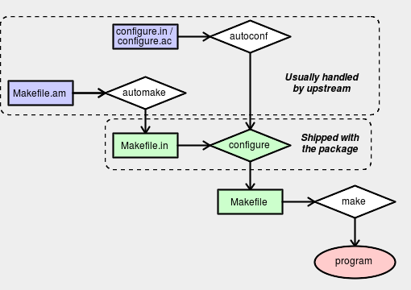

# The Basics of Autoconf and Automake

## GNU Build System

Each package of the GNU project should hava a `configure` script, and the minimal interface it should have. The `Makefile` too should follow some established conventions. The result? A unified build system that amkes all packages almost indistinguishable by the installer. In its simplest scenario, all the installer has to do is to unpack the package, run `./configure && make && make install`, and repeat with the next package to install.

The Autotools are tools that will create a GNU Build System for your package. Autoconf mostly focuses on `configure` and Automake on `Makefiles`. 

## Major Components

Autoconf is a tool for producing shell scripts that automatically configure software source code packages to adapt to many kinds of Posix-like systems. The configuration scripts produced by Autoconf are independent of Autoconf when they are run, so their users do not need to have Autoconf.

Automake allows you to specify your build needs in a Makefile.am file with a vastly simpler and more powerful syntax than that of a plain makefile, and then generates a portable Makefile.in for use with Autoconf.



[Image Source](https://devmanual.gentoo.org/general-concepts/autotools/)

A basic overview of how the main autotools components fit together.

In a simple setup:

- The `autoconf` program produces a `configure` script from either `configure.in` or `configure.ac` (see note below).
- The `automake` program produces a `Makefile.in` from a `Makefile.am`.
- The `configure` script is run to produce one or more `Makefile` files from `Makefile.in` files.
- The `make` program uses the `Makefile` to compile the program.

## Making configure scripts

The configuration scripts that Autoconf produces are by convention called `configure`. When run, `configure` creates several files, replacing configuration parameters in them with appropriate values. The files that `configure` creates are:

- one or more `Makefile` files, usually one in each subdirectory of the package;
- optionally, a C header file, the name of which is configurable, containing `#define` directives;
- a shell script called `config.status` that, when run, recreates the files listed above;
- an optional shell script normally called `config.cache` (created when using `configure --config-cache`) that saves the results of running many of the tests.
- a file called `config.log` containing any messages produced by compilers, to help debugging if `configure` makes a mistake.

To create a `configure` script with Autoconf, you need to write an Autoconf input file `configure.ac` (or configure.in) and run `autoconf` on it. If you write your own feature tests to supplement those that come with Autoconf, you might also write files called `aclocal.m4` and `acsite.m4`. If you use a C header file to contain `#define` directives, you might also run `autoheader`, and you can distribute the generated file `config.h.in` with the package.

Here is a diagram showing how the files that can be used in configuration are produced. Programs that are executed are suffixed by ‘*’. Optional files are enclosed in square brackets (‘[]’). autoconf and autoheader also read the installed Autoconf macro files (by reading `autoconf.m4`).

Files used in preparing a software package for distribution, when using just Autoconf:

     your source files --> [autoscan*] --> [configure.scan] --> configure.ac
     
     configure.ac --.
                    |   .------> autoconf* -----> configure
     [aclocal.m4] --+---+
                    |   `-----> [autoheader*] --> [config.h.in]
     [acsite.m4] ---'
     
     Makefile.in
Additionally, if you use Automake, the following additional productions come into play:

     [acinclude.m4] --.
                      |
     [local macros] --+--> aclocal* --> aclocal.m4
                      |
     configure.ac ----'
     
     configure.ac --.
                    +--> automake* --> Makefile.in
     Makefile.am ---'
Files used in configuring a software package:

                            .-------------> [config.cache]
     configure* ------------+-------------> config.log
                            |
     [config.h.in] -.       v            .-> [config.h] -.
                    +--> config.status* -+               +--> make*
     Makefile.in ---'                    `-> Makefile ---'


The `autoconf` tool supposedly runs `autoconf` (and `automake`, `autoheader`, `aclocal`, `autopoint` and `libtoolize`) as necessary. Sometimes it works. Some packages ship a shell sript named `autogen.sh` which does the same thing (this is not related to `autogen`).

**Warning**: you must **not** attempt to modify any of the generated files in between running `configure` and `make`. This can lead to autotools trying to be clever and recreate the files, in turn leading to your changes being removed. In some situations this will also result in `./configure` arguments being silently dropped, which can give broken dependencies. The best way to processed is usually to work with the `.ac`/`.in` files instead.

## configure.ac File

The `configure.ac` file is used to create the `./configure` script. It consists of a series of macros which are processed and expanded by `autoconf`. These macros can check for packages and libraries, handle `--enable` and `--with` switches, and generate various files.

### Basic Format of configure.ac

The `configure.ac` file is a basic text file. Indenting and whitespace are largely irrelevant. Comments are indicated by the string `dnl` (`dnl` is actually a macro which discards the remainder of the input - it stands for "discard new line").

A typical file might start with something like the following:

```sh
dnl Process this file with autoconf
AC_INIT(appname, 0.1)
AC_PREREQ(2.5)
AC_CONFIG_SRCDIR(src/main.c)
AC_CONFIG_AUX_DIR(config)
AC_INIT_AUTOMAKE(1.8)
```

The `AC_PREREQ` line, if present, tells you which `autoconf` version you need. This is useful, because `autoconf` is not compatible between versions. In the above example, we need `=autoconf-2.5*`. and we should `export WANT_AUTOCONF="2.5"` (or use the `autoconf-2.59` script) when calling `autoconf`.

The `AM_INIT_AUTOMAKE` line tells us which `automake` version we need. Again, this is little change that an `automake-1.7` script will work properly with `automake-1.8`. Setting `WANT_AUTOMAKE="1.8"` in the environment can be used to make an unversioned `automake` call run the correct version.

Usually, some standard checks will follow:
```sh
dnl Check for toolchain and install components
AC_PROG_CC
AC_PROG_INSTALL
AC_PROG_LN_S
AC_PROG_RANLIB
```

For non-standard applications, you may also see manual checks:
```sh
dnl Check for sed
AC_CHECK_PROGS(regex_cmd, sed)
if test x$regex_cmd = "x" ; then
    AC_MSG_ERROR([sed is required to build the data files.])
fi
```

You may also see checks for compiler features:
```sh
dnl Check that our compiler can do const and inline
AC_C_CONST
AC_C_INLINE
```

Library and header checks:
```sh
dnl Check for standard headers:
AC_HEADER_STDC
AC_HEADER_DIRENT
AC_CHECK_HEADERS([stdlib.h stdio.h libintl.h locale.h])

dnl Check for libraries:
AC_CHECK_LIB(ssl, SSL_free)
```

And function checks:
```sh
dnl Check for functions:
AC_CHECK_FUNCS([setlocale strtol])
```

Often these will be all jumbled together without any useful comments. In some cases, many of the checks done won't even be necessary for the application in question - most autotools code is copy/pasted rather than written from scratch, and `autoscan` (a tool which helps write `configure.ac`) is sometimes over-eager to add in checks.

The file will finish with some output functions:
```sh
AM_CONFIG_HEADER(config.h)
AC_OUTPUT(Makefile src/Makefile nls/Makefile man/Makefile tests/Makefile)
```

These are used to make the `./configure` script generate the relevant files.

### Enable and Disable Checks

Many packages have optional support for various extras (graphics toolkits, libraries which add funtionality, interpreters, features, ...). This is handled via `--enable-foo` and `--disable-foo` switches to `./configure`, which are generated from `autoconf` rules.

A simple `--enable` / `--disable` function might look something like the following:
```sh
AC_MSG_CHECKING(--enable-cscope argument)
AC_ARG_ENABLE(cscope,
    [  --enable-cscope         Include cscope interface.],
    [enable_cscope=$enableval],
    [enable_cscope="no"])
AC_MSG_RESULT($enable_cscope)
if test "$enable_cscope" = "yes"; then
  AC_DEFINE(FEAT_CSCOPE)
fi
```

Sometimes more complicated checks are included based upon whether or not an option is enabled. There are also some predefined macros which include `AC_ARG_ENABLE`. So grepping `configure.ac` for `AC_ARG_ENABLE` may not give a complete list. A better way is to use `./configure --help` and check the output.

**Important**: The third argument is used when a `--enable` or `--disable` switch to `./configure` is provided, and the fourth is used when such a switch is not passed. A common misconception is that the third is enable and the fourth is disable - this is `not` the case. You may encounter packages that get this wrong.

A simple way to check that a package is using this macro properly is to install the optional dependency, and then try all of `./configure`. `./configure` `--enable-foo` and `./configure --disable-foo`. If the second and third runs give the same results, something is wrong. If the first run gives a different result to the second and third, there is a good chance that a misunderstanding of the `AC_ARG_ENABLE` arguments is to blame.

### With and Without Checks

A simple `--with` / `--without` check might look like:
```sh
AC_MSG_CHECKING([whether to enable foo])
AC_ARG_WITH(foo,
    [  --with-foo           enable foo support],
    with_foo=$withval,
    with_foo=yes)
AC_MSG_RESULT($with_foo)
```

Again, the third argument is for `specified` and the fourth for `not specified`, and there are standard macros which include `with` options.

### Automatic Checks

It's possible to write autoconf rules which bypass the manual enable / disable convention (or which just ignore what the user asks for). If your package does this, it must be fixed to avoid dependency problems.

The most common form is packages which simply use `AC_CHECK_LIB` to decide whether or not to enable a feature. If you find a package which does this, you **must** change the behaviour.

### Quoting Rules for configure.ac

Behind the scenes, `autoconf` makes heavy use of the `m4` macro processor to do the work. The `m4` quote characters are set by `autoconf` to be `[` and `]` for opening and closing quotes respectively. Using `"` or `"` may produce unexpected results.

To include a literal left square bracket, the easiest thing to do is to use the special string `@<:@`. For a right bracket, use `@:>@`.

For example:
```sh
AC_MSG_RESULT(the first)
AC_MSG_RESULT([the second])
AC_MSG_RESULT("the third")
AC_MSG_RESULT(@<:@the fourth@:>@)
AC_MSG_RESULT([@<:@the fifth@:>@])
``` 

give:
```
    the first
    the second
    "the third"
    [the fourth]
    [the fifth]
```

When in doubt, it is generally safest to quote macro arguments using `[ ]` rather than leaving things unquoted.

## Makefile.am Files

The `Makefile.am` file is processed by `automake` to create `Makefile.in`, which is in turn processed by `configure` to create `Makefile`, which is in turn used by `make` to build the software.

The basic format is like that of a `Makefile`. However, you will see various `special` variables being set, rather than every rule being written manually.

A very simple example:
```sh
bin_PROGRAMS = myapp
myapp_SOURCES = myapp_commandline.c myapp.c
```

All the standard GNU rules will be generated, so `make`, `make clean`, `make distclean`, `make dist` and so on will all work here.

You may also see some standard `Makefile` constructs showing up whenever there isn't a standard `automake` way of handling a certain task. For example:
```sh
CLEANFILES = glep31check.1
man_MANS = glep31check.1
EXTRA_DIST = glep31check.in

%.1 : %.in
    @regex_cmd@ -e "s,\@VERSION\@,$(VERSION),g" $? > $@
```

Here, the `@regex_cmd@` variable will be substituted with whatever `configure` detects (`sed` in this case) when creating the `Makefile`. This is handled via the macro `AC_SUBST(VARNAME)` in `configure.ac`.

### Makefile Variables

Sometimes, badly behaved `Makefile.am` files will override user variables such as `CFLAGES`. This must not be allowed. There are separate special variables which should be used in these situations - for setting `CFLAGS`. For example, a `Makefile.am` should use `AM_CFLAGS` so that user preferences are not ignored.

So, if a `Makefile.am` contains, say:
```sh
CFLAGS="-Wall"
```

You should `sed` of `patch` it to use:
```sh
AM_CFLAGS="-Wall"
```

Remember to manually run `autoconf` then `automake` if you do this.

### config.h.in File

The `config.h.in` file is generated by `autoheader`. You shouldn't have to worry about this usually, but occasionally you may need to run `autoheader` manually as part of the build process if upstream do not ship a pre-generated version.

### aclocal and m4 Files

In the `configure.ac` or `configure.in` files you can call not only the default macros defined by `autoconf` and `automake`. but also other functions which can be defined by specific packages like libraries and programs to check for their features in the correct manner.

Those functions are (usually) defined in `m4` files placed in the `/usr/share/aclocal` directory by packages. Problems can arise when you need to regenerate the `autotools` files, because the functions used by the `configure.ac` file can be defined in an `m4` macro file which isn't installed on the user's system. This is the case for example for some optional features which require libraries and are disabled by `USE` flags. If the `m4` files aren't installed in the user's system, the `autoconf` step will fail.

To resolve this, most packages just ship the `m4` macro files needed for their ``configure.ac in an `m4` subdirectory in the source package. Unfortunately, not all `m4` directories are complete, even if they are present.

## Reference

* [The Basics of Autotools](https://devmanual.gentoo.org/general-concepts/autotools/)
* [3 Making configure Scripts](https://www.gnu.org/savannah-checkouts/gnu/autoconf/manual/autoconf-2.69/html_node/Making-configure-Scripts.html#Making-configure-Scripts)