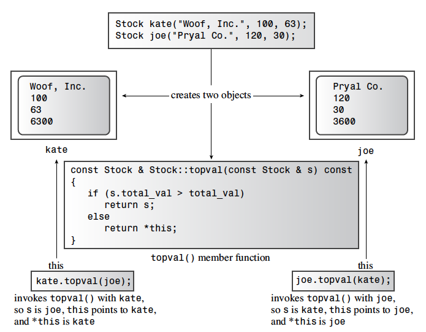

# Objects and Classes

The following are the most important Object-oriented programming (OOP) features:
- Abstraction
- Encapsulation and data hiding
- Polymorphism
- Inheritance
- Reusability of code

## Abstraction and Classes

### What is a Type? 

In short, specifying a basic type does three things:
- It determines how much memory is needed for a data object
- It determines how the bits in memory are interpreted.(A `long` and a `float` might use the same number of bits in memory, but they are translated into numeric values differently.)
- It determines what operations, or methods, can be performed using the data object.

For built-in types, the information about operations is built in to the compiler. But when you define a user-defined type in C++, you have to provide the same kind of information yourself.

### Classes in C++

A _class_ is a C++ vehicle for translating an abstraction to a user-defined type. It combines data representation and methods for manipulating that data into one neat package.

Typically, C++ programmers place the interface, in the form of a class definition, in a header file and place the implementation, in the form of code for the class methods, in a source code file.

The binding of data and methods into a single unit is the most striking feature of the class. `private` and `public` describe `access control` for class members. The public member functions provide the interface between object and program. This insulation of data from direct access by a program is called _data hiding_. (C++ provides a third access-control keyword, _protected_).

The public interface represents the abstraction component of the design. Gathering the implementation details together and separating them from the abstraction is called _encapsulation_. Data _hiding_ (putting data into the private section of a class) is an instance of encapsulation. Another example of encapsulation is the usual practice of placing class function definitions in a separate file from the class declaration.

The principle is to separate the details of implement the data representation of the details of the member functions, you can change those details without changing the program interface, and that makes programs much easier to maintain.

You don't have to use the keyword `private` in class declarations because that is the default access control for class objects.

- When defining a member function, using the scope-resolution operator (::) to identify the class to which the function belongs.
- Class methods can access the `private` components of the class.


## Class Constructors and Destructors

### Default Constructors

A `default constructor` is a constructor that is used to create an object when you don't provide explicit initialization values.
```c++
String cat;					// uses the default constructor
int x;						// just as creating x without providing a value
String String() { }			// the default constructor would look like this

String first;				// calls default constructor implicitly
String first = String();	// calls it explicitly
String *ptr = new String;	// calls it implicitly
```

The header file for the stock program
```c++
class Stock    // class declaration
{
public:
	// two constructors
	Stock();
	Stock(const std::string & co, long n = 0, double pr = 0.0);
	~Stock();   // destrcutors
	void buy(long num, double price);
	void sell(long num, double price);
	void update(double price);
	void show();
	
private:
	std::string company;
	long shares;
	double share_val;
	double total_val;
	void set_tot() { total_val = share_val * shares; }
};       // note semicolon at the end	
```

Usually a constructor is used to initialize members of a class object. Your initialization should match the constructor's argument list.
```c++
Bozo(const char * fname, const char * lname);    // constructor prototype
```

In this case, you can use it to initialize new objects as follows:
```c++
Bozo bozetta = bozo("Bozotta", "Biggens");		// primary form
Bozo fufu("Fufu", "O'Dweeb");					// short form
Bozo *pc = new Bozo("Popp", "Le Peu"); 			// dynamic object
```

If C++11 rules are in effect, you can use list initialization instead:
```c++
Bozo bozetta = {"Bozetta", "Biggens"};		// C++11
Bozo fufu{"Fufu", "O'Dweeb"};				// C++11
Bozo *pc = new Bozo{"Popp", "Le Peu"}; 		// C++11
```

### Destructors

When you use a constructor to create an object, the program undertakes the responsibility of tracking that object until it expires. At that time, the program automatically calls a special memeber function bearing the formidable title `destructor`. The destructor should clean up any debris, so it actually serves a useful purpose.
```c++
~Bozo();	// class destructor
```

Class destructors that use `delete` become necessary when class constructors use `new`.

### C++11 list initialization

With C++11, you can use the list-initialization syntax with classes.
```c++
Stock hot_tip = {"Derivatives Plus Plus", 100, 45.0};
Stock jock {"Sport Age Storage, Inc"};
Stock temp {};
```

The bracked lists in the first two declarations match the following constructor:
```c++
Stock::Stock(const std::string & co, long n = 0, double pr = 0.0);
```

The third declaration matches the default constructors, so `temp` is construted using it.


### `const` member functions

Consider the following code snippet:
```c++
const Stock land = Stock("Kludgehorn Properties");
land.show();
```

With current C++, the compiler should object to the second line. Why? Because the code for `show()` fails to guarantee that it won't modify the invoking object, which, because it is `const`, should not be altered.

The `show()` method doesn't have any arguments for `const` to qualify. The C++ solution is to place the `const` keyword after the function parentheses.
```c++
void show() const;    // promises not to change invoking object
```

Similarly, the beginning of the function definition should look like this:
```c++
void Stock::show() const    // promises not to change invoking ojbect
```

## The `this` Pointer

The most direct way is to have the method return a reference to the object that has larger total value.
```c++
const Stock & topval(const Stock & s) const;
```

This function accesses one object implicitly and one object explicitly, and it returns a reference to one of those two objects. The `const` in parentheses states that the function won't modify the explicitly accessed object, and the `const` that follows the parentheses states that the function won't modify the implicitly accessed object. Because the function returns a reference to one of the two `const` objects, the return type also has to be a `const` reference.

Suppose that you want to compare the Stock objects `stock1` and `stock2` and assign the one with the greater total value to the object `top`. The first form accesses `stock1` implicitly and `stock2` explicitly, whereas the second accesses `stock1` explicitly and `stock2` implicitly. 
```c++
top = stock1.topval(stock2);
top = stock2.topval(stock1);
```

The _this_ pointer points to the object used to invoke a member function. (Basically, _this_ is passed as a hidden argument to the method.) In general, all class methods have a _this_ pointer set to the address of the object that invokes the method.




However, `this` is the address of the object. The object itself is symbolized by `*this`. Applying the dereferencing operator * to a pointer yields the value to which the pointer points.
```c++
const Stock & Stock::topval(const Stock & s) const
{
	if (s.total_val > total_val)
		return s;		// argument object
	else
		return *this;	// invoking object
}
```


## Class Scope

- gloabel scope
- local scope
- a new kind of scope: class scope

Class scope applies to names defined in a class, such as the names of class data members and class member functions. Items that have class scope are known within the class but not outside the class. Also class scope means you can't directly access members of a class from the outside world.
```c++
Stock sleeper("Exclusive Ore", 100, 0.25);		// create object
sleeper.show();			// use object to invoke a member function
show();					// invalid -- can't call method directly
```

Within a class declaration or a member function definition you can use the unqualified name. A constructor name is recognized when it is called because its name is the same as the class name. Otherwise, you must use the direct membership operator (.), the indirect membership operator (->), or the scope-resolution operator (::), depending on the context.
```c++
class IK
{
private:
	int fuse;		// fuss has class scope
public:
	IK(int f = 9) { fuss = f; } // fuss is in scope
	void ViewIK() const;		// ViewIK has class scope
};

void IK::ViewIK() const 		// IK:: places ViewIK into IK scope
{
	cout << fuss << endl;		// fuss in scope within class methods
}

...
int main()
{
	IK * pik = new IK;
	IK ee = IK(8);		// constructor in scope because has class name
	ee.ViewIK();		// class object brings ViewIK into scope
	pik->ViewIK();		// poiner-to-IK brings ViewIK into scope
...
}
```

### Scoped Enumerations (C++11)

C++11 provides a new form of enumberation that avoids this problem by having class scope for its enumerators. the declarations for this form look like this:
```c++
enum class egg {Small, Medium, Large, Jumbo};
enum class t_shirt {Small, Medium, Large, Xlarge};

egg choice = egg::Large;		// the large enumerator of the egg enum
t_shirt Floyd = t_shirt::Large; // the large enumerator of the t_shirt enum
```

## Abstract Data Types

Using classes is a good way to implement what computer scientists describes as _abstract data types_ (ADTs). As the name suggests, an ADT describes a data type in a general fashion without bringing in language or implementations details. Consider, for example, the stack.
```c++
// stack.h  -- class definition for the stack ADT

#ifndef STACK_H_
#define STACK_H_ 

typedef unsigned long Item;

class Stack    // class declaration
{
public:
	Stack();
	bool isempty() const;
	bool isfull() const;
	// push() returns false it stack already is full,
	// true otherwise
	bool push(const Item & item);	// add item to stack
	// pop() returns false if stack already is empty,
	// true otherwise
	bool pop(Item & item);			// pop top into item
	
private:
	enum {MAX = 10};	// constant specific to class
	Item items[MAX];	// holds stack items
	int top;			// index for top stack item
};       // note semicolon at the end
#endif
```

## Summary

OOP emphasizes how a program represents data and how the data is used. Then, you need to design a class that implements the interface. Typically, private data members store the information, whereas public member functions provide the only access to the data. The class combines data and methods into one unit, and the private aspect accomplishes data hiding.

Usually, you separate a class declaration into two parts. The class declaration proper goes into a header file, with the methods represented by function prototypes. The source code that defines the member functions goes into a methods file. This approach separates the description of the interface from the details of the implementation. As long as a program and a class communicate only through methods defining the interface, you are free to improve either part separately without worrying about unforeseen interactions.

A class is a user-defined type, and an object is an instance of a class. This means an object is a variable of that type or the equivalent of a variable. C++ tries to make user-defined types as similar as possible to standard types, so you can declare objects, pointers to objects, and arrays of objects. You can pass objects as arguments, return them as function return values, and assign one object to anthother of the same type.

Each object holds its own copies of the data portion of a class declaration, but they share the class methods. If `mr_object` is the name of a particular object and `try_me()` is a member function, you invoke the member function by using the dot membership operator: `mr_object.try_me()`. OOP terminology desctribes this function call as sending a `try_me` message to the `mr_object` object. Any reference to class data members in the `try_me ()` method then applies to the data members of the `mr_object` object.

If you want a member function to act on more than one object, you can pass additional objects to the method as arguments. If a method needs to refer explicitly to the object that evoked it, it can use the `this` pointer. The `this` pointer is set to the address of the evoking object, so `*this` is an alias for the object itself.

## Reference

- C++ Primer Plus (Developer's Library) 6th Edition by Stephen Prata
