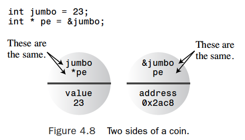
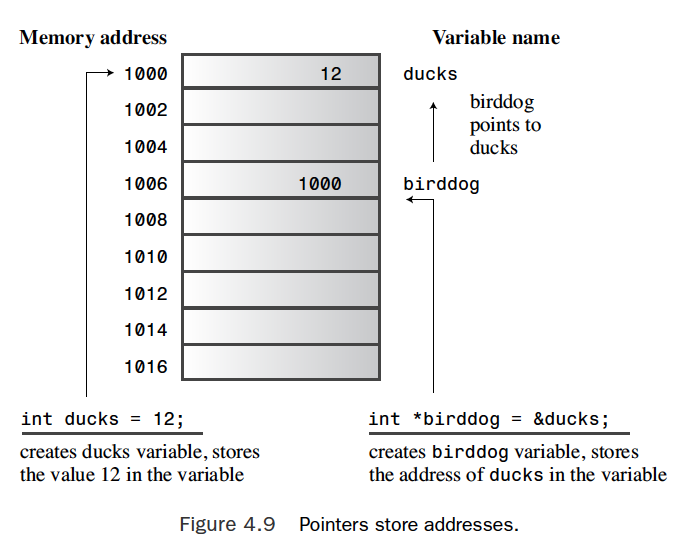
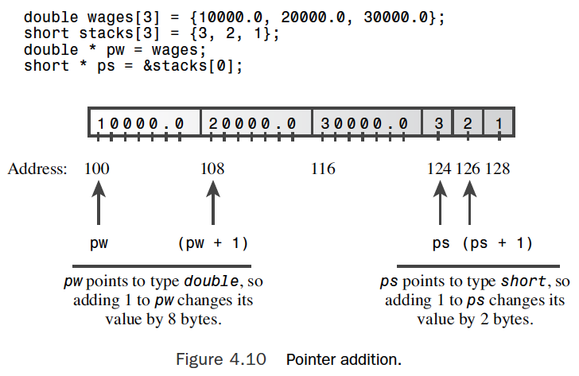

# Set out to C++

- [C++ Initiation](#cpp-initiation)
- [Dealing with data](#dealing-with-data)
- [Compound Types](#compound-types)
  - [Strings](#strings)
  - [Reading string input](#reading-string-input)
  - [Introducing the string class](#introducing-the-string-class)
  - [Structures, Unions and Enumerations](#structures-unions-and-enumerations)
  - [Pointers and the Free store](#pointers-and-the-free-store)

## CPP Initiation

* main () is called by startup code that the compiler adds to your program to mediate between the program and the operating system. In effect, the function header describes the interface between main () and the operating system.
* main () function returns an integer value to the function that calls it and that main () take no information from the function that calls it:
```c++
int main ()
int main (void)  //very explicit style
//Under C++, leaving the parentheses empty is the same as using void in the parentheses
//In C, leaving the parentheses empty means you are remaining silent about whether there are arguments
//void main ()    this variant doesn't work on some system, should avoid this form
```

* C++, like C, uses *preprocessor*. This is a program that processes a source file before the main compilation takes place.
```c++
#include <iostream>    // a PREPROCESSOR directive
```

* This directive causes the preprocessor to add the contents of the *iostream* file to your program. This is a typical **preprocessor action**: adding or replacing text in the source code before it's compiled.

* Namespace support is a C++ feature designed to simplify the writting of large programs and of programs that combine pre-existing code from several vendors and to help organize programs. The namespace facility lets a vendor package its wares in unit called a *namespace* so that you can use the name of a namespace to indicate which vendor's product you want.
```c++
Microflop::wanda("go dancing?");    // use Microflop namespace version
Piscine::wanda("a fish named Desire");   // use Piscine namespace version
```

* This *using* directive makes all the names in the *std* namespace available. Modern practice regards this as a bit lazy and potentially a problem in large projects.
```c++
using std::cout;   // make cout available
using std::endl;   // make endl available
using std::cin;    // make cin available
using namespace std;  //lazy approach, all namespace available 
```

* C++ output with cout: the output is a stream - that is, a series of characters flowing from the program. The *cout* object, whose properties are defined in the *iostream* file, represents that stream. The object properties for *cout* include an insertion operator (<<) that inserts the information on its right into the stream.

* The C++ style for declaring variables is to declare a variable as close to its first use as possible.

* For input, *cin* uses the >> operator to extract charachters from the input stream. Typically, you provide a variable to the right of the operator to receive the extracted information.


## Dealing with data

* If you don't initialize a variable that is defined inside a function, the variable's value is indeterminate. That means the value if whatever happened to be sitting at that memory location prior to the creation of the variable.

* From smallest to largest, the integer types are (with C++11):
```
bool
char
signed char
unsigned char
short
unsigned short
int
unsigned int
long
unsigned long
long long
unsigned long long
```

* C++ guarantees that *char* is large enough to hold any member of the system's basic character set, *wchar_t* can hold any member of the system's extended set.

## Compound Types

- Arrays

An **array** is called a compound type because it is built from some other type. C uses the term derived type, but because C++ uses the term derived for class relationships, it had to come up with a new term.

### Strings

A **string** is a series of characters stored in consecutive bytes of memory. C++ has two ways of dealing with strings: taken from C and often called a *C-style* string and alternative method based on a string class library.

C-style strings have a special feature: the last character of every string is the *null character*. This character, written \0, is the character with ASCII code 0, and it serves to mark the string's end.
```c
chat cat[8] = {'f', 'a', 't', 'e', 's', 's', 'a', '\0'}; // a string
```

There is a better way to initialize a character array to a string. Just use a quoted string, called a *string constant* or *string literal*.
```c
char bird[11] = "Mr. Cheeps";      // the \0 is understood
char fish[] = "Bubbles";           // let the compiler count
```

Note that a string constant (with double quotes) is not interchageable with a character constant (with single quotes).
```c
char shirt_size = 'S';    // this is fine
char shirt_size = "S";    // illegal type mismatch
```

But "S" is not a character constant, it represents the string consisting of two characters, the S and the \0 characters. Even worse, "S" actually represents the memory address at which the string is stored. So the statement attempts to assign a memory address to *shirt_size*.

### Reading string input

- cin()
The *cin* technique is to use whitespace - spaces, tabs, and newlines - to delineate a string. This means *cin* reads just one word when it gets input for a character when it places the string into the array. After it reads this word, *cin* automatically adds the terminating null character when it places the string into the array.

- getline()
The *getline* function conveniently gets a line at a time. It reads input through the newline character marking the end of the line, but it doesn't save the newline character. Instead, it replaces it with a null character when storing the string.

- get()
One variant works much like getline(). It takes the same arguments, interprets them the same way, and reads to the end of a line. But rather than read and discard the newline character, *get()* leaves that character in the input queue.

Suppose you use two calls to get() in a row:
```c++
cin.get(name, ArSize);
cin.get(dessert, ArSize);     // a problem
```

Because the first call leaves the newline character in the input queue, that newline character is the first character the second call sees. Thus, get() concludes that it's reached the end of line without having found anything to read.

The call cin.get() (with no arguments) reads the single next character, even if it is a newline, so you can use it to dispose of the newline character and prepare for the next line of input.
```c++
cin.get(name, ArSize);     // read first line
cin.get();                 // read newline
cin.get(dessert, ArSize);  // read second line

cin.get(name, ArSize).get();  //concatenate member functions
```

- Mixing string and numeric input
```c++
cout << "What year was your house built?\n";
int year;
cin >> year;
cout << "What is its street address?\n";
char address[80];
cin.getline(address, 80);
```

You never get the opportunity to enter the address. The problem is that when cin reads the year, it leaves the newline generated by the Enter key in the input queue. Then cin.getline() reads the newline as an empty line and assigns a null string to the *address* array. The fix is to read and discard the newline before reading the address.
```c++
cin >> year;
cin.get();   // or cin.get(ch);
```

### Introducing the string class

The class definition hides the array nature of a string and lets you treat a string much like an ordinary variable.

### Structures, Unions and Enumerations

- Structures
```c++
//the struct keyword
//           the tag becomes the name for the new type
struct inflatable
{  // opening braces
  char  name[20];   //structure members
  float  volume;
  double  price;
};  // closing braces
// terminates the structure declaration

inflatable hat;   // hat is a structure variable of type inflatable

inflatable gifts[100];  // array of 100 infltable structures
```

- Unions
A *union* is a data format that can hold different data types but only one type at a time. The syntax is like that for a structure, but the meaning is different.
```c++
union one4all
{
  int int_val;
  long long_val;
  double double_val;
};
```

You can use a *one4all* variable to hold an *int*, a *long*, or *double*, just as long as you do so at different times:
```c++
one4all pail;
pail.int_val = 15;         // store an int
pail.double_val = 1.38;    // store a double, int value is lost
```

Thus, *pail* can serve as an *int* variable on one occasion and as a *double* variable at another time. Because a union holds only one value at a time, it has to have space enough to hold its largest member. Hence, the size of the union is the size of its largest member.

Unions often (but not exclusively) are used to save memory space. For example, C++ is used for embedded system, such as the processors used to control a toaster oven, an MP3 player, or a Mars rover.

- Enumerations

The C++ *enum* facility provides an alternative to *const* for creating symbolic constants. For example:
```c++
enum spectrum {red, orange, yellow, green, blue, violet, indigo, ultraviolet};
```

By default, enumberators are assigned integer values starting with 0 for the first enumerator, 1 for the second enumerator, and so forth.

You can use an enumeration name to declare a variable of the enumeration type:
```c++
spectrum band;     // band a variable of type spectrum
band = blue;       // valid, blue is an enumerator
int color = blue;  // valid, spectrum type promoted to int
```

Setting enumerator values, the assigned values musth be integers.
```c++
enum bits{one = 1, two = 2, four = 4, eight = 8};
enum bigstep{first, second = 100, third};    // first is 0, third is 101
enum {zero, null = 0, one, numero_uno = 1};  // both zero and null are 0, one and numero_uno are 1.

bits myflag;
myflag = bits(6);     // valid, because 6 is in bits range 
```

The range is defined as follows. For example, the largest *bigstep* value, as previously defined, is 101. The smallest power of two greater than this is 128, so the upper end of the range is 127. Next, to find the lower limit, you find the smallest enumerator value. If it is 0 or greater, the lower limit for the range is 0. If it is negative, say, -6, the next power of two [time a minux sign] is -8, and the lower limit is -7.

The idea is that the compiler can choose how much space to use to hold an enumeration. It might use 1 byte or less for an enumeration with a small range and 4 bytes for an enumeration with type *long* values. 

### Pointers and the Free store

#### Pointers and the C++ Philosophy

Object-oriented programming differs from traditional procedural programming in that OOP emphasizes making decisions during runtime instead of during compile time. Runtime means while a program is running, and compile time means when the compiler is putting a program together.

Runtime decisions provide the flexibility to adjust to current cirumstances. For example, consider allocating memory for an array. The traditional way is to declare an array. To decide an array in C++, you have to commit yourself to a particular array size. Perhaps you think an array of 20 elements is sufficient 80% of the time but that occasionally the program will need to handle 200 elements. To be safe, you use an array with 200 elements. This results in your program wasting memory most of the time it's used. OOP tries to make a program more flexible by delaying such decisions until runtime. That way, after the program is running, you can tell it you need only 20 elements one time or that you need 205 elements another time.

In short, with OOP you would like to make the array size a runtime decision. To make this approach possible, the language has to allow you to create an array - or the equivalent - while the program runs. The C++ method involves using the keyword `new` to request the correct amount of memory and using pointers to keep track of where the newly allocated memory is found.

Making runtime decisions is not unique to OOP. But C++ makes writing the code a bit more strightward than does C.

The *int* variable `jumbo` and the pointer variable `pe` are just two sides of the same coin. The `jumbp` variable represents the value as primary and uses the `&` operator to get the address, whereas the `pe` variable represents the address as primary and uses the `*` operator to get the value. Because `pe` points to `jumbo`, `*pe` and `jumbo` are completely equivalent. You can use `*pe` exactly as you would use a type *int* variable. 



Image Source: C++ Primer Plus (6th Edition)

#### Declaring and Initializing Pointers

A computer needs to keep track of the type of value to which a pointer refers. For example, the address of a *char* typically looks the same as the address of a *double*, but *char* and *double* use different numbers of bytes and different internal formats for storing values. Therefore, a pointer declaration must specify what type of data to which the pointer points.



Image Source: C++ Primer Plus (6th Edition)

In C++, the combination `int *` is a compound type, it is the same to declare pointers to other types:
```c++
double * d_ptr;    // d_ptr points to type double
char * c_ptr;      // c_ptr points to type char
```

Note that whereas `d_ptr` and `c_ptr` point to data types of two different sizes, the two variables `d_ptr` and `c_ptr` themselves are typically the same size. The size or value of an address doesn't really tell you anything about the size or kind of variable or building you find at that address.

> Pointer Golden Rule: Always initialize a pointer to a definite and appropriate address before you apply the dereferencing operator (*) to it.

```c++
int *pt;
pt = 0xB8000000;         // type mismatch
pt = (int *) 0xB8000000; // types now match
```

Here's an example of allocating Memory with *new*:
```c++
int *pn = new int;     // allocate memory with new
...                    // use the memory
delete pn;             // free memory with delete when done
```

The `new int` part tells the program you want some new storage suitable for holding an `int`. The `new` operator uses the type to figure out how many bytes are needed. Then it finds the memory and returns the address.

The `delete` removes the memory to which *pn* points, it doesn't remove the pointer *pn* itself. You can reuse *pn*, for example, to point to another `new` allcoation. You should use `delete` only to free memory allocated with `new`. This doesn't mean you have to use the same pointer you used with `new`; instead, you have to use the same address:
```c++
int * ps = new int; // allocate memory
int * pq = ps; 		// set second pointer to same block
delete pq; 			// delete with second pointer
```

Ordinarily, you won't create two pointers to the same block of memory because that
raises the possibility that you will mistakenly try to delete the same block twice.

Creating a dynamic array with `new`, for example:
```c++
int * psome = new int [10];   // get a block of 10 ints
// the new operator returns the address of the first element of the block
delete [] psome;              // free a dynamic array
```



Image Source: C++ Primer Plus (6th Edition)

> Note: Adding one to a pointer variable increases its value by the number of bytes of the type to which it points.

Now consider the array experession `stacks[1]`. The C++ compiler treats this expression exactly as if you wrote as if you wrote it as *(stacks + 1). The second expression means calculate the address of the second element of the array and then find the value stored there.

And it you use a pointer instead of an array name, C++ makes the same conversion: `pointername[i] becomes *(pointername + i)`

- Pointers and Strings

The special relationship between arrays and pointers extends to C-style strings. Consider the following code:
```c++
char flower[10] = "rose";
cout << flower << "s are red\n";
```

The name of an array is the address of its first element, so `flower` in the `cout` statement is the address of the `char` element containing the character `r`. If you give `cout` the address of a character, it prints everything from that character to the first null character that follows it.

With `count` and with most C++ expressions, the name of an array `char`, a pointer-to-char, and a quoted string constant are all interpreted as the address of the first character of a string.

- Using new to create dynamic structures


Image Source: C++ Primer Plus (6th Edition)

This assigns to `pt` the address of a chunk of free memory large enouth to holds a structure of the `things` type. Note that the syntax is exactly the same as it is for C++'s built-in types.

When you create a dynamic structure, you can't use the dot membership operator with the structure name because the structure has no name. C++ provides an operator just for this situation: the arrow membership operator (->). 

- Automatic storage, static storage, and dynamic storage

Automatic storage: ordinary variables defined inside a function. The variables come into existence automatically when the function containing them is invoked, and they expire when the function terminates. (local variables)

Static storage: exists throught the execution of an entire program. There are two ways to make a variable static. One is to define it exeternally, outside a funtion. The other is to use the keyword `static` when declaring a variable:
```c++
static double fee = 56.50;
```

Dynamic storage: the `new` and `delete` operators provide a more flexible approach than automatic and static variables. They manage a pool of memory, which C++ refers to as the *free store* or *heap*.

In a stack, the automatic addition and removal mechanism results in the part of memory in use always being contiguous. But the interplay between `new` and `delete` can leave holes in the free store, making keeping track of where to allocate new memory requests more difficult.

## Reference

* C++ Primer Plus (6th Edition) (Developer's Library) 6th Edition by Stephen Prata
