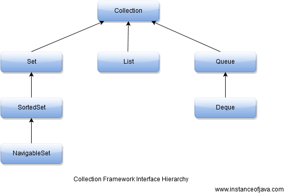

# Comparison in Java

>Created by iFDING

>Create Date: 02/22/2017

<div class="message">
<b>Reader beware:</b> this is a JavaSE comparison post: String, StringBuffer and StringBuilder.
</div>

###  String, StringBuilder and StringBuffer

#### String

String is immutable (once created can not be changed) object. The object created as String is stored in the **Constant String Pool**.

Every immutable object in Java is thread safe, that implies Stirng is also thread safe. String can not be used by two threads simultaneously.

```java
String demo = "hello";
// The above object is stored in constant string pool and its value can not be modified.

demo = "Bye";
// New "Bye" string is created in constant pool and referenced by the demo ariable

// "Hello" string still exists in string constant pool and its value is not overrided 
// but we lost reference to the "hello" string
```

#### StringBuffer

StringBuffer is mutable. The object created through StringBuffer is stored in the **heap**. StringBuffer has the same methods as the StringBuilder, but **each method in StringBuffer is synchronized** that is **StringBuilder is thread safe**.

It does not allow two threads to simultaneously access the same method. Each method can be accessed by one thread at a time.

StringBuffer value can be changed, it means it can be assigned to the new value. It can be converted to the string by using toString() method.

```java
StringBuffer demoBuf = new StringBuffer("hello");
// The above object stored in heap and its value can be changed

demoBuf = new StringBuffer("Bye");
// Above statement is right as it modifies the value which is allowed in the StringBuffer
```

#### StringBuilder

StringBuilder is same as the StringBuffer, that is it stores the object in heap and it can also be modified. The main difference between the StringBufer and StringBuilder is that **StringBuilder is not thread safe**.

StringBuilder is faster than the StringBuffer when calling the same methods of each class.

```java
StringBuilder demoBui = new StringBuilder("hello");

demoBui =new StringBuilder("Bye");
// Above statement is right as it modifies the value which is allowed in the StringBuilder
```

|                 | String                | StringBuffer     | StringBuilder    |
| --------------- |:---------------------:|:----------------:|:----------------:|
| Storage Area    | Constant String Pool  | Heap             | Heap             |
| Modifiable      | No (immutable)        | Yes (mutable)    | Yes (mutable)    |
| Thread Safe     | Yes                   | Yes              | No               |
| Performance     | Fast                  | Very slow        | Fast             |

Source from:[Difference Between String , StringBuilder And StringBuffer Classes With Example : Java](http://javahungry.blogspot.com/2013/06/difference-between-string-stringbuilder.html)

### try-catch-finally

```java
public static void main(String[] args) {
    System.out.println(Test.test());
}

public static int test() {
    try {
        return 0;
    }
    finally {
        System.out.println("finally trumps return.");
    }
}
```

Output:

```
finally trumps return. 
0
```

Source from:[Does finally always execute in Java?](http://stackoverflow.com/questions/65035/does-finally-always-execute-in-java?page=1&tab=votes#tab-top)


### Abstract Class Vs Interface

#### Abstract Class

* An class that is delcared **abstact** - it may or may not include absract methods.

* Cannot be instantiated, but they can be subclassed.

* May have static fields and static methods.

* When an abstract class is subclassed, the subclass usually provides implementations for all of the abstract methods in its parent class.

* However, if it does not, then the subclass must also be declared abstract.

An abstract method is a method that is declared without an implementation (without braces and followed by a semicolon), like this:

```java
abstract void sum(int a, int b);
```

Consider using abstract classes if any of these statements apply to your sistuation:

1. You want to share code among several closely related classes.

2. You expect that classes that extend your abstract class have many common methods or fields or require access modifiers other than public (such as protected and private).

3. You want to declare non-static or non-final fields. This enables you to define methods that can access and modify the state of the object to which they belong.

#### Interface

* An interface is just the declaration of methods of an Object, it's not the implementation.

* In interface, we define what kind of operation an object can perform. These operations are defined by the classes that implement interface.

* Interfaces form a contract between the class and the outside world, and this contract is enforced at build time by the compiler.

```java
interface Vehical {
    // declaration
    void changeGear(int newValue);
    void speedUp(int increment);
    void applyBrakes(int decrement);
}

class Car implements Vehical {
    int speed = 0;
    int gear = 1;
    // implementation
    void changeGear(int newValue) {
        gear = newValue;
    }
    void speedUp(int increment) {
        speed = speed + increment; 
    }
    void applyBrakes(int decrement) {
        speed = speed - decrement;
    }
    void printStates() {
        System.out.println(" speed:" + speed + " gear:" + gear);
    }
}
```

Consider using interfaces if any of these statements apply to your situation:

1. You expect that unrelated classes would implement your interface. For example, comparable and cloneable interfaces.

2. You want to specify the behavior of a particular data type, but not concerned about who implements its behavior.

3. You want to take advantage of multiple inheritances.

Source from: [When to Use Abstract Class and Interface](https://dzone.com/articles/when-to-use-abstract-class-and-intreface)


### Static Vs Non Static Nested Classes

1. In case of declaring member fields and methods, non static nested class cannot have static fields and methods. But, in case of static nested class, can have static and non static fields and methods.

2. The instance of non static nested class is created with the reference of object of outer class, in which it has defined, this means it has enclosing instance. But the instance of static nested class is created wihtout the reference of outer class, which means it does not have enclosing instance.

```java
class A
{
    class B
    {
        // static int x; not allowed here
    }

    static class C
    {
        static int x; // allowed here
    }
}

class Test
{
    public static void main(String… str)
    {
        A a = new A();

        // Non Static Nested Class
        // Requires enclosing instance
        A.B obj1 = a.new B(); 

        // Static Nested Class
        // No need for reference of object to the outer class
        A.C obj2 = new A.C(); 
    }
}
``` 

Source from: [stackoverflow](http://stackoverflow.com/questions/1353309/java-static-vs-non-static-inner-class)

### Iterator Vs Foreach

**Iterator** is an interface provided by collection framework to traverse a collection and for a sequential access of items in the collection.

```java
//Iterating over collection 'c' using iterator
for (Iterator i = c.iterator(); i.hasNext();)
    System.out.println(i.next());
```

**For each** loop is meant for traversing items in a collection.

```java
//Iterating over collection 'c' using for-each
for (Element e : c)  //reads as "for each element e in elements"
    System.out.println(e);
```

In Java 8 using **lambda** expressions:

```java
elements.forEach(e -> System.out.println(e));
```

#### Difference between two traversals

* In for-each loop, we can't modify collection, it will throw a `ConcurrentModificationException` on the other hand with iterator we can modify collection.

* Modifying a collection simply means removing an item or changing content of an item stored in the collection. This occurs because for-each loop implicitly creates an iterator but it is not exposed to the user thus we can't modify the items in the collections.

When to use which traversal?

* If we have to modify collection, we must use an Iterator.

* While using nested for loops it is better to use for-each loop.

#### Performance Analysis

Traversing a collection using for-each loops or iterators give the same performance, means the time complexity of both these traversals.

If you iterate using the old styled C for loop then we might increase the imte complexity drastically.

```java
// Here I is List, it can be ArrayList/LinkedList and n is size of the List
for (i=0; i<n; i++)
    System.out.println(I.get(i));
```

Here if the list I is an ArrayList then we can access it in O(1) time since it is allocated contiguous memory blocks (just like an array), i.e random access is possible. But if the collection is LinkedList, then random access is not possible since it is not allocated contiguous memory blocks, so in order to access a element we will have to traverse the link list till you get to the required index, thus the time taken in worst case to access an element will be O(n).

**Iterator and for-each loop are faster than simple for loop for collections with no random access, while in collections which allows random access there is no performance change with for-each loop /for loop /Iterator.**

### ArrayList Vs LinkedList Vs Vector

* List is an ordered sequence of elements.

* Set is a set of elements which is unordered and every element is unique.

The following is the class hierarchy diagram of Collection.


* From the hierarchy diagram, they all implement List interface. They are very similar to use.

* Their main difference is their implementation which causes different performance for different operations.

* ArrayList is implemented as a reziable array. It's elemetns can be accessed directly by using the get and set methods, since ArrayList is essentially an array.

* LinkedList is implemented as a double linked list. Its performance on add and remove is better than ArrayList, but worse on get and set methods.

* Vector is similar with ArrayLis, but it is synchronized.

* ArrayList is a better choice if your program is thread-safe.

* Vector and ArrayList require space as more elements are added.

* Vector each time doubles its array size, while ArrayList grow 50% of its size each time.

* LinkedList also implements Queue interface which adds more methods than ArrayList and Vector, such as offer(), peek(), poll(), etc.

* The default initial capacity of an ArrayList is pretty small. It is a good habit to construct the ArrayList with a higher initial capacity. This can avoid the resizing cost.

Source from: [ArrayList vs. LinkedList vs. Vector](https://dzone.com/articles/arraylist-vs-linkedlist-vs)

### Comparable Vs. Comparator

Mostly used as the sorting tools for the collection classes such as the Arraylist, Hashset, etc.

Commparable Interface: Comparable is an public interfaces which is used to impose an natural ordering (if numbers then 1,2,3 or in alphabetical order 'a','b','c') of the class that implements it. Sorting by the ASCII values.

Comparator Interface: A comparison function, which is used to impose ordering on some collection of objects. To allow precisely control over the sort order, Comparators can be passed to a sort method (e.g Collectons.sort()).Certain type of data structures such as TreeSet or TreeMap can also be sorted using comparator.

| Comparator                                  | Comparable                               |
| ------------------------------------------- |:----------------------------------------:|
| many sort sequences can be created          | Only one sort can be created             |
| public int compare(Object o1, Object o2)    | public int compareTo(Object o)           |
|     negative(<),zero(=),positive(>)         |     negative(<),zero(=),positive(>)      |
| Two objects provided to it                  | compares "this" reference                |
| build a class separate from sorting class   | modify the class whose instances to sort |
| java.util package                           | java.lang package                        |
| should be used as an utility to sort objects| should be provided by default            |

* Comparable is used to implement natural ordering of object. String, Date and wrapper classes implements Comparable interface. Its good practive to override compareTo() for value objects.

* If any class implement Comparable interface then collection of that object either list or Array can be sorted automatically bu using Collections.sort() or Arrays.sort() method can object will be sorted based on there natural order defined by CompareTo method.

* Objects which implement Comparable can be used as keys in a SortedMap like treemap or elements in a SortedSet for example TreeSet, without specifying any Comparator.

Source from: [Difference Between Comparable And Comparator Interface Along With Example In Java : Collection](http://javahungry.blogspot.com/2013/08/difference-between-comparable-and.html)

### Collections Vs Collection

* Major difference between Collection adn Collections is Collection is an interface and Collections is a class.

* Both are belongs to java.util package

* Collection is base interface for list set and queue.

* Collections is a class and it is called utility class.

* Collections utility class contains some predefined methods so that we can use while working with Collection type of classes (treeset, arraylist, linkedlist etc.)

* Collection is base interface for List, Set dan Queue.



Collection Vs Collections

```java
public interface Collection<E> 
extends Iterable<E>
```

```java
public class Collections
extends Object
```

Collections utility class contains static utility methods so that we can use those methods by using class name without creating object of Collections class object.

ArrayList is a Collection type of class means it is implementing Collection interface internally.

Source: [Difference between Collections and Collection](http://www.instanceofjava.com/2016/06/collection-vs-collections-in-java-with.html)

### Set Vs List Vs Map Vs Queue Vs Stack Vs Deque

Set: collection that doesn't allow duplicates ans also doesn't allow accessing elements by index. Instead provides methods that check if element or elements exists.

* EumSet - specialized class to work with enum types

* HashSet - keeps unordered list of elements (order is unpredictable). Implementation based on HashMap.

* LinkedHashSet - keeps ordered list of elements. Implementation based on LinkedHashMap.

* TreeSet - provides an implementation of the Set interface that uses a tree for storage. Objects are sorted in a sorted and ascending order.

* SortedSet - extends Set and declares the behavior of a set sorted in an ascending order.

List: collection that allow duplicates and behave like array(index elements by integer) but is more flexible. First element has index = 0, last one has index = length - 1.

* ArrayList - keeps unordered list of elements using array.

* LinkedList - keeps ordered list of elements using doubly-linked list.

* Vector - mostly the same as ArrayList but it is thread safe.

Map: collection that allow duplicates and is similar to list except that index elements by key (key can be any object). Map can be assumed as associative array.

* HashMap - keeps unordered list of elements using array.

* LinkedHashMap - keeps ordered list of elements using doubly-linked list.

* TreeMap - keeps ordered list of elements using RBT. Elements are ordered by natural order or by custom comparator.

* HashTable - keeps unordered list of elements as HashMap, but is snchronized. This class is obsolete.

There are three subtypes of list:

* Stack - Elements are added (pushed) and removed (popped) from top of collection. This principle is called LIFO.

* Queue - Elements are added (pushed) and removed (popped) in order they where added. FIFO.

* Deque - Elements are added and removed form both sides. (Pronounced "Deck")

Source: [Java Collections: Set, List, Map, Queue, Stack, Deque](https://szakuljarzuk.wordpress.com/2015/07/28/java-collections-set-list-map-queue-stack-deque/)
