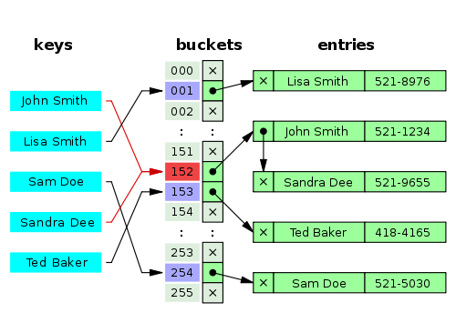
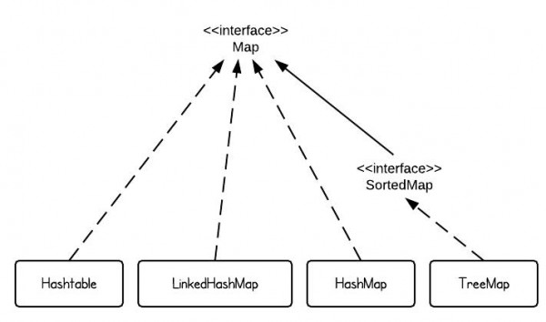

# Java Hash implementations

>iFDING

>02/21/2017


<div class="message">
<b>Reader beware:</b> this is a Hash* (HashCode, HashMap, hashTable, HashSet) post.
</div>

hashCode is used for bucketing in Hash implementations like HashMap, HashTable, HashSet, etc.

#### What is hashCode

A hashCode is a number generated from any object. This is what allows objects to be stored/retrieved quickly in a HashTable. 

Imagine the following simple example: on the table in front of you you have nine boxes, each marked with a number 1 to 9. You also have a pile of wildly different objects to store in these boxes, but once they are in there you need to be able to find them as quickly as possible.

Source: [What is HashCode](https://coderanch.com/t/321515/java/HashCode)

The contract is explained in the hashCode method's JavaDoc. It can be roughly summarized with this statement:

**Objects that are equal must have the same hash code within a running process**

* Unequal objects must have different hash codes - **WRONG!**

* Objects with the same hash code must be equal - **WRONG!**


Source from: [Here](http://eclipsesource.com/blogs/2012/09/04/the-3-things-you-should-know-about-hashcode/)

The contract allows for unequal objects to share the same hash code, such as the "A" and "µ" objects in the same box. In match terms, the mapping from objects to hash codes doesn't have to be injective or even bijective. This is obvious because the number of possible distinct objects is usually bigger than the number of possible hash codes(2^32). 


### What is Hash Function, Hash Value and Bucket

hashCode() function which returns an integer value is the Hash function. This is the code for the hash function (also known as hashCode method) in Object Class:

```java
public native int hashCode();
```

The most important point: hashCode method return int value.

So the **Hash Value** is the int value returned by the hash function.

A bucket is used to store key value pairs. A bucket can have multiple key-value pairs. In hash map, bucket used simple linked list to store object.

### How Hash Map works

Code inside Java API (HashMap class internal implementation) for HashMap get(Object key) method

```java
Public  V get(Object key)
{
    if (key ==null)
    //Some code

    int hash = hash(key.hashCode());  //key.hashCode() returns hashValue
    // it looks like int hash = hash(hashValue)
    
    // if key found in hash table then  return value
    //    else return null
}
```

HashMap get(Key k) method calls hashCode method on the key object and applies returned hashValue to its own static hash function to find a bucket location (backing array) where keys and values are stored in form of a nested class called **Entry (Map.Entry)** . Both key and value is stored in the bucket as a form of Entry object.

* Whenever we call get (Key k) method on the HashMap object. First it checks that whether key is null or not.

* If key is null, then Null keys always map to hash 0, thus index 0.

* If key is not null then, it will call hash function on the key object.

We might wonder why we are calulating the hashvalue again using hash(hashValue). Answer is, It defends against poor quality hash functions.

hashValue is used to find the bucket location at which the Entry object is stored. Entry object stores in the bucket like this (hash, key, value, bucketindex).

What if when two different keys have the same hashcode?

The bucket is the linkesd list effectively. Its not a LinkedList as in a java.util.LinkedList - it's a separate (simpler) implementation just for the map.

So we traverse through linked list, comparing keys in each entries using keys.equals() until it return true. Then the corresponding entry object Value is returned.



Does it traverse from start to end one by one ? Or the linked list is sorted based on key and then it traverses?

When an element is added/retrieved, same procedure follows:

1. Using key.hashCode() determine initial hashValue for the key.

2. Pass intial hashValue as hashValue in hash (hashValue) function, to calculate the final hashValue.

3. Final hash value is then passed as a first parameter in the indexFor(int,int) method. The second parameter is length which is a constant in HashMap Java API, represented by **DEFAULT_INITIAL_CAPACITY (default value: 16).

4. IndexFor(int,int) method returns the first entry in the appropriate bucket. The linked list in the bucket is then iterated over - (the end is found and the element is added or the key is matched and the value is returned).

How will you measure the performance of HashMap?

According to Oracle Java Docs, An instance of HashMap has two parameters that affect its performance: initial capacity and load factor.

**Capacity** is the number of buckets in the hash table (HashMap class is roughly equivalent to HashTable, except that is unsynchronized and permits nulls), and the initial capacity is simply the capacity at the time the hash table is created.

**Load factor** is a measure of how full the hash table is allowed to get before its capacity is automatically increased. When the number of entries in the hash table exceeds the product of the load factor and the current capacity, the hash table is rehashed (that is, internal data structures are rebuilt) so that the hash table has approximately twice the number of buckets.

Source: [How Hash Map Works In Java](http://javahungry.blogspot.com/2013/08/hashing-how-hash-map-works-in-java-or.html)

### HashMap Vs HashTable

|                           | HashMap                      | HashTable                       |
| ------------------------- |:----------------------------:|:-------------------------------:|
| Synchronized              | No                           | Yes                             |                      
| Thread-Safe               | No                           | Yes                             |
| Null Keys and Null values | One null key,Any null values | Not permit null keys and values |
| Iterator type             | Fail fast iterator           | Fail safe iterator              |
| Performance               | Fast                         | Slow in comparison              |
| Superclass and Legacy     | AbstractMap, No              | Dictionary, Yes                 |

Iterating the values: HashMap object values are iterated by using iterator. HashTable is the only class other than vector which uses enumerator to iterate the values of HashTable object.

According to Oracle Docs, if the HashTable is structurally modified at any time after the iterator is created in any way except the iterator's own remove method, then the iterator will throw ConcurrentModification Exception.

Performance: HashMap is much faster and uses less memory then HashTable as former is unsynchronized. Unsynchronized objects are often much better in performance in compare to synchronized object like HashTable in single threaded environment.

Source: [6 Difference Between HashMap And HashTable](http://javahungry.blogspot.com/2014/03/hashmap-vs-hashtable-difference-with-example-java-interview-questions.html)

### HashMap Vs ConcurrentHashMap

**Thread-Safe:**

* ConcurrentHashMap is thread-safe that is the code can be accessed by single thread at a time.
* While HashMap is not thread-safe.

**Synchronization Method:**

* HashMap can be synchronized by using synchronizedMap (HashMap) method. By using this method we get a HashMap object which is equivalent to the HashTable object. So every mofification is performed on Map is locked on Map object.

* ConcurrentHashMap synchronizes or locks on the certain portion of the Map. To optimize the performance of ConcurrentHashMap, Map is divided into different partitions depending upon the Concurrency level. So that we do not need to sychronize the whole Map Object.

**Null Key:**

* ConcurrentHashMap does not allow NULL values. So the key can not be null in ConcurrentHashMap.
* While in HashMap there can only be one null key.

**Performance:**

* In multiple threaded environment HashMap is usually faster than ConcurrentHashMap. As only single thread can access the certain portion of the Map and thus reducing the performance.
* While in ConcurrentHashMap any number of threads can access the code at the same time.

Source: [HashMap Vs ConcurrentHashMap](http://javahungry.blogspot.com/2014/02/hashmap-vs-concurrenthashmap-java-collections-interview-question.html)

### HashMap Vs TreeMap Vs HashTable Vs LinkedHashMap

Map overview



There are 4 commonly used implementations of Map in Java SE - HashMap, TreeMap, HashTable and LinkedHashMap:

* HashMap is implemented as hash table, and there is no ordering on keys or values.

* TreeMap is implemented based on red-black tree structure, and it is ordered by the key.

* LinkedHashMap preserves the insertion order.

* HashTable is synchronized, in contrast to HashMap. It has an overhead for synchronization.

* This is the reason that HashMap should be used if the program is thread-safe.

Source: [HashMap vs. TreeMap vs. Hashtable vs. LinkedHashMap](http://www.programcreek.com/2013/03/hashmap-vs-treemap-vs-hashtable-vs-linkedhashmap/)
