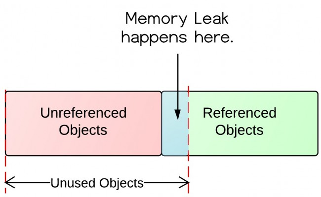
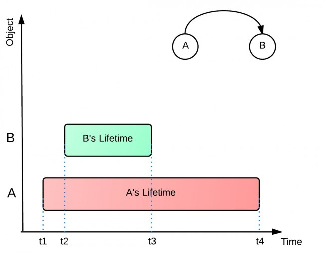

# The Introduction of Java Memory Leaks

>Created by iFDING

>Create Date: 02/22/2017


<div class="message">
<b>Reader beware:</b> this is a Java Memory Leaks post.
</div>

#### What is memory leaks?

Memory Leak: objects are no longer being used by the application, but Garbage Collector can not remove them because they are being referenced.

The following diagram illustrates what is unused and what is unreferenced.



From the diagram, there are referenced objects and unreferenced objects. Unreferenced objects will be garbage collected, while referenced objects will not be garbage collected. Unreferenced objects are surely unused, because no other objects refer to it. However, unused objects are not all unreferenced.

#### Java Heap Vs Native memory leak

Java heap is where the objects created by your application live. The maximum heap is determined by the -Xmx flag of the java command line that starts the application. 

Native memory is 'outside' Java heap but still within the total 'process size'. This is where low level driver (such as file system handles, threads etc) consumes memory.

Total process size = Java Heap + Native Memory

To tackle native memory leak, you need to turn on to OS tools. On Linux, try mtrace. On Windows look for /Md and /Mdd compiler options.

In this article, the memory leak means Java heap (NOT native memory).

#### Why memory leaks happen?

In the example below, object A refers to object B. A's lifetime (t1 - t4) is much longer than B's (t2 - t3). When B is no longer being used in the application, A still holds a reference to it. Garbage Collector can not remove B from memory. This would possibly cause out of memory problem, because if A does the same thing for more objects, then there would be a lot of objects that are uncollected and consume memory space.

It is also possible that B hold a bunch of references of other objects. Those objects referenced by B will not get collected either. All those unused objects will consume precious memory space.



#### How to prevent memory leaks?

The following are some quick hands-on tips for preventing memory leaks.

1. Pay attention to Collection classes, such as HashMap, ArrayList, etc., as they are common places to find memory leaks. When they are declared `static`, their life time is the same as the life time of the application.

2. Pay attention to event listeners and callbacks. A memory leak may occur if a listener is registered but not unregistered when the class is not being used any longer.

3. "If a class manages its own memory, the programmer should be alert for memory leaks". Often times member variables of an object that point to other objects need to be null out.

4. If you want to know what is filling up the heap, you could take a heap dump and analyze. You application server may provide commands / scripts to take heap dump. But the following command will work for any Java process:

```
jmap –dump:format=b,file=<dump file path> <pid>
```

5. Common reason 1 for memory leak: not cleaning up after 'Exceptions'. When the function breaks due to excption, you must ensure that you clean up whatever you were doing. For example, if you had a DB transaction going on, you have to close all that in the 'finally' block of your 'try-catch'. this is especially important if the exception is recurring. 

6. Common reason 2 for memory leak: handling large result set in memory. This seems obvious but many developers underestimate the size of the result set in production and end up filling up JVM heap. Use techniques like 'pagination' or 'lazy loading'.

7. OutOfMemmoryError does NOT necessarily mean memory leak. You can have memory leak with no errors at all. There are several reasons why 'OutOfMemory' can occur. For example, it can occur due to 'fragmentation' (whenever JVM allocates memory, it must be contiguous blocks of memory). 'OutOfMemoryError' can also occur if 'PermGen' if full (the area of the heap where class objects and interned strings are stored).

8. You need to have some knowlege of the application in order to successfully locate a memory leak.

9. A heap histogram can be used to narrow down memory leak.

```
Jmap –histo <pid>
```

Thw output will contain the class name, number of instances and sizes for each class in the memory. Take few histograms at few minutes interval and notice any trend.

10. There are powerful third party profiles that you can use, such as Quest Jprobe and Borland Optimizeit. Note that progiling a Java application to track memory leak is a time consuming and iterative process. But it does work.

#### References:

* [The Introduction of Java Memory Leaks](http://www.programcreek.com/2013/10/the-introduction-of-memory-leak-what-why-and-how/)
* [Ten things you need to know about Java memory leak](http://karunsubramanian.com/websphere/ten-things-you-need-to-know-about-java-memory-leak/)

