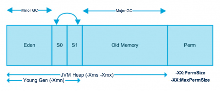

# The JVM Architecture Explained

>iFDING

>02/23/2017

<div class="message">
<b>Reader beware:</b> An overview of the different components of the JVM, along with a very useful diagram.
</div>

#### What is JVM?

Bytecode will be executed by JRE (Java Runtime Environment). JRE is the implementation of Java Virtual Machine (JVM), which analyzes the bytecode, interprets the code, and executes it. 

A Virtual Machine is a software implementation of a physical machine. Java was developed with the concept of **WORA (Write Once Run Anywhere)**, which runs on a VM. The compiler compiles the Java file into a Java.class file, then that .class ifle is input into the JVM, which Loads and executes the class file. Below is a diagram of the Architecture of the JVM.

#### JVM Architecture Diagram


#### How does JVM work?

As shown in the above architecture diagram, the JVM is divided into three main subsystems:

* Class Loader Subsystem

* Runtime Data Area

* Execution Engine

##### Class Loader Subsystem

Java's dynamic class loading functionality is handled by the class loader subsystem. It loads, links, and initializes the class file when it refers to a class for the first time at runtime, not compile time.

* Loading

Classes will be loaded by this component. Boot Strap class Loader, Extension class Loader, and Application class Loader are the three class loader which will help in achieving it.

1. Boot Strap ClassLoader - Responsible for loading classes from the bootstrap classpath, nothing but rt.jar. Highest priority will be given to this loader.

2. Externsion ClassLoader - Responsible for loading classes which are inside ext folder (jre\lib).

3. Application ClassLoader - Responsible for loading Application Level Classpath, path metioned Environment Variable etc.

The above Class Loaders will follow Delegation Hierarchy Algorithm while loading the class files.

* Linking

1. Verify - Bytecode verifier will verify whether the generated bytecode is proper or not if verification fails we will get the verification error.

2. Prepare - For all static variables memory will be allocated and assigned with default values.

3. Resolve - All symbolic memory references are replaced with the original references from Method Area.

* Initialization

This is the final phase of Class Loading, here all static variables will be assigned with the original values, and the static block will be executed.

##### Runtime Data Area

The Runtime Data Area is divided into 5 major components:

- **Method Area** - All the class level data will be stored here, including static variables. There is only one method area per JVM, and it is shared resource.

- **Heap Area** - All the Objects and their corresponding instance variables and arrays will be stored here. There is also one Heap Area per JVM. Since the Method and Heap areas share memory for multiple threads, the data stored is not thread safe.

- **Stack Area** - For every thread, a separate runtime stack will be created. For every method call, one entry will be made in the stack memory which is called as Stack Frame. All local variables will be created in the stack memory. The stack area is thread safe since it is not a shared resource. The Stack Frame is divided into three subentities:

1. Local Variable Array - Related to the method how many local variables are involved and the corresponding values will be stored here.

2. Operand stack - If any intermediate operation is required to perform, operand stack acts as runtime workspace to perform the operation.

3. Frame data - All symbols corresponding to the method is stored here. In the case of any exception, the catch block information will be maintained in the frame data.

- **PC Registers** - Each thread will have separate PC Registers, to hold the address of current executing instruction once the instruction is executed the PC register will be updated with the next instruction.

- **Native Method stacks** - Native Method Stack holds native method information. For every thread, a separate native method stack will be created.

##### Execution Engine

The bytecode which is assigned to the Runtime Data Area will be executed by the Execution Engine. The Execution Engine reads the bytecode and executes it piece by piece.

* **Interpreter** - The interpreter interprets the bytecode faster, but executes slowly. The disadvantage of the interpreter is that when one method is called multiple times, every time a new interpretation is required.

* **JIT Compiler** - The JIT Compiler neutralizes the disadvantage of the interpreter. The Execution Engine will be using the help of the interpreter in converting byte code, but when it finds repeated code it uses the JIT complier, which compiles the entire bytecode and changes it to native code. This native code will be used directly for repeated method calls, which improve the performance of the system.

1. Intermediate Code generator - Produces intermediate code

2. Code Optimizer - Responsible for optimizing the intermediate code generated above

3. Target Code Generator - Responsible for Generating Machine Code or Native Code

4. Profiler - A special component, responsible for finding hotspots, i.e. whether the method is called multiple times or not.

* **Garbage Collector** - Collects and removes unreferenced objects. Garbage Collection can be triggered by calling "System.gc()", but the execution is not guaranteed. Garbage collection of the JVM collects the objects that are created.

Java Native Interface (JNI) - JNI will be interacting with the Native Method Libraries and provides the Native Libraries required for the Execution Engine.

Native Method Libraries - It is a collection of the Native Libraries which is required for the Execution Engine.

#### JVM Memory Model



As you can see in the above image, JVM memory is divided into separate parts. At broad level, JVM Heap memory is phycially divided into two parts - **Young Generation** and **Old Generation**.

##### Young Generation

Young generation is the place where all the new objects are created. When young generation is filled. garbage collection is performed. This garbage collection is called **Minor GC**. Young Generation is divided into three parts - **Eden Memory** and two **Survivor Memory** spaces.

Important Points about Young Generation Spaces:

* Most of the newly created objects are located in the Eden memory space.

* When Eden space is filled with objects, Minor GC is performed and all the survivor objects are moved to one of the survivor spaces.

* Minor GC also checks the survivor objects and move them to the other survivor space. So at a time, one of the survivor space is always empty.

* Objects that are survived after many cycles of GC, are moved to the Old generation memory space. Usually it's done by setting a threshold for the age of the young generation objects before they become eligible to promote to Old generation.

##### Old Generation

Old Generation memory contains the objects that are long lived and survived many rounds of Minor GC. Usually garbage collection is performed in Old Generation memory when it's full Old Generation Garbage Collection is called **Major GC** and usually takes longer time.

* Stop the World Event

All the Garbage Collections are "Stop the World" events because all application threads are stopped until the operation completes.

Since Young Generation keeps short-lived objects, Minor GC is very fast and the application doesn't get affected by this.

However Major GC takes longer time because it checks all the live objects. Major GC should be minimized because it will make your application unresponsive for the garbage collection duration. So if you have a responsive application and there are a lot of Major Garbage Collection happening. You will notice timeout errors.

The duration taken by garbage collector depends on the strategy used for garbage collection. That's why it's necessary to monitor and tune the garbage collector to avoid timeouts in the highly responsive applications.

* Permanent Generation

"Perm Gen" contains the application metadata required by the JVM to describe the classes and methods used in the application. Note that Perm Gen is not part of Java Heap memory.

Perm Gen is populated by JVM at runtime based on the classes used by the application. Perm Gen also contains Java SE library classes and methods. Perm Gen objects are garbage collected in a full garbage collection.

* Method Area

Method Area is part of space in the Perm Gen and used to store class structure (runtime constants and static variables) and code for methods and contructors.

* Memory Pool

Memory Pools are created by JVM memory managers to create a pool of immutable objects. If implementation supports it. String Pool is a good example of this kind of memory pool. Memory Pool can belong to Heap or Perm Gen, depending on the JVM memory manager implementation.

* Runtime Constant Pool

Runtime constant pool is per-class runtime representation of constant pool in a class. It contains class runtime constants and static methods. Runtime constant pool is the part of method area.

* Java Stack Memory

Java stack memory is used for execution of a thread. They contain method specific values that are short-lived and references to other objects in the heap that are getting referred from the method.

##### Java Heap Memory Switches
 
| VM switch         | VM switch description                                                  | 
| ----------------- |:----------------------------------------------------------------------:|
| -Xms              | Initial heap size when JVM starts                                      |
| -Xmx              | Maximum heap size                                                      |
| -Xmm              | Size of the Young Generation, rest of the space goes for Old Generation|
| -XX:PermGen       | Initial size of the Permanent Generation memory                        |
| -XX:MaxPermGen    | Maximum size of Perm Gen                                               |
| -XX:SurvivorRatio | For providing ratio of Eden space and Survivor Space                   |
| -XX:NewRatio      | Ratio of old/new generation sizes. The default value is 2              |

##### Java Garbage Collection

Java Garbage Collection is the process to identify and remove the unused objects from the memory and free space to be allocated to objects created in the future processing.

Garbage Collector: the program running in the background that looks into all the objects in the memory and find out objects that are not referenced by any part of the program. All these unreferenced objects are deleted and space is reclaimed for allocation to other objects.

One of the basic way of garbage collection involves three steps:

1. Marking: This is the first step where garbage collector identifies which objects are in use and which ones are not in use.

2. Normal Deletion: Garbage Collector removes the unused objects and reclaim the free space to be allocated to other objects.

3. Deletion with Compacting: For better performance, after deleting unused objects, all the survived objects can be moved to be together. This will increase the performance of allocation of memory to newer objects.

Shortcomings:

1. It's not efficient because most of the newly created objects will become unused.

2. Objects that are in-use for multiple garbage collection cycle are most likely to be in-use for future cycles too.

So, Java Garbage Collection is Generational and we have Young Generation and Old Generation space in the heap memory.

##### Java Garbage Collection Types

There are five types of garbage collection types that we can use in our applications. We just need to use JVM switch to enable the garbage collection strategy for the application.

1. Serical GC (-XX:+UseSericalGC): simple mark-sweep-compact approach for young and old generatios garbage collection i.e. Minor and Major GC. Serial GC is useful in client-machines such as our simple stand alone applications and machines with smaller CPU.

2. Parallel GC (-XX:+UseParallelGC): Parallel GC is same as Serial GC except that is spawns N threads for young generation garbage collection where N is the number of CPU cors in the system. `-XX:ParallelGCThreads=n`. Parallel Garbage Collector is also called throughput collector because it uses multiple CPUs to speed up the GC performance. Parallel GC uses single thread for Old Generation garbage collection.

3. Parallel Old GC(-XX:+UseParallelOldGC): This is same as Parallel GC except that it uses multiple threads for both Young Generation and Old Generation garbage collection.

4. Concurrent Mark Sweep (CMS) Collector (-XX:+UseConcMarkSweepGC): CMS Collector is also referred as concurrent low pause collector. It does the garbage collection for Old generation. CMS collector on young generation uses the same algorithm as that of the parallel collector.

5. G1 Garbage Collector(-XX:UseG1GC): The Garbage First or G1 garbage collector is available from Java 7 and it's long term goal is to replace the CMS collector. The G1 collector is a parallel, concurrent, and incrementally compacting low-pause garbage collector.

##### Java Garbage Collection Monitoring

For executing jstat you need to know the process id of the applciation, you can get it easily using:

```
ps -eaf | grep java
```

The release of JDK 8 inctroduced Java control, Java Flight Recorder, and jcmd utility for diagnosing problems with JVM and Java applications. It is suggested to use the latest utility, jcmd instead of the previous jstack, jinfo, and jmap utilities utilities for enhanced diagnostics and reduced performance overhead.

#### References:

* [The JVM Architecture Explained](https://dzone.com/articles/jvm-architecture-explained)

* [Java (JVM) Memory Model – Memory Management in Java](http://www.journaldev.com/2856/java-jvm-memory-model-memory-management-in-java)

* [Monitoring Tools](https://docs.oracle.com/javase/8/docs/technotes/guides/troubleshoot/tooldescr025.html)
