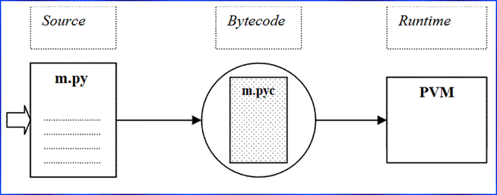

# How Python Runs Programs

>iFDING

>03/18/2017


<div class="message">
<b>Reader beware:</b> How the Python interpreter executes programs in general
</div>


### How Python runs programs

#### Execution model

* A script, text file of statements, m.py

* m.py (sourcecode)  --> m.pyc (bytecode)  --> Python Virtual Machine


[Image source](http://learning-python.com/class/Workbook/unit02.htm)

#### Python Virtual Machine(PVM)

* The PVM is just a big code loop that iterates through byte code instructions, one by one, to carry out operations.

* The PVM is the running engine of Python.

* It is always present as part of the Python system, it's the component that truly runs your scripts.

* It's just the last step of what is called the "Python interpreter".

#### Performance implications

* There is usually no build or "make" step in Python work: code runs immediately after it is written

* Python byte code is not binary machine code(e.g., instructions for an Intel or ARM chip), Byte code is a Python-specific representation.

* This is why some Python code may not run as fast as C or C++ code, the PVM loop, not the CPU chip, still must interpret the byte code, and byte code instructions require more work than CPU instructions.

* Unlike in classic interpreters, there is still an internal compile step - Python does not need to renalyze and reparse each source statement's text repeatedly.

#### Development implications

* There is really no distinction between the development and execution environments.

* The systems that compile and execute source code are really one and the same.

* In Python, the compiler is always present at runtime and is part of the system that runs programs.

* A much more rapid development cycle, there is no need to precompile and link before execution may begin, simply type and run the code.

* Users can modify the Python parts of a system onsite without needng to have or compile the entire system's code.

* There is no initial compile-time phase at all, and everything happens as the program is running.

* This even includes operations such as the creation of functions and classes and the linkage of modules.

* Such events occur before execution in more static languages, but happen as programs execute in Python. 

#### Execution variations

* JITs: just-in-time compilers for Python bytecode, Psyco, the original JIT compiler

* Frozen binaries, it's possible to turn Python programs into true executables, see Py2exe (windows), PyInstaller (Linux & Mac OS X), py2app(Mac), freeze(original), cx_freeze

* Other VMs: PyPy (Python VM in Python), Parrot (language neutral, pies)...

#### 5 major implementations

* [CPython](https://www.python.org/): the standard implementation(coded in C)

* [Jython](http://www.jython.org/): python for the Java Platform

* [IronPython](http://ironpython.net/): providing with the power of the .NET Framework.

* [PyPy](http://pypy.org/): a replacement for CPython for speed, the main reason is speed, faster.

* [Stackless](https://wiki.python.org/moin/StacklessPython): Python for concurrency, microthreads, avoid much of overhead associated with usual operating system threads.

* Others: [Numba](http://numba.pydata.org/)(JIT+types), [Cython](http://cython.org/)(Python/C hybrid), [Pythran](http://pythonhosted.org/pythran/)(Py->C++), Shed Skin (Python-to-C++ translator)...

### How you run programs

#### Top-level program architecture

* __Program__  = multiple.py text files

  * One is the "main" top-level file: launch to run

  * Others are "modules": libraries of tools

  * Some modules come from the "standard library"

* __Modules__  accessed and linked by imports: "import module"

  * Import = find it, compile it (maybe), run it(once)

* __Attributes__ fetched from objects: "module.attr"

  * Variables inside objects (including modules)


[Image source](http://learning-python.com/class/Workbook/unit02.htm)

b.py
```
def func():
	......
```

a.py
```
import b
b.func()
```


### Reference

* [Programming Python: Powerful Object-Oriented Programming](https://www.amazon.com/Programming-Python-Powerful-Object-Oriented/dp/0596158106)

* [2. Using the Interpreter](http://learning-python.com/class/Workbook/unit02.htm)
