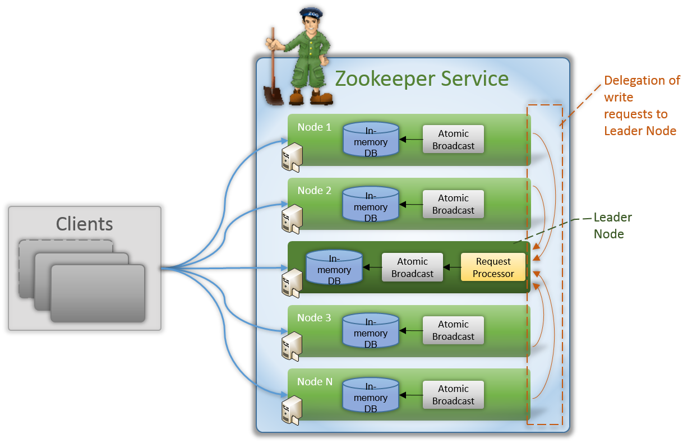

# Apache ZooKeeper Architecture

### What is ZooKeeper

* As Apache defines it, ZooKeeper is a distributed, open-source coordination service for distributed applications. 

* It exposes a simple set of primitives that distributed applications can build upon to implement higher level services for synchronization, configuration maintenance, and groups and naming.

* It is implemented in Java and has bindings for both Java and C. 

* It is designed to be easy to program to, and uses a data model styled after the familar directory tree structure of file systems.

### Architecture

#### Hierarchical Namespace

* Like a standard file system, ZooKeeper allows distributed processes to coordinate with other through a shared hierarchal namespace. The name space consists of data registers - called znodes, these are similar to files and directories. A name is sequence of path elements separated by a slash (/). Every node in ZooKeeper's namespace is identified by a path.

[Image source](https://zookeeper.apache.org/doc/r3.3.4/zookeeperOver.html)

* Unlike a standard file system, which is designed for storage, ZooKeeper data is kept in-memory, which means ZooKeeper can acheive high throughput and low latency numbers.

* ZooKeeper was designed to store coordination data: status, configuration, location information, etc., so the data stored at each node is usually small, in the byte to kilobyte range.

* Znodes maintain a stat structure that includes version numbers of data changes, ACL (Access Control List) changes, and timestamps, to allow cache validations and coordinated updates. Each time a znode's data changes, the version number increases. For instance, whenever a client retrieves data it also receives the version of the data.

* ZooKeeper also has the notion of ephemeral nodes. These znodes exists as long as the session that created the znode is active. When the session ends the znode is deleted.

#### ZooKeeper Service

* Like the distributed process it coordinates, ZooKeeper itself is intended over a sets of hosts called an ensemble.

[Image source](https://zookeeper.apache.org/doc/r3.3.4/zookeeperOver.html)

* The servers that make up the ZooKeeper service must all know about each other. 

* They maintain an in-memory image of state, along with a transaction logs and snapshots in a persistent store.

* As long as a majority of the servers are available, the ZooKeeper service will be available.

* Clients connect to a single ZooKeeper server. The client maintains a TCP connection through which it sends requests, gets responses, gets watch events, and sends heart beats. If the TCP connection to the server breaks,  the client will connect to a different server.

* ZooKeeper stamps each update with a number that reflects the order of all ZooKeeper transactions. Subsequent operations can use the order to implement higher-level abstractions, such as synchronization primitives.

* It is especially fast in "read-dominant" workloads. ZooKeeper applications run on thousands of machines, and it performs best where reads are more common than writes, at ratios of around 10:1.

* ZooKeeper supports the concept of watches. Clients can set a znodes. A watch will be triggered and removed when the znode changes. When a watch is triggered the client receives a packet saying that the znode has changed. And if the connection between the client and one of the ZooKeeper servers is broken, the client will receive a local notification.

[Image source](http://www.allprogrammingtutorials.com/tutorials/introduction-to-apache-zookeeper.php)

There are two types of nodes shown in above diagram:

#### Leader Node

* Leader node is the only node responsible for processing the write requests. All other nodes called followers simply delegate the client write calls to Leader node.

* We don't mark any node as leader while setting up Apache ZooKeeper cluster. It instead is elected internally among all the nodes of cluster. Apache ZooKeeper uses the concept of majority for same i.e Note that gets highest number of votes is elected as Leader.

* This serves as the basis of recommendation that suggests to have odd number of nodes in a cluster for best failover and availability. i.e. if we create the cluster of four nodes and two nodes go offline for some reasons. Apache ZooKeeper will be down as half of the nodes have gone offline as it is not possible to gain majority for Leader node election.

#### Follower Node

* All nodes other than Leader are called Follower Nodes. A follower node is capable of servicing read requests on its own. For write requests, it gets it done through Leader Node. Followers also play an important role of electing a new leader if existing leader node goes down.

#### ZooKeeper Components

[Image source](https://zookeeper.apache.org/doc/r3.3.4/zookeeperOver.html)

* Request Processor

This component is only active in Leader Node and is resposible for processing write requests originating from client of follower nodes. Once request processor processes the write request, it broadcasts the changes to follower nodes so that they can update their state accordingly.

* Atomic Bradcast

This component is present in both Leader Node and Follower Nodes. This component is responsible for broadcasting the changes to other nodes (in Leader Node) as well as redeiving the change notification (in Follower Nodes).

* In-memory Database (Peplicated Database) 

This in-memory and replicated database is responsible for storing the data in ZooKeeper. Every node contains its own database that enables that enables them to server read requests. In addition to this, data is also written to file system providing recoverability in case of any problems with cluster. In case of write requests, in-memory database is updated only after it has successfully been written to file system.

### Guarantees

* Sequential Consistency - Updates from a client will be applied in the order that they were sent.

* Atomicity - Updates either succeed or fail. No partial results.

* Single System Image - A client will see the same view of the service regardless of the server that it connects to.

* Reliability - Once an update has been applied, it will persist from that time forward until a client overwrites the update.

* Timeliness - The clients view of the system is guaranteed to be up-to-date within a certain time bound.

### Possible Use Cases

* Synchronizations primitives such as Barriers, Queues for the distributed environment

* Multi-machines cluster management

* Coordination and failure recovery service

* Automatic leader selection

For example:

Apache Hadoop relies on ZooKeeper for automatic fail-over of Hadoop HDFS Namenode and for the high availability of YARN ResourceManager.

Apache Mesos is a cluster manager that provides efficient resource isolation and sharing across distributed applications. Mesos uses ZooKeeper for fault-tolerant replicated master.

Neo4j is a distributed graph database that uses ZooKeeper for write master selection and read slave coordination.

Apache HBase, a distribuded database built on Hadoop, uses ZooKeeper for master election, lease management of region servers, and other communication between region servers.

### Reference

* [ZooKeeper Wiki](https://zookeeper.apache.org/doc/r3.3.4/zookeeperOver.html)
* [Introduction to Apache ZooKeeper](http://www.allprogrammingtutorials.com/tutorials/introduction-to-apache-zookeeper.php)
* [ZooKeeper fundamentals, deployment, and applications](http://www.ibm.com/developerworks/library/bd-zookeeper/)
