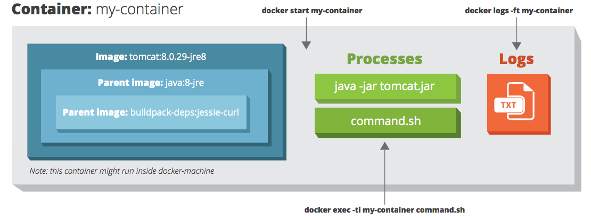

# docker cheat sheet

>iFDING

>02/15/2017


## Glossary

* Layer - a set of read-only files to provision the system. Think of a layer as a read only snapshot of the filesystem
* Image - a read-only layer that is the base of a container. Might have a parent image
* Container - a runnable instance of the image, basically it is a process isolated by docker that runs on top of the filesytem that an image provides.
* Registry/Hub - central place where images live
* Docker machine - a VM to run Docker containers. On linux you can run docker contianers natively, but on OSX and Windows you need a layer of abstraction.
* Docker compose - a utility to run multiple containers as a system

## Build

* Build an image from the Dockerfile in the current directory and tage the image

```
docker build -t myapp:1.0 .
```

* List all images that are locally stored with the Docker engine

```
docker images
```

* Delete an image from the local image store

```
docker rmi alpine:latest
```

## Ship

* Pull an image from a registry

```
docker pull image_name
```

* Push an image to a registry

```
docker push myrepo/myalpine:3.4
```

* Save a running container as an image

```
docker commit -m "commit message" -a "author" container_name username/image_name:tag
```

## Run

* Create and start a container

```
docker run --it --name container_name image_name command

docker run  --it  connect the container to terminal
            --rm  remove container automatically after it exits
      --name web  name the container
      -p 5000:80  expose port 5000 externally and map to port 80
      -v ~/dev: /code alpine:3.4 /bin/sh  create a host mapped volume inside
                  the container the image from which the container is 
                  instantiated the command to run inside the container
```

* Example filesystem and port mappings

```
docker run -it --rm -p 8080:8080 -v /path/to/agent.jar:/agent.jar -e
           JAVA_OPTS="-javaagent:/agent.jar" tomcat:8.0.29-jre8
```



* Start and stop a container(through SIGTERM)

```
docker [start|stop] container_name
```

* Stop a running container through SIGKILL

```
docker kill container_name
```

* Delete dangling images

```
docker rmi $(docker images -q -f dangling=true)
```

* Remove all stopped containers

```
docker rm $(docker ps -a -q)
```

* Delete all running and stopped containers

```
docker rm -f $(docker ps -aq)
```

* Create an overlay network and specify a subnet

```
docker network create --subnet 10.1.0.0/24 --gateway 10.1.0.1 -d overlay mynet
```

* List the networks

```
docker network ls
```

* List running containers

```
docker ps
```

* Create a new bash process inside the container and connect it to the terminal

```
docker exec -it container_name bash
```

* Print the last 100 lines of a container's logs

```
docker logs --tail 100 container_name
```

## Orchestrate

* Initialize swarm mode and listen on a specific interface

```
docker swarm init --advertise-addr 10.1.0.2
```

* Join an existing swarm as a manager node

```
docker swarm join --token <manager-token> 10.1.0.2:2377
```

* Join an existing swarm as a worker node

```
docker swarm join --token <worker-token> 10.1.0.2:2377
```

* List the nodes participating in a swarm

```
docker node ls
```

* Create a service from an image exposed on specific port and deploy 3 instances

```
docker service create --replicas 3 -p 80:80 --name web nginx
```

* List the services running in a swarm

```
docker service ls
```

* Scale a service

```
docker service scale web=5
```

* List the tasks of a service

```
docker service ps web
```

## Reference

* [Docker](https://www.docker.com/)

* [Docker Commands and Best Practices Cheat Sheet](https://zeroturnaround.com/rebellabs/docker-commands-and-best-practices-cheat-sheet/)

