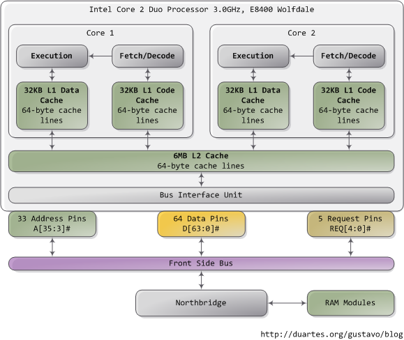
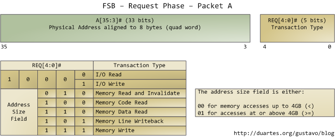

# Getting Physical With Memory

> When trying to understand complex system, you can often learn a lot by stripping away abstractions and looking at their lowest levels.

Gustavo Duarte wrote this post to take a look at memory and I/O ports in their simplest and most fundamental level: the interface between the processor and bus. These details underlie higher level topics like thread synchronization and the need for the Core i7. Here's our friend the Core 2 again: 

A Core 2 processor has 775 pins, about half of which only provide power and carry no data. Once you group the pins by functionality, the physcial interface to the processor is surprisingly simple. The diagram shows the key pins involved in a memory or I/O port operation: address lines, data pins, and request pins.

These operations take place in the context of a **transaction** on the front side bus. FSB (Front-side bus) transactions go through 5 phases: arbitration, request, snoop, response, and data. Throughout these phases, different roles are played by the components on the FSB, which are called **agents**. Normally the agents are all the processors plus the northbridge.

We only look at the **request phase** in this post, in which 2 packets are output by the **request agent**, who is usually a processor. Here are the juiciest bits of the first packet, output by the address and request pins:

The address lines output the starting physical memory address for the transaction. We have 33 bits but they are interpreted as bits 35-3 of an address in which bits 2-0 are zero. Hence we have a 36-bit address, aligned to 8 bytes, for a total of 64GB (2^36 bytes) addressable physical memory. This has been the case since the Pentium Pro. The request pins specify what type of transaction is being initiated; in I/O requests the address pins specify an I/O port rather than a memory address. After the first packet is output, the same pins transmit a second packet in the subsequent bus clock cycle:

The attribute signals are interesting: they reflect the 5 types of memory caching behavior available in Intel processors. By puting this information on the FSB, the request agen lets other processors know how this transaction affects their caches, and how the memory controller (northbridge) should behave. The processor determines the type of a given memory region mainly by looking at page tables, which are maintained by the kernel.

Typically kernel treat **all RAM memory as write-back**, which yields the best performance. In write-back mode the unit of memory access is the cache line, 64 bytes in the Core 2. If a program reads a single byte in memory, the processor loads the whole cache line that contains that byte into the L2 and L1 caches. When a program *writes* to memory, the processor only modifies the line in the cache, but does *not* update main memory. Later, when it becomes necessary to post the modified line to the bus, the whole cache line is written at once. So most requests have 11 in their length field, for 64 bytes. Here's a read example in which the data is not in the caches:

 

Some of the physical memory range in an Intel computer is [mapped to devices](motherboard-chipsets-memory-map.md) like hard drives and network cards instead of actual RAM memory. This allows drivers to communicate with their devices by writing to and reading from memory. The kernel marks these memory regions as **uncacheable** in th page tables. Accesses to uncacheable memory regions are reproduced in the bus exactly as requested by a program or driver. Hence it's possible to read or write single bytes, words, and so on. This is done via the byte enable mask in packet B above.

The primitives discussed here have many implications. For example:

1. Performance-sensitive applications should try to pack data that is accessed together into the same cache line. Once the cache line is loaded, further reads are much faster and extra RAM accesses are avoided.

2. Any memory access that falls within a single cache line is guaranteed to be atomic (assuming write-back memory). Such an access is serviced by the processor's L1 cache and the data is read or written all at once; it cannot be affected halfway by other processors or threads. In particular, 32-bit and 64-bit operations that don't cross cache line boundaries are atomic.

3. The front bus is shared by all agents, who must arbitrate for bus ownership before they can start a transaction. Moreover, all agents must listen to all transactions in order to maintain cache coherence. Thus bus conetention becomes a servere problem as more cores and processors are added to Intel computers. The Core i7 solves this by having processors attached directly to memory and communicating in a point-to-point rather than broadcast fashion.

These are the highlights of physical memory requests; the bus will surface again later in connection with locking, multi-threading, and cache coherence. 

### Reference

* [Getting Physical With Memory](http://duartes.org/gustavo/blog/post/getting-physical-with-memory/)
