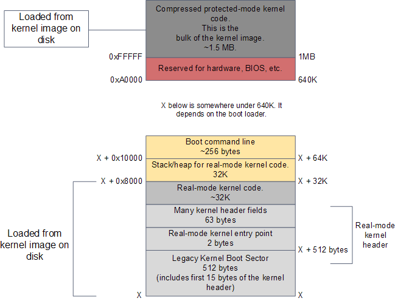
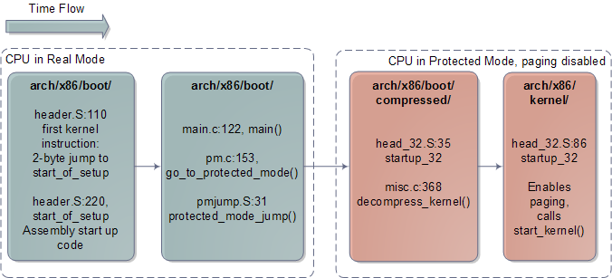
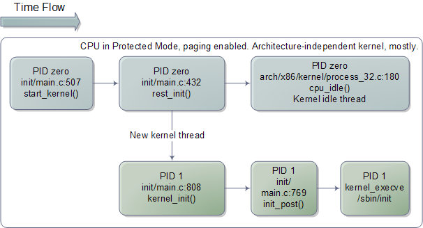

# The Kernel Boot Process

The previous post explained [how computers boot up](how-computers-boot-up.md) right up to the point where the boot loader, after stuffing the kernel image into memory, is about to jump into the kernel entry point.

At this point in the Intel X86 boot story the processor is running in real-mode, is able to address 1 MB of memory, and RAM looks like this for a modern Linux system:

Figure 1. RAM contents after boot loader is done

[Image Source](http://duartes.org/gustavo/blog/post/kernel-boot-process/)

- The kernel image has been loaded to memory by the boot loader using the BIOS disk I/O services. This image is an exact copy of the file in your hard drive that cotains the kernel, e.g. /boot/vmlinuz-2.6.22-14-server.
- The image is split into two pieces: a small part containing the real-mode kernel code is loaded below the 640K barrier; the bulk of the kernel, which runs in protected mode, is loaded after the first megabyte of memory.

- The action starts in the real-mode kernel header pictured above. This region of memory is used to implement the Linux boot protocol between the boot loader and the kernel.
- Some of the values there are read by the boot loader while doing its work. These include amenities such as a human-readable string containing the kernel version, but also crucial information like the size of the real-mode kernel piece.
- The boot loader also writes values to this region, such as the memory address for the command-line parameters given by the user in the boot menu.
- Once as the boot loader is finished it has filled in all of the parameters required by the kernel header. It's then time to jump into the kernel entry point.

The diagram below shows the code sequence for the kernel initialization, along with source directories, files, and line numbers:

Figure 2. Architecture-speific Linux Kernel Initialization

[Image Source](http://duartes.org/gustavo/blog/post/kernel-boot-process/)

- The early kernel start-up for the Intel architecture is in file [arch/x86/boot/header.S](http://lxr.linux.no/linux+v2.6.25.6/arch/x86/boot/header.S). It's in assembly languange, which is rare for the kernel at large but common for boot code.
- The start of this file actually contains boot sector code, a left over from the days when Linux could work without a boot loader. Nowadays this boot sector, if executed, only prints a “bugger_off_msg” to the user and reboots. Modern boot loaders ignore this legacy code. 
- After the boot sector code we have the first 15 bytes of the real-mode kernel header; these two pieces together add up to 512 bytes, the size of a typical disk sector on Intel hardware.

- After these 512 bytes, at offset 0x200, we find the very first instruction that runs as part of the Linux kernel: the real-mode entry point.
- It’s in header.S:110 and it is a 2-byte jump written directly in machine code as 0x3aeb. You can verify this by running hexdump on your kernel image and seeing the bytes at that offset – just a sanity check to make sure it’s not all a dream. 
- The boot loader jumps into this location when it is finished, which in turn jumps to header.S:229 where we have a regular assembly routine called start_of_setup. This short routine sets up a stack, zeroes the bss segment (the area that contains static variables, so they start with zero values) for the real-mode kernel and then jumps to good old C code at [arch/x86/boot/main.c:122](http://lxr.linux.no/linux+v2.6.25.6/arch/x86/boot/main.c#L122).

- main() does some house keeping like detecting memory layout, setting a video mode, etc. It then calls go_to_protected_mode(). Before the CPU can be set to protected mode, however, a few tasks must be done.
- There are two main issues: interrupts and memory. In real-mode the interrupt vector table for the processor is always at memory address 0, whereas in protected mode the location of the interrupt vector table is stored in a CPU register called IDTR.
- Meanwhile, the translation of logical memory addresses (the ones programs manipulate) to linear memory addresses (a raw number from 0 to the top of the memory) is different between real-mode and protected mode.
- Protected mode requires a register called GDTR to be loaded with the address of a Global Descriptor Table for memory. So go_to_protected mode() calls [setup_idt()](http://lxr.linux.no/linux+v2.6.25.6/arch/x86/boot/pm.c#L144) and [setup_gdt()](http://lxr.linux.no/linux+v2.6.25.6/arch/x86/boot/pm.c#L115) to install a temporary interrupt descriptor table and global descriptor table.

- We're now ready for the plunge into protected mode, which is done by [protected_mode_jump](http://lxr.linux.no/linux+v2.6.25.6/arch/x86/boot/pmjump.S#L31), another assembly routine. This routine enables protected mode by setting the PE bit in the CRO CPU register.
- At this point we're running with [paging] **disabled**; paging is an opptional feature of the processor, even in protected mode, and there's no need for it yet.
- What's important is that we're no longer confined to the 640K barrier and can now address up to 4GB of RAM. 
- The routine then calls the 32-bit kernel entry point, which is [startup_32](http://lxr.linux.no/linux+v2.6.25.6/arch/x86/boot/compressed/head_32.S#L35) for compressed kernels. This routine does some basic register initializations calls [decompress_kernel()](http://lxr.linux.no/linux+v2.6.25.6/arch/x86/boot/compressed/misc.c#L368), a C function to do the actual decompression.

- decompress_kernel() prints the familiar "Decompressing Linux..." message. Decompression happens in-place and once it's finished the uncompressed kernel image has overwritten the compressed one pictured in the first diagram.
- Hence the uncompressed contents also start at 1MB. decompress_kernel() then prints "done." and the comforting "Booting the kernel." 
- “Booting” it means a jump to the final entry point in this whole story, which is the protected-mode kernel entry point at the start of the second megabyte of RAM (0x100000). That sacred location contains a routine called, [startup_32](http://lxr.linux.no/linux+v2.6.25.6/arch/x86/kernel/head_32.S#L86). But this one is in a different directory.

- The second incarnation of startup_32 is also an assembly routine, but it contains 32-bit mode initializations. It clears the bss segment for the protected-mode kernel (which is the true kernel that will now run until the machine reboots or shuts down), sets up the final global descriptor table for memory, builds page tables so that paging can be turned on, enables paging, initializes a stack, creates the final interrupt descriptor table, and finally jumps to to the architecture-independent kernel start-up, [start_kernel()](http://lxr.linux.no/linux+v2.6.25.6/init/main.c#L507).

The diagram below shows the code flow for the last leg of the boot:

Figure 3. Architecture-independent Linux Kernel Initialization

- start_kernel() looks more like typical kernel code, which is nearly all C and machine independent. The function is a long list of calls to initializations of the various kernel subsystems and data structures. These include the scheduler, memory zones, time keeping, and so on. 
- start_kernel() then calls [rest_init()](http://lxr.linux.no/linux+v2.6.25.6/init/main.c#L432), at which point things are almost all working.
- rest_init() creates a kernel thread passing another function, [kernel_init()](http://lxr.linux.no/linux+v2.6.25.6/init/main.c#L808), as the entry point.
- rest_init() then calls [schedule()](http://lxr.linux.no/linux+v2.6.25.6/kernel/sched.c#L3959) to kickstart task scheduling and goes to sleep by calling [cpu_idle()](http://lxr.linux.no/linux+v2.6.25.6/arch/x86/kernel/process_32.c#L180), which is the idle thread for the Linux kernel. 
- cpu_idle() runs forever and so does process zero, which hosts it. Whenever there is work to do – a runnable process – process zero gets booted out of the CPU, only to return when no runnable processes are available.

- But here's the kicker for us. This idle loop is the end of the long thread we followed since boot, it's the final descendent of the very first jump executed by the processor after power up.
- All of this mess, from reset vector to BIOS to MBR to boot loader to real-mode kernel to protected-mode kernel, all of it leads right here, jump by jump by jump it ends in the idle loop for the boot processor, cpu_idle(). Which is really kind of cool. 
- However, this can’t be the whole story otherwise the computer would do no work.

- At this point, the kernel thread started previously is ready to kick in, displacing process 0 and its idle thread. And so it does, at which point kernel_init() starts running since it was given as the thread entry point. 
- [kernel_init()](http://lxr.linux.no/linux+v2.6.25.6/init/main.c#L808) is responsible for initializing the remaining CPUs in the system, which have been halted since boot. 
- All of the code we’ve seen so far has been executed in a single CPU, called the boot processor. As the other CPUs, called application processors, are started they come up in real-mode and must run through several initializations as well. Many of the code paths are common, as you can see in the code for [startup_32](http://lxr.linux.no/linux+v2.6.25.6/arch/x86/kernel/head_32.S#L86), but there are slight forks taken by the late-coming application processors. 
- Finally, kernel_init() calls [init_post()](http://lxr.linux.no/linux+v2.6.25.6/init/main.c#L769), which tries to execute a user-mode process in the following order: /sbin/init, /etc/init, /bin/init, and /bin/sh. If all fail, the kernel will panic. Luckily init is usually there, and starts running as PID 1. It checks its configuration file to figure out which processes to launch, which might include X11 Windows, programs for logging in on the console, network daemons, and so on. Thus ends the boot process as yet another Linux box starts running somewhere. 

### Reference

* [The Kernel Boot Process](http://duartes.org/gustavo/blog/post/kernel-boot-process/)
