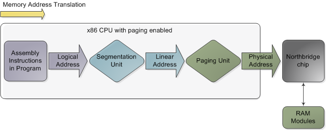
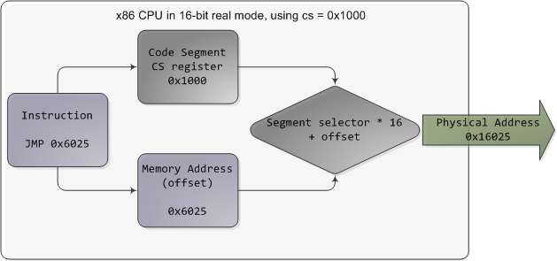
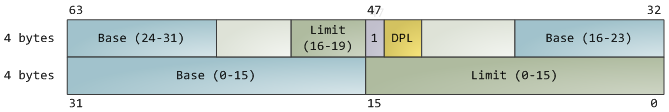

# Memory Translation and Segmentation

- In the chipsets that power Intel motherboards, memory is accessed by the CPU via the front side bus, which connects it to the northbridge chip. 
- The memory addresses exchanged in the front side bus are **physical memory addresses**, raw numbers from zero to the top of the available physical memory.
These numbers are mapped to physcial RAM sticks by the northbridge.
- Physcial addresses are concrete and final - no translation, no paging, no privilege checks - you put them on the bus and that's that. 
- Within the CPU, however, programs use **logical memory address**, which must be translated into physical addresses before memory access can take place.

Conceptually address translation looks like this:

Figure 1. Memory address translation in x86 CPUs with paging enabled

[Image Source](http://duartes.org/gustavo/blog/post/memory-translation-and-segmentation/)

- This is **not** a physical diagram, only a depiction of the address translation process, specifically for when the CPU has paging enabled. If you turn off paging, the output from the segmentation unit is already a physical address; in 16-bit real mode that is always the case.
- Translation starts when the CPU executes an instruction that refers to a memory address. The first step is translating that logic address into a **linear address**.
- But why go through this step instead of having software use linear (or physical) addresses directly? For roughly the same reason humans have an appendix whose primary function is getting infected. 
 

It's a wrinkle of evolution. To really make sense of x86 segmentation we need to go back to 1978.

- The original 8086 had 16-bit registers and its instructions used mostly 8-bit or 16-bit operands. This allowed code to work with 2^16 bytes, or 64K of memory, yet Intel engineers were keen on letting the CPU use more memory without expanding the size of registers and instructions. So they introduced segment registers as a means to tell the CPU which 64K chunk of memory a program's instructions were going to work on.
- It was a reasonable solution: first you load a segment register, effectively saying "here, I want to work on the memory chunk starting at X"; afterwards, 16-bit memory addresses used by your code are interpreted as offsets into your chunk, or segment.
- There were four segment registers: one for the stack (ss), one for program code (cs), and two for data (ds,es). Most programs were small enough back then to fit their whole stack, code, and data each in a 64K segment, so segmentation was often transparent.

Nowadays segmentation is still present and is always enabled in x86 processors. Each instruction that touches memory implicitly uses a segment register.

- For example, a jump instruction uses the code segment register (cs) whereas a stack push instruction uses the stack segment register (ss). In most cases you can explicitly override the segment register used by an instruction.
- Segment registers store 16-bit **segment selectors**; they can be loaded directly with instructions like MOV. The sole exception is cs, which can only be changed by instructions that affect the flow of execution, like CALL or JMP. Though segmentation is always on, it works differently in real mode versus protected mode.

In real mode, such as during [early boot](how-computers-boot-up.md), the segment selector is a 16-bit number specifying the physical memory address for the start of a segment. This number must somehow be scaled, otherwise it would also be limited to 64K, defeating the purpose of segmentation.

- For example, the CPU could use the segment selector as the 16 most significant bits of the physical memory address (by shifting it 16 bits to the left, which is equivalent to multiplying by 2^16). This simple rule would enable segments to address 4 gigs of memory in 64K chunks, but it would increase chip packaging costs by requiring more physical address pins in the processor. 

- So Intel made the decision to multiply the segment selector by only 24 (or 16), which in a single stroke confined memory to about 1MB and unduly complicated translation.

Here’s an example showing a jump instruction where cs contains 0x1000:

Figure 2. Real mode segmentation

[Image Source](http://duartes.org/gustavo/blog/post/memory-translation-and-segmentation/)

Real mode segment starts range from 0 all the way to 0xFFFF0 (16 bytes short of 1 MB) in 16-byte increments.

- To these values you add a 16-bit offset (the logical address) between 0 and 0xFFFF. It follows that there are multiple segment/offset combinations pointing to the same memory location, and physical addresses fall above 1MB if your segment is high enough (see the infamous A20 line). 
- Also, when writing C code in real mode a far pointer is a pointer that contains both the segment selector and the logical address, which allows it to address 1MB of memory. Far indeed. As programs started getting bigger and outgrowing 64K segments, segmentation and its strange ways complicated development for the x86 platform. This may all sound quaintly odd now but it has driven programmers into the wretched depths of madness.

In 32-bit protected mode, a segment selector is no longer a raw number, but instead it contains an index into a table of segment descriptors. The table is simply an array containing 8-byte records, where each record describes one segment and looks thus:

Figure 3. Segment descriptor

[Image Source](http://duartes.org/gustavo/blog/post/memory-translation-and-segmentation/)

There are three types of segments: code, data, and system. For brevity, only the common features in the descriptor are shown here. The **base address** is a 32-bit linear address pointing to the beginning of the segment, while the **limit** specifies how big the segment is. Adding the base address to a logical memory address yields a linear address. DPL is the descriptor privilege level; it is a number from 0 (most privileged, kernel mode) to 3 (least privileged, user mode) that controls access to the segment.

These segment descriptors are stored in two tables: the **Global Descriptor** Table (GDT) and the **Local Descriptor Table** (LDT). Each CPU (or core) in a computer contains a register called **gdtr** which stores the linear memory address of the first byte in the GDT. To choose a segment, you must load a segment register with a **segment selector** in the following format:

Figure 3. Segment Selector

[Image Source](http://duartes.org/gustavo/blog/post/memory-translation-and-segmentation/)

The TI bit is 0 for the GDT and 1 for the LDT, while the index specifies the desired segment selector within the table. We’ll deal with RPL, Requested Privilege Level, later on. 

Now, come to think of it, when the CPU is in 32-bit mode registers and instructions can address the entire linear address space anyway, so there’s really no need to give them a push with a base address or other shenanigan. 

So why not set the base address to zero and let logical addresses coincide with linear addresses? Intel docs call this “flat model” and it’s exactly what modern x86 kernels do (they use the basic flat model, specifically). Basic flat model is equivalent to disabling segmentation when it comes to translating memory addresses. So in all its glory, here’s the jump example running in 32-bit protected mode, with real-world values for a Linux user-mode app:

Figure 4. Protected Mode Segmentation

[Image Source](http://duartes.org/gustavo/blog/post/memory-translation-and-segmentation/)

The contents of a segment descriptor are cached once they are accessed, so there’s no need to actually read the GDT in subsequent accesses, which would kill performance. Each segment register has a hidden part to store the cached descriptor that corresponds to its segment selector. 

For more details, including more info on the LDT, see chapter 3 of the Intel System Programming Guide Volume 3a. Volumes 2a and 2b, which cover every x86 instruction, also shed light on the various types of x86 addressing operands – 16-bit, 16-bit with segment selector (which can be used by far pointers), 32-bit, etc.

In Linux, only 3 segment descriptors are used during boot. They are defined with the [GDT_ENTRY](http://lxr.linux.no/linux+v2.6.25.6/arch/x86/boot/pm.c#L103) macro and stored in the [boot_gdt](http://lxr.linux.no/linux+v2.6.25.6/arch/x86/boot/pm.c#L119) array. Two of the segments are flat, addressing the entire 32-bit space: a code segment loaded into cs and a data segment loaded into the other segment registers. The third segment is a system segment called the Task State Segment. After boot, each CPU has its own copy of the GDT. They are all nearly identical, but a few entries change depending on the running process. You can see the layout of the Linux GDT in [segment.h](http://lxr.linux.no/linux+v2.6.25.6/include/asm-x86/segment.h#L15) and its instantiation is [here](http://lxr.linux.no/linux+v2.6.25.6/arch/x86/kernel/cpu/common.c#L24).

There are four primary GDT entries: two flat ones for code and data in kernel mode, and another two for user mode. When looking at the Linux GDT, notice the holes inserted on purpose to align data with CPU cache lines – an artifact of the von Neumann bottleneck that has become a plague. Finally, the classic “Segmentation fault” Unix error message is not due to x86-style segments, but rather invalid memory addresses normally detected by the paging unit.

Intel deftly worked around their original segmentation kludge, offering a flexible way for us to choose whether to segment or go flat. Since coinciding logical and linear addresses are simpler to handle, they became standard, such that 64-bit mode now enforces a flat linear address space. But even in flat mode segments are still crucial for x86 protection, the mechanism that defends the kernel from user-mode processes and every process from each other. It’s a dog eat dog world out there!

### Reference

* [Memory Translation and Segmentation](http://duartes.org/gustavo/blog/post/memory-translation-and-segmentation/)

