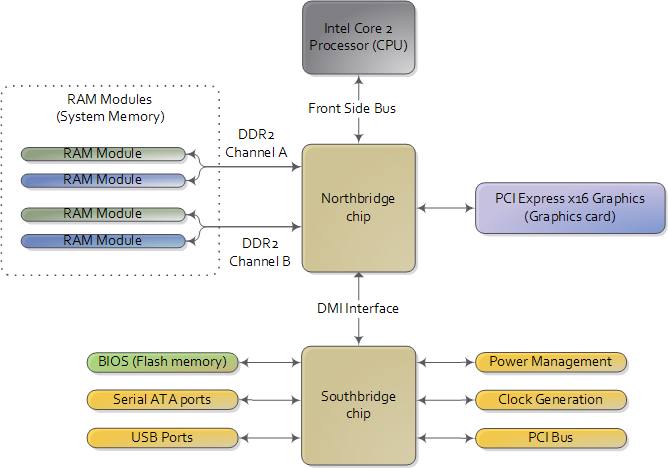
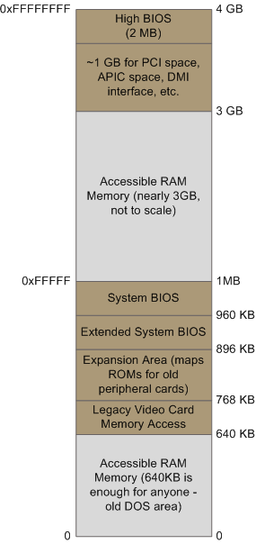

# Motherboard Chipsets and the Memory Map

### Motherboard Chipsets

Let's take a look at how an Intel computer is wired up nowadays. The diagram below shows the main components in a motherboard and bubious color taste:

Figure 1. Diagram for modern motherboard

[Image Source](http://duartes.org/gustavo/blog/post/motherboard-chipsets-memory-map/)

The northbridge and sourthbridge make up the chipset.

- The crucial thing to keep in mind it that the CPU doesn't really know anything about what it's connected to.
- It talks to the outside world through its pins but it doesn't care what that outside world it.
- It might be a motherboard in a computer but it could be a toaster, network router, brain implant, or CPU test bench.
- There are three main ways by which the CPU and the outside communicate: memory address space, I/O address space, and interrupts.

- In a motherboard the CPU's gateway to the world is the front-side bus connecting it to the northbridge.
- Whenever the CPU needs to read or write memory it does so via this bus.
- It uses some pins to transmit the physical memory address it wants to write or read, while other pins send the value to be written or recieve the value being read.
- An Intel Core 2 QX6600 has 33 pins to transmit the physical memory address (so there are 2^33 choices of memory locations) and 64 pins to send or receive data (so data is transmitted in a 64-bit data path, or 8-byte chunks).
- This allows the CPU to physically address 64 gigabytes of memory (2^33 locations * 8 bytes) althogh most chipsets only handle up to 8 gigs of RAM.

- We're used to thinking of memory only in terms of RAM, the stuff programs read from and write to all the time.
- And indeed most of the memory requests from the processor are routed to RAM modules by the northbridge.But not all of them. 
- Pysical memory addresses are also used for communication with assorted devices on the motherboard (this communication is called *memory-mapped I/O*). These devices include video cards, most PCI cards(say, a scanner or SCSI card), and also the flash memory that stores the BIOS.

### Memory Map

- When the northbridge receives a physical memory request it decides where to route it: should it go to RAM? Video card maybe? This routing is decided via the memory address map.
- For each region of physical memory address, the memory map knows the device that owns that region. The bulk of the addresses are mapped to RAM, but when they aren't the memory map tells the chipset which device should service requests for those addresses.
- This mapping of memory addresses away from RAM modules causes the classic hole in PC memory between 640KB and 1MB.
- A bigger hole arises when memory addresses are reserved for video cards and PCI devices. This ia why 32-bit OSes have problems using 4 gigs of RAM.
- In Linux the file **/proc/iomem** neatly lists these address range mappings. The diagram below shows a typical memory map for the first 4 gigs of physical memory addresses in an Intel PC:

Figure 2. Memory layout for the first 4 gigabytes in an Intel system

[Image Source](http://duartes.org/gustavo/blog/post/motherboard-chipsets-memory-map/)

- Actual addresses and ranges depend on the specific motherboard and devices present in the computer, but most Core 2 systems are pretty close to the above. All ot the brown regions are mapped away from RAM.
- Remember that these are phsical addresses that are used on the motherboard buses.
- Inside the CPU (for example, in the programs we run and write), the memory addresses are **locial** and they must be translated by the CPU into a phycial address before memory is accessed on the bus.

- The rules for translation of logical addresses into physical addresses are complex and they depend on the mode in which the CPU is running (real mode, 32-bit protected mode, and 64-bit protected mode).
- Regardless of the translation mechanism, the CPU mode determines how much physical memory can be accessed.
- For example, if the CPU is running in 32-bit mode, then it is only capable of physically addressing 4GB (well, there is an exception called physical address extension, but ignore it for now).
- Since the top 1GB or so of physical addresses are mapped to motherboard devices the CPU can effectively use only \~3 GB of RAM.
- If the CPU is in real mode, then it can only address 1 megabyte of physical RAM (this is the only mode early Intel processors were capable of).
- On the other hand, a CPU running in 64-bit mode it is possible to use physical addresses above the total RAM in the system to access the RAM regions that correspond to physical addresses stolen by motherboard devices.
- This is called **reclaiming** memory and it's done with help from the chipset.

### Reference

* [Motherboard Chipsets and the Memory Map](http://duartes.org/gustavo/blog/post/motherboard-chipsets-memory-map/)
