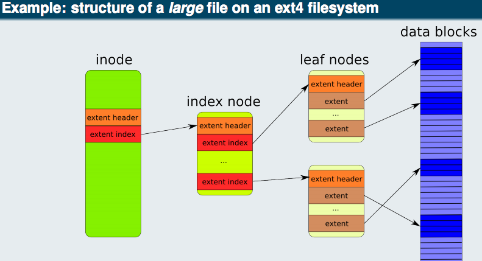
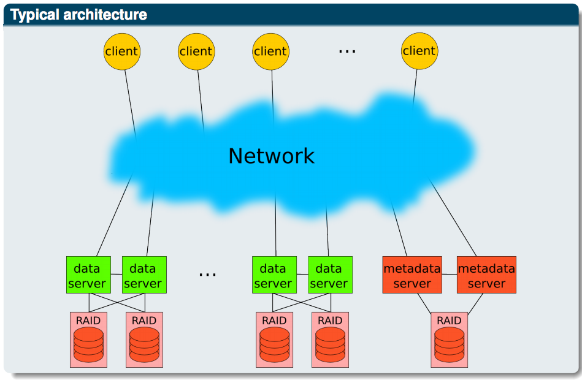
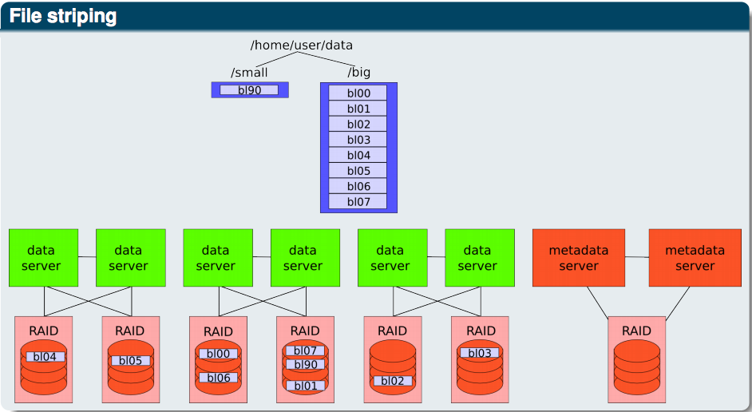
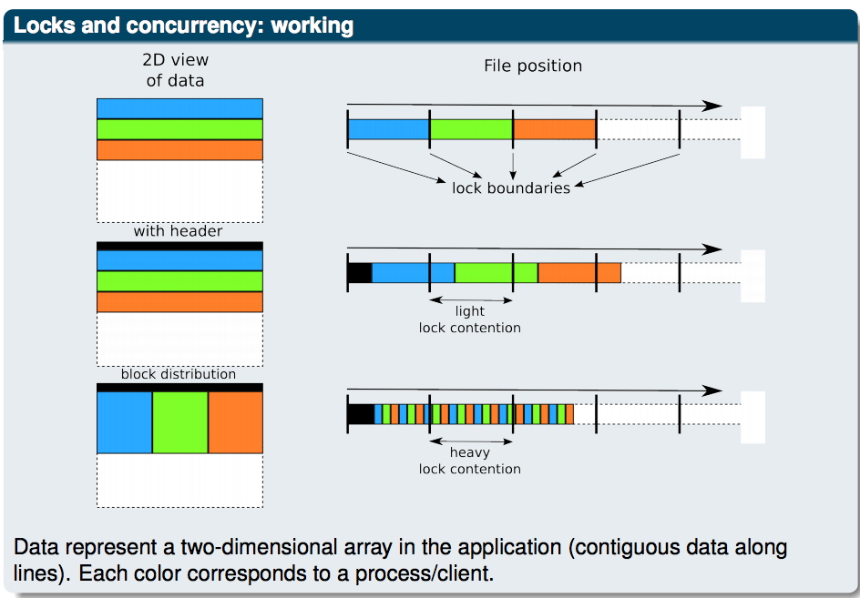
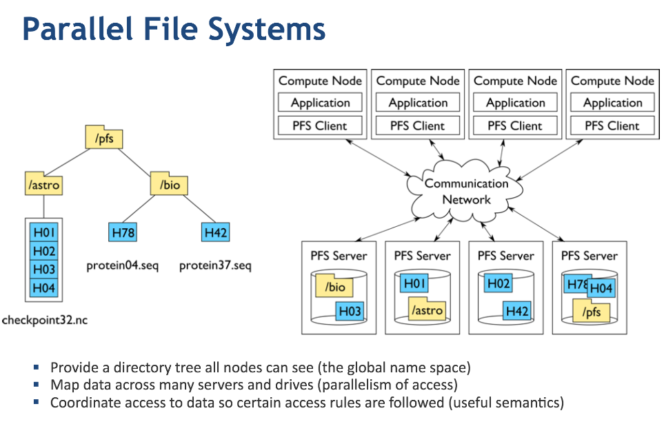

# Parallel File Systems

## Overview

### Parallel supercomputer

A parallel computer consists of:
  - a set of computing cores having access to a local memory and grouped into nodes;
  - a fast and efficient interconnection network;
  - a fast storage system.

Each node contains computing cores possibly assisted of accelerators (GPGPU, XeonPhi, FPGA...).
  - All cores with a node have access to the same memory (shared memory arachitecture).
  - However, usually, the cores of a node can not access the memory of another node (distributed memory architecture).
  - Fully-shared memory machines exists in which all the cores can access the memory of any node. In this kind of machine, the memory accesses are highly non-uniform (NUMA) because, according to where the memory is relative to a given core, performance (throughput and latency) will vary. Performance can also vary within a node, but in a much less pronounced way.

### What is a filesystem?

- A filesystem has two main functions:
  - To organize and maintain the files namespace
  - To store the contents of the files and their attributes

- Data: They correspond to the actual file contents

- Metadata: Metadata is a set of information about files. They contain, for example:
  - Data position on the disks
  - File sizes
  - Creation, last modification and last access dates
  - The owners (UID and GID) and the permissions

### Sequential filesystems

- Local sequential filesystems
  - A local sequential filesystem is a filesystem that can not be directly accessed remotely.
  - Only one client can access it (the operating system of the machine).
  - In general, there is no parallelism (one simultaneous access at a time).

## What are parallel File Systems?

A parallel filesystem is designed to enable simultaneous accesses to a filesystem to multiple clients. The differences with a _simple_ shared filesystem is the level of parallelism:
  - Multiple clients can read and write simultaneously, not one at a time.
  - The distribution of data. A client will get good performance if the data is spread across multiple data servers.

This parallelism is transparent to the client which sees the filesystem as if it was local.

In addition to the functions of a local filesystem, a parallel filesystem must efficiently manage potential conflicts between different clients. The preferred approach is to use locks to limit and control concurrent accesses to a given file or directory.

A parallel filesystem is comprised of:
  - clients which will read or write data to the filesystem;
  - one or more metadata servers. They manage metadata and placement of data on the drives, as well as access control locks (for example to avoid that 2 clients modify the same part of a file simultaneously);
  - a number of data servers. These store all the data. For some parallel filesystems, data and metadata can be handled by the same server;
  - and one or more networks (dedicated or not) for interconnecting these components.

- File striping

A file will usually be cut into pieces of fixed size (called stripes or chunks) and disseminated between different servers. A read or write of the file will therefore be done in parallel on different file servers. The speed of writing or reading will be the sum of the rates obtained on these servers.

- Data integrity and redundancy

The parallel filesystem must also ensure data integrity and system redundancy. This can be done in several ways:
  - Each data and metadata server manages several drives that use a local filesystem with RAID support ensuring data integrity in case of loss of one or more disks.
  - Data can be replicated in several different places.
  - A data or metadata server may be able to manage disks from another server and take over it in case of failure.
  - An alternative pathway for the data may exist (two different networks, for example).

- Locks and concurrency: purpose

To ensure consistency of data and metadata, parallel filesystems usually use locks that limit concurrent access to this information. This allows, among others, to ensure the atomicity of read/write operations. For example, a process writes a block of data and one wants to read it at the same time. The use of a lock guarentee that the reader will read the data blocks as it was before or after the change (as it gets the lock before or after the writer), but never a mixture of both.

- Locks and concurrency: working

Depending on the filesystem, the locks on the data are managed on a file-level or on a stripe-level basis. There are 2 main types of locks:
  - Exclusive locks for writes limiting access to a range from a single client.
  - Shared locks for read accesses to a range by any number of clients and preventing changes/concurrent writes.

- Caches

A cache is a local copy close to the one that uses it. Its purpose is to accelerate performance. Their influence can be very important.

In a parallel filesystem, caches are mainly:
  - Data servers side. Caches are prior the disks in random access memory (faster) and can be read and write (in this last case, the memory has to be powered by batteries in case of power failure);
  - Clients side. Data consistency between different clients must be assured. This is done via locks. For example, a client which has write access will flush its caches to data servers if the corresponding lock is removed. Another case, if data is cached on some clients and another begins writting in the same part of the file, read caches will be invalidated (i.e. the data on them can no longer be used) before starting to read the newly written data from the data servers.

Each parallel filesystem has its own way of managing caches.

### Parallel File Systems

- Store application data persistently
  - usually extremely large datasets that can't fit in memory
- Provide global _shared_ namespace (file, directories)
- Designed for _parallelism_
  - _Concurrent_ (often coordinated) access from many clients
- Designed for _high-performance_
  - Operate over high-speed networks
  - Optimized I/O path for maximum bandwidth

### Parallel vs. Distributed

How are Parallel File Systems different from Distributed File Systems?

- Data distribution
  - Distributed file sytems often store entire objects(_files_) on a single storage node
  - Parallel file systems distribute data of a single object across multiple storage nodes

- Symmetry
  - Distributed file systems often run on architectures where the storage is co-located with the application.
  - Parallel file systems are often run on architectures storage is physically separate from the compute system (not always true here either)

- Fault-tolerance
  - Distributed file systems take on fault-tolerance reponsibilities
  - Parallel file systems run on enterprise shared storage

- Workloads
  - Distributed file systems are geared for loosely coupled, distributed applications (think data-intensive)
  - Parallel file systems target HPC applications, which tend to perform highly coordinated I/O accesses, and have massive bandwidth requirements.

## Reference

- [Introduction to parallel filesystems](http://www.idris.fr/media/docs/docu/idris/idris_patc_filesystems_proj.pdf)
- [Parallel File Systems](http://www.cs.iit.edu/~iraicu/teaching/CS554-F13/lecture17-pfs-sam-lang.pdf)
